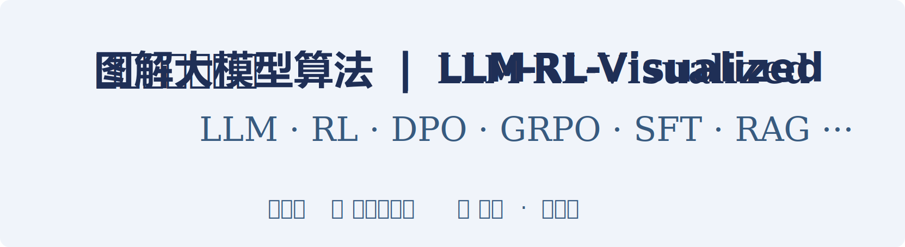
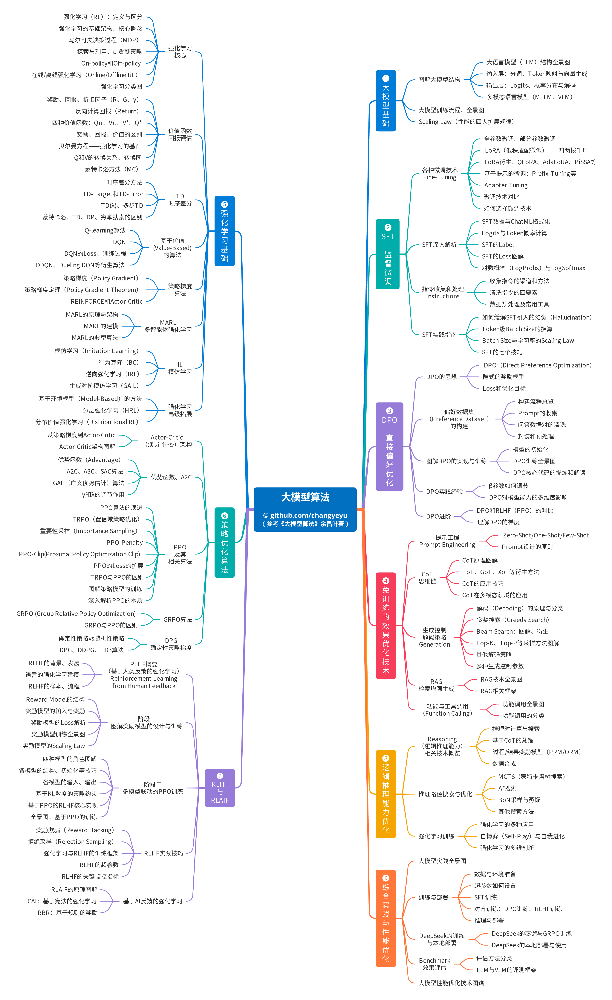
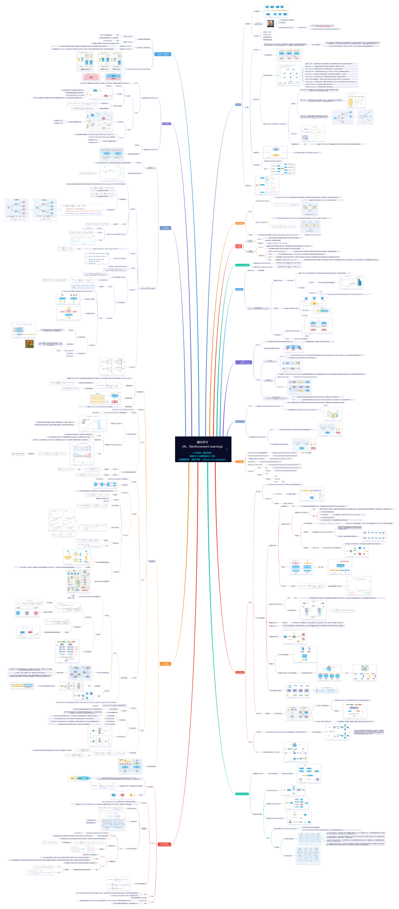
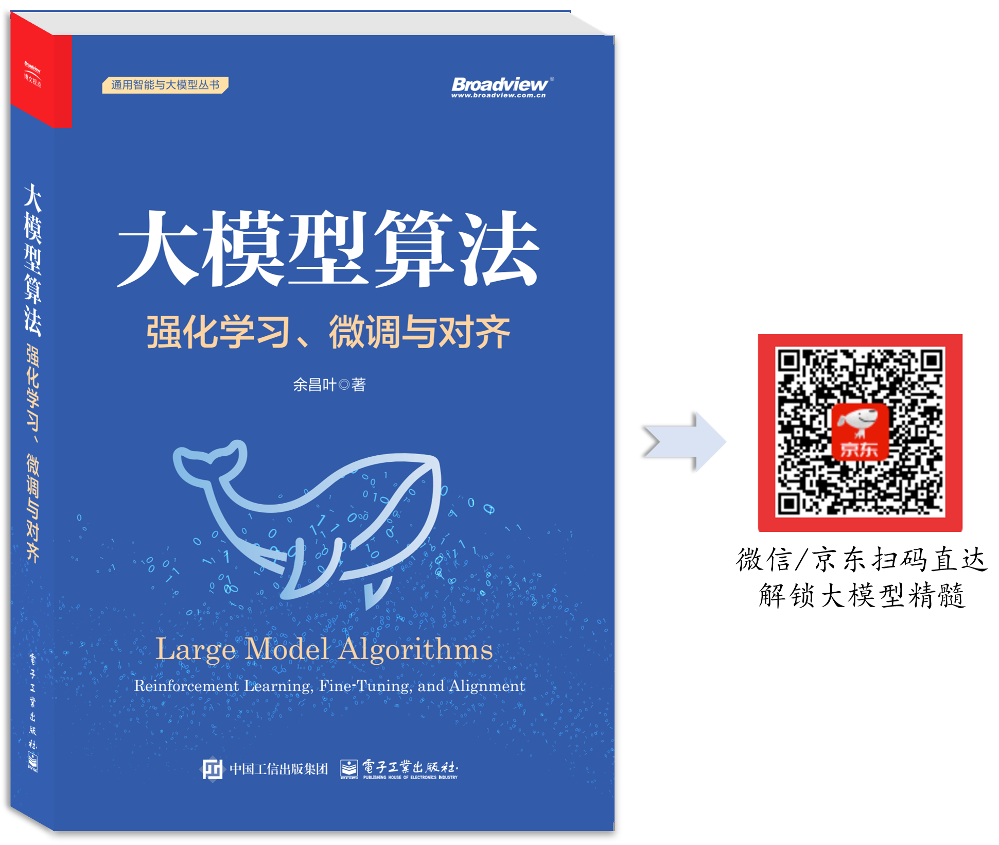

<p align="center">
  
</p>

<p align="center">
  <a href="./src/README_EN.md">
    
  </a> 
  &nbsp; &nbsp;&nbsp;

  <a href="./README.md">
    
  </a>    
</p>

---

## 项目说明
🎉 **原创 100+ 架构图，重磅开源！大模型算法一览无余！** 涵盖 LLM、VLM 等大模型技术，训练算法（RL、RLHF、GRPO、DPO、SFT 与 CoT 蒸馏等）、效果优化与 RAG 等。  

🎉 架构图的<strong>文字详解、更多架构图</strong> 详见：<a href="https://book.douban.com/subject/37331056/">《大模型算法：强化学习、微调与对齐》</a>

🎉 本项目 **长期勘误、更新、追加**，欢迎点击右上角 ↗ 的 **Star ⭐** 关注！  

🎉 点击图片可查看高清大图，或浏览仓库目录中的 `.svg` 格式矢量图（支持无限缩放）


## 内容索引
- [大模型算法总体架构（以LLM、VLM为主）](#header-1)
- [强化学习算法图谱 (rl-algo-map).pdf————全网最大！](#header-126)
- [【LLM基础】LLM结构总图————全网最大！](#header-2)
- [【LLM基础】LLM（Large Language Model）结构](#header-3)
- [【LLM基础】LLM生成与解码（Decoding）过程](#header-4)
- [【LLM基础】LLM输入层](#header-5)
- [【LLM基础】LLM输出层](#header-6)
- [【LLM基础】多模态模型结构（VLM、MLLM ...）](#header-7)
- [【LLM基础】LLM训练流程](#header-8)
- [【SFT】微调（Fine-Tuning）技术分类](#header-9)
- [【SFT】LoRA（1 of 2）](#header-10)
- [【SFT】LoRA（2 of 2）](#header-11)
- [【SFT】Prefix-Tuning](#header-12)
- [【SFT】TokenID与词元的映射关系](#header-13)
- [【SFT】SFT的Loss（交叉熵）](#header-14)
- [【SFT】指令数据的来源](#header-15)
- [【SFT】多个数据的拼接（Packing）](#header-16)
- [【DPO】RLHF与DPO的训练架构对比](#header-17)
- [【DPO】Prompt的收集](#header-18)
- [【DPO】DPO（Direct Preference Optimization）](#header-19)
- [【DPO】DPO训练全景图](#header-20)
- [【DPO】β参数对DPO的影响](#header-21)
- [【DPO】隐式奖励差异对参数更新幅度的影响](#header-22)
- [【免训练的优化技术】CoT（Chain of Thought）与传统问答的对比](#header-23)
- [【免训练的优化技术】CoT、Self-consistency CoT、ToT、GoT <sup>[<a href="./src/references.md">87</a>]</sup>](#header-24)
- [【免训练的优化技术】穷举搜索（Exhaustive Search）](#header-25)
- [【免训练的优化技术】贪婪搜索（Greedy Search）](#header-26)
- [【免训练的优化技术】波束搜索（Beam Search）](#header-27)
- [【免训练的优化技术】多项式采样（Multinomial Sampling）](#header-28)
- [【免训练的优化技术】Top-K采样（Top-K Sampling）](#header-29)
- [【免训练的优化技术】Top-P采样（Top-P Sampling）](#header-30)
- [【免训练的优化技术】RAG（检索增强生成,Retrieval-Augmented Generation）](#header-31)
- [【免训练的优化技术】功能调用（Function Calling）](#header-32)
- [【强化学习基础】强化学习(Reinforcement Learning, RL)的发展历程](#header-33)
- [【强化学习基础】三大机器学习范式](#header-34)
- [【强化学习基础】强化学习的基础架构](#header-35)
- [【强化学习基础】强化学习的运行轨迹](#header-36)
- [【强化学习基础】马尔可夫链vs马尔可夫决策过程（MDP）](#header-37)
- [【强化学习基础】探索与利用问题（Exploration and Exploitation）](#header-38)
- [【强化学习基础】Ɛ-贪婪策略下使用动态的Ɛ值](#header-39)
- [【强化学习基础】强化学习训练范式的对比](#header-40)
- [【强化学习基础】强化学习算法分类](#header-41)
- [【强化学习基础】回报（累计奖励，Return）](#header-42)
- [【强化学习基础】反向迭代并计算回报G](#header-43)
- [【强化学习基础】奖励（Reward）、回报（Return）、价值（Value）的关系](#header-44)
- [【强化学习基础】价值函数Qπ与Vπ的关系](#header-45)
- [【强化学习基础】蒙特卡洛（Monte Carlo，MC）法预估状态St的价值](#header-46)
- [【强化学习基础】TD目标与TD误差的关系（TD target and TD error）](#header-47)
- [【强化学习基础】TD(0)、多步TD与蒙特卡洛（MC）的关系](#header-48)
- [【强化学习基础】蒙特卡洛方法与TD方法的特性](#header-49)
- [【强化学习基础】蒙特卡洛、TD、DP、穷举搜索的关系 <sup>[<a href="./src/references.md">32</a>]</sup>](#header-50)
- [【强化学习基础】两种输入输出结构的DQN（Deep Q-Network）模型](#header-51)
- [【强化学习基础】DQN的实际应用示例](#header-52)
- [【强化学习基础】DQN的“高估”问题](#header-53)
- [【强化学习基础】基于价值vs基于策略（Value-Based vs Policy-Based）](#header-54)
- [【强化学习基础】策略梯度（Policy Gradient）](#header-55)
- [【强化学习基础】多智能体强化学习（MARL，Multi-agent reinforcement learning）](#header-56)
- [【强化学习基础】多智能体DDPG <sup>[<a href="./src/references.md">41</a>]</sup>](#header-57)
- [【强化学习基础】模仿学习（IL，Imitation Learning）](#header-58)
- [【强化学习基础】行为克隆（BC，Behavior Cloning）](#header-59)
- [【强化学习基础】逆向强化学习（IRL，Inverse RL）、强化学习（RL）](#header-60)
- [【强化学习基础】有模型（Model-Based）、无模型（Model-Free）](#header-61)
- [【强化学习基础】封建等级强化学习（Feudal RL）](#header-62)
- [【强化学习基础】分布价值强化学习（Distributional RL）](#header-63)
- [【策略优化架构算法及其衍生】Actor-Critic架构](#header-64)
- [【策略优化架构算法及其衍生】引入基线与优势（Advantage）函数A的作用](#header-65)
- [【策略优化架构算法及其衍生】GAE（广义优势估计,Generalized Advantage Estimation）算法](#header-66)
- [【策略优化架构算法及其衍生】PPO（Proximal Policy Optimization）算法的演进](#header-67)
- [【策略优化架构算法及其衍生】TRPO（Trust Region Policy Optimization）及其置信域](#header-68)
- [【策略优化架构算法及其衍生】重要性采样（Importance sampling）](#header-69)
- [【策略优化架构算法及其衍生】PPO-Clip](#header-70)
- [【策略优化架构算法及其衍生】PPO训练中策略模型的更新过程](#header-71)
- [【策略优化架构算法及其衍生】PPO的伪代码](#header-71-2)
- [【策略优化架构算法及其衍生】PPO与GRPO（Group Relative Policy Optimization） <sup>[<a href="./src/references.md">72</a>]</sup>](#header-72)
- [【策略优化架构算法及其衍生】确定性策略vs随机性策略（Deterministic policy vs. Stochastic policy）](#header-73)
- [【策略优化架构算法及其衍生】确定性策略梯度（DPG）](#header-74)
- [【策略优化架构算法及其衍生】DDPG（Deep Deterministic Policy Gradient）](#header-75)
- [【RLHF与RLAIF】语言模型的强化学习建模](#header-76)
- [【RLHF与RLAIF】RLHF的两阶段式训练流程](#header-77)
- [【RLHF与RLAIF】奖励模型（RM）的结构](#header-78)
- [【RLHF与RLAIF】奖励模型的输入输出](#header-79)
- [【RLHF与RLAIF】奖励模型预测偏差与Loss的关系](#header-80)
- [【RLHF与RLAIF】奖励模型的训练](#header-81)
- [【RLHF与RLAIF】PPO训练中四种模型的合作关系](#header-82)
- [【RLHF与RLAIF】PPO训练中四种模型的结构与初始化](#header-83)
- [【RLHF与RLAIF】一个双头结构的价值模型](#header-84)
- [【RLHF与RLAIF】RLHF：四种模型可以共享同一个底座](#header-85)
- [【RLHF与RLAIF】PPO训练中各模型的输入与输出](#header-86)
- [【RLHF与RLAIF】PPO训练中KL距离的计算过程](#header-87)
- [【RLHF与RLAIF】基于PPO进行RLHF训练的原理图](#header-88)
- [【RLHF与RLAIF】拒绝采样（Rejection Sampling）微调](#header-89)
- [【RLHF与RLAIF】RLAIF与RLHF的区别](#header-90)
- [【RLHF与RLAIF】Claude模型应用的宪法AI（CAI）原理](#header-91)
- [【RLHF与RLAIF】OpenAI RBR（基于规则的奖励）](#header-92)
- [【逻辑推理能力优化】基于CoT的知识蒸馏（Knowledge Distillation）](#header-93)
- [【逻辑推理能力优化】基于DeepSeek进行蒸馏](#header-94)
- [【逻辑推理能力优化】ORM和PRM（结果奖励模型和过程奖励模型）](#header-95)
- [【逻辑推理能力优化】MCTS每次迭代的四个关键步骤](#header-96)
- [【逻辑推理能力优化】MCTS的运行过程](#header-97)
- [【逻辑推理能力优化】语言场景下的搜索树示例](#header-98)
- [【逻辑推理能力优化】BoN（Best-of-N）采样](#header-99)
- [【逻辑推理能力优化】多数投票（Majority Vote）方法](#header-100)
- [【逻辑推理能力优化】AlphaGoZero在训练时的性能增长趋势 <sup>[<a href="./src/references.md">179</a>]</sup>](#header-101)
- [【LLM基础拓展】大模型性能优化技术图谱](#header-102)
- [【LLM基础拓展】ALiBi位置编码](#header-103)
- [【LLM基础拓展】传统的知识蒸馏](#header-104)
- [【LLM基础拓展】数值表示、量化（Quantization）](#header-105)
- [【LLM基础拓展】常规训练时前向和反向过程](#header-106)
- [【LLM基础拓展】梯度累积（Gradient Accumulation）训练](#header-107)
- [【LLM基础拓展】Gradient Checkpoint（梯度重计算）](#header-108)
- [【LLM基础拓展】Full recomputation(完全重计算)](#header-109)
- [【LLM基础拓展】LLM Benchmark](#header-110)
- [【LLM基础拓展】MHA、GQA、MQA、MLA](#header-111)
- [【LLM基础拓展】RNN（Recurrent Neural Network）](#header-112)
- [【LLM基础拓展】Pre-norm和Post-norm](#header-113)
- [【LLM基础拓展】BatchNorm和LayerNorm](#header-114)
- [【LLM基础拓展】RMSNorm](#header-115)
- [【LLM基础拓展】Prune（剪枝）](#header-116)
- [【LLM基础拓展】温度系数的作用](#header-117)
- [【LLM基础拓展】SwiGLU](#header-118)
- [【LLM基础拓展】AUC、PR、F1、Precision、Recall](#header-119)
- [【LLM基础拓展】RoPE位置编码](#header-120)
- [【LLM基础拓展】RoPE对各序列位置、各维度的作用](#header-121)
- [所有架构图的 文字详解✍️、更多架构图🖼️](#header-122)
- [书籍参考文献](#header-123)
- [用于参考文献（引用格式）](#header-124)
- [BibTeX（引用格式）](#header-125)

<br>

---

### <a name="header-1"></a>大模型算法总体架构（以LLM、VLM为主）


### <a name="header-126"></a> 强化学习算法图谱 (rl-algo-map).pdf————全网最大！
- 本人历时数天、呕心沥血之作，点击本仓库右上角 ↗ 的 **Star ⭐** ，就是对我最大的鼓励啦！
- 下图仅为预览图，高清图见： <a href="https://github.com/changyeyu/LLM-RL-Visualized/blob/master/%E5%BC%BA%E5%8C%96%E5%AD%A6%E4%B9%A0%E7%AE%97%E6%B3%95%E5%9B%BE%E8%B0%B1%20(rl-algo-map).pdf"> 强化学习算法图谱 (rl-algo-map).pdf </a>
[](https://github.com/changyeyu/LLM-RL-Visualized/blob/master/%E5%BC%BA%E5%8C%96%E5%AD%A6%E4%B9%A0%E7%AE%97%E6%B3%95%E5%9B%BE%E8%B0%B1%20(rl-algo-map).pdf)

### <a name="header-2"></a>【LLM基础】LLM结构总图————全网最大！
- 本人历时几十个小时、呕心沥血之作，点击本仓库右上角 ↗ 的 **Star ⭐** ，就是对我最大的鼓励啦！
- LLM主要有Decoder-Only（仅解码器）或MoE（Mixture of Experts, 专家混合模型）两种形式，两者在整体架构上较为相似，主要区别为MoE在FFN（前馈网络）部分引入了多个专家网络。
[](https://raw.githubusercontent.com/changyeyu/LLM-RL-Visualized/master/images_chinese/source_svg/%E3%80%90LLM%E5%9F%BA%E7%A1%80%E3%80%91LLM%E7%BB%93%E6%9E%84%E5%85%A8%E8%A7%86%E5%9B%BE.svg)

### <a name="header-3"></a>【LLM基础】LLM（Large Language Model）结构
- LLM主要有Decoder-Only（仅解码器）或MoE（Mixture of Experts, 专家混合模型）**两种形式**，两者在整体架构上较为**相似**，主要区别为MoE在FFN（前馈网络）部分引入了多个专家网络。
- 一个典型的LLM结构，可分为**三部分**——输入层、多层Decoder堆叠结构和输出层（包括语言模型头与解码模块）

[](https://raw.githubusercontent.com/changyeyu/LLM-RL-Visualized/master/images_chinese/png_big/%E3%80%90LLM%E5%9F%BA%E7%A1%80%E3%80%91LLM%E7%BB%93%E6%9E%84.png)

### <a name="header-4"></a>【LLM基础】LLM生成与解码（Decoding）过程
- **解码策略**是决定最终输出文本流畅性、多样性及整体表现的核心因素。**常见**的解码算法包括：贪婪搜索、波束搜索（Beam Search）及其衍生算法、多项式采样、Top-K采样、Top-P采样、对比搜索（Contrastive Search）、投机解码（Speculative Decoding）、前瞻解码（Lookahead Decoding）、DoLa解码等。
- LLM的输出层负责根据概率分布，应用**解码算法**确定最终预测的下一个/N个词元。
- 根据概率分布，应用解码策略（例如随机采样或选择最大概率）确定最终预测的**下一个**词元。例如，在贪婪搜索解码策略下，选择概率最高的词元“我”作为预测结果。
- 每一个token（词元）的生成都需要**重新走一遍**所有层Transformer结构。
- 这里只展示了每次预测一个词元的方案，也有一次性预测**多个词元**的方案，详见《大模型算法：强化学习、微调与对齐》第四章。
[](https://raw.githubusercontent.com/changyeyu/LLM-RL-Visualized/master/images_chinese/png_big/%E3%80%90LLM%E5%9F%BA%E7%A1%80%E3%80%91LLM%E7%94%9F%E6%88%90%E4%B8%8E%E8%A7%A3%E7%A0%81%E8%BF%87%E7%A8%8B.png)

### <a name="header-5"></a>【LLM基础】LLM输入层
- LLM的输入层将输入**文本**转换为多维**数值矩阵**（Tensor，张量），以便送往模型主体结构进行计算。
[](https://raw.githubusercontent.com/changyeyu/LLM-RL-Visualized/master/images_chinese/png_big/%E3%80%90LLM%E5%9F%BA%E7%A1%80%E3%80%91LLM%E8%BE%93%E5%85%A5%E5%B1%82.png)

### <a name="header-6"></a>【LLM基础】LLM输出层
LLM的输出层负责根据隐藏状态（多维数值矩阵）预测下一个词元（文本）。处理流程如图所示：
- （1）**输入隐藏状态**：Decoder最后一层的隐藏状态（Hidden States）作为LLM输出层的输入。如图中所示维度为3×896的数值矩阵，包含了前缀序列的所有语义信息。
- （2）**语言模型头**（LM Head）：通常是一个全连接层，用于将隐藏状态转换为Logits（推理时只计算最后一个位置的Logits）。如图所示，Logits的形状为3×151936，对应于词表中每个词元的得分。
- （3）**提取最后位置的Logits**：预测下一个词元仅依赖于前缀序列最后一个位置的Logits，因此需要从所有位置的Logits中提取最后一个位置的Logits。如图所示，提取得到一个151936维的向量 [2.0, 3.1, −1.7, ... , −1.7]，用于后续预测。
- （4）**转换为概率分布**（Softmax）：通过Softmax函数将Logits转换为概率分布，得到词表中每个词元的概率。例如，生成的151936维概率向量为[0.01, 0.03, 0.001, ... , 0.001]，该向量内所有概率之和为1。概率值越大，表示该词元作为下一个词元的可能性越高。例如，“我”的概率为0.34。
- （5）**解码（Decoding）**：根据概率分布，应用解码策略（例如随机采样或选择最大概率）确定最终预测的下一个词元。例如，在贪婪搜索解码策略下，选择概率最高的词元“我”作为预测结果。
[](https://raw.githubusercontent.com/changyeyu/LLM-RL-Visualized/master/images_chinese/png_big/%E3%80%90LLM%E5%9F%BA%E7%A1%80%E3%80%91LLM%E8%BE%93%E5%87%BA%E5%B1%82.png)

### <a name="header-7"></a>【LLM基础】多模态模型结构（VLM、MLLM ...）
多模态模型根据侧重不同，通常有以下**多种称呼**：
- **VLM**（Vision-Language Model，视觉语言模型）
- **MLLM**（Multimodal Large Language Model，多模态大语言模型）
- **VLA**（Vision-Language-Action Model，视觉语言动作模型）
[](https://raw.githubusercontent.com/changyeyu/LLM-RL-Visualized/master/images_chinese/png_big/%E3%80%90LLM%E5%9F%BA%E7%A1%80%E3%80%91%E5%A4%9A%E6%A8%A1%E6%80%81%E6%A8%A1%E5%9E%8B%E7%BB%93%E6%9E%84.png)

### <a name="header-8"></a>【LLM基础】LLM训练流程
- 大模型的训练主要分为**两个阶段**——预训练（Pre-Training）和后训练（Post-Training）。在每个阶段，所使用的训练数据、训练范式（算法）、训练目标和超参数均有所不同。
- **预训练**阶段包括初期训练（基于海量数据的短上下文训练）、中期训练（长文本/长上下文训练）以及退火（Annealing）训练等。此阶段以自监督学习为主，使用的数据量最大，同时也是最消耗算力的环节。
- **后训练**阶段则包含多种可选的训练范式（算法），包括但不限于SFT（监督微调）、蒸馏、RSFT（拒绝采样微调）、RLHF（基于人类反馈的强化学习）、DPO（直接偏好优化），以及其他强化学习方法，例如GRPO（群体相对策略优化）、PPO（近端策略优化）等。其中，某些环节也可进行多轮迭代训练，例如多轮拒绝采样微调（Rejection Sampling Fine-Tuning, RSFT）。
[](https://raw.githubusercontent.com/changyeyu/LLM-RL-Visualized/master/images_chinese/png_big/%E3%80%90LLM%E5%9F%BA%E7%A1%80%E3%80%91LLM%E8%AE%AD%E7%BB%83%E6%B5%81%E7%A8%8B.png)

### <a name="header-9"></a>【SFT】微调（Fine-Tuning）技术分类
- 可用于SFT的微调技术种类多样，如下图的分类图所示：前两种方法仅需基于预训练模型主体进行微调，开发成本较低；而并联低秩微调和Adapter Tuning则需要**引入额外**的新模块，实施过程相对复杂一些。这些方法均是针对模型参数进行微调，而基于Prompt的微调则另辟蹊径，从**模型的输入**着手进行微调。
[](https://raw.githubusercontent.com/changyeyu/LLM-RL-Visualized/master/images_chinese/png_big/%E3%80%90SFT%E3%80%91%E5%BE%AE%E8%B0%83%E6%8A%80%E6%9C%AF%E5%88%86%E7%B1%BB.png)

### <a name="header-10"></a>【SFT】LoRA（1 of 2）
- **LoRA**（Low-Rank Adaptation, 低秩适配微调）由微软的研究团队于2021年发表。由于其高效的微调方式和良好的效果，在各类模型中得到广泛的应用。LoRA的**核心思想**在于——微调前后模型的参数差异∆W具有低秩性。
- 一个矩阵具有**低秩性**，意味着它包含较多的冗余信息，将其分解为多个低维矩阵后，不会损失过多有用信息。例如，如图所示，一个1024×1024的矩阵可以被近似分解为一个1024×2矩阵与一个2×1024矩阵的乘积，从而将参数量约减少至原来的0.4%。

[](https://raw.githubusercontent.com/changyeyu/LLM-RL-Visualized/master/images_chinese/png_big/%E3%80%90SFT%E3%80%91LoRA%EF%BC%881%20of%202%EF%BC%89.png)

### <a name="header-11"></a>【SFT】LoRA（2 of 2）
- A和B的**初始化**方式：
- （1）矩阵A使用随机数初始化，如kaiming初始化；
- （2）矩阵B使用全0初始化，或使用极小的随机数初始化。
- **目的**在于——确保在训练初期，插入的LoRA模块不会对模型整体输出造成过大的扰动。
[](https://raw.githubusercontent.com/changyeyu/LLM-RL-Visualized/master/images_chinese/png_big/%E3%80%90SFT%E3%80%91LoRA%EF%BC%882%20of%202%EF%BC%89.png)

### <a name="header-12"></a>【SFT】Prefix-Tuning
- **Prefix-Tuning**由斯坦福大学的研究团队提出，可以用于对语言模型进行轻量级微调。
- 如图所示，该方法在输入的起始位置插入一段连续的、可训练的向量（Embedding），称为前缀（Prefix）。在处理后续的Token时，Transformer将这些向量视为 **虚拟Token**，并参与Attention计算。

[](https://raw.githubusercontent.com/changyeyu/LLM-RL-Visualized/master/images_chinese/png_big/%E3%80%90SFT%E3%80%91Prefix-Tuning.png)

### <a name="header-13"></a>【SFT】TokenID与词元的映射关系
- 以SFT数据（经过ChatML格式预处理）为例，该数据经过Tokenizer处理后，被转换为33个Token，对应33个序列位置，如图所示。
- 每个Token ID与相应的词元**一一对应**。
[](https://raw.githubusercontent.com/changyeyu/LLM-RL-Visualized/master/images_chinese/png_big/%E3%80%90SFT%E3%80%91TokenID%E4%B8%8E%E8%AF%8D%E5%85%83%E7%9A%84%E6%98%A0%E5%B0%84%E5%85%B3%E7%B3%BB.png)

### <a name="header-14"></a>【SFT】SFT的Loss（交叉熵）
- 与预训练阶段类似，SFT的Loss也是基于交叉熵（CE，Cross Entropy）
[](https://raw.githubusercontent.com/changyeyu/LLM-RL-Visualized/master/images_chinese/png_big/%E3%80%90SFT%E3%80%91SFT%E7%9A%84Loss%EF%BC%88%E4%BA%A4%E5%8F%89%E7%86%B5%EF%BC%89.png)

### <a name="header-15"></a>【SFT】指令数据的来源
- **指令数据**（Instructions）是指为模型提供的一组引导性输入及期望输出的描述，通常包括问题（或任务提示）及其对应的答案，常用于对模型进行微调训练。
[](https://raw.githubusercontent.com/changyeyu/LLM-RL-Visualized/master/images_chinese/png_big/%E3%80%90SFT%E3%80%91%E6%8C%87%E4%BB%A4%E6%95%B0%E6%8D%AE%E7%9A%84%E6%9D%A5%E6%BA%90.png)

### <a name="header-16"></a>【SFT】多个数据的拼接（Packing）
- 模型训练时通常使用**固定长度**的输入。当输入的数据长度不一致时，对于短序列，会在其末尾填充（padding）以匹配最大序列长度，这会导致计算资源的**浪费**。
- 因此，正如图所示，常见的做法是将多条数据拼接（Packing）在一起，填充到一个固定长度的输入序列中。
- 为了确保计算过程中不同数据之间**互不干扰**，通常需要**重设**位置编号（Reset position ID）和注意力掩码（Reset attention mask），以在计算Attention时保持各条数据的语义独立性。
[](https://raw.githubusercontent.com/changyeyu/LLM-RL-Visualized/master/images_chinese/png_big/%E3%80%90SFT%E3%80%91%E5%A4%9A%E4%B8%AA%E6%95%B0%E6%8D%AE%E7%9A%84%E6%8B%BC%E6%8E%A5%EF%BC%88Packing%EF%BC%89.png)

### <a name="header-17"></a>【DPO】RLHF与DPO的训练架构对比
不同于RLHF，DPO以监督学习的训练方式，大幅简化了对齐训练：
- **流程简洁**：DPO直接对策略模型进行优化，不需要预先训练Reward模型（奖励函数）。DPO只需要基于预先给定的偏好数据进行训练，**无需**中途采样。
- **稳定性**：DPO是一种监督学习方法，摆脱了强化学习训练的不稳定性。
- **低开销**：DPO在训练过程中只需要加载**一个模型**（只需加载策略模型，而对于参考模型，可以将参考模型的输出结果预先录制好，然后在训练时就不需要加载），算力开销更低，更易于落地实践。
[](https://raw.githubusercontent.com/changyeyu/LLM-RL-Visualized/master/images_chinese/png_big/%E3%80%90DPO%E3%80%91RLHF%E4%B8%8EDPO%E7%9A%84%E8%AE%AD%E7%BB%83%E6%9E%B6%E6%9E%84%E5%AF%B9%E6%AF%94.png)

### <a name="header-18"></a>【DPO】Prompt的收集
[](https://raw.githubusercontent.com/changyeyu/LLM-RL-Visualized/master/images_chinese/png_big/%E3%80%90DPO%E3%80%91Prompt%E7%9A%84%E6%94%B6%E9%9B%86.png)

### <a name="header-19"></a>【DPO】DPO（Direct Preference Optimization）
- **DPO**（Direct Preference Optimization，直接偏好优化）是由斯坦福大学等研究团队于2023年提出的一种偏好优化算法，可用于LLM、VLM与MLLM的对齐训练。
- 该算法在基于PPO的RLHF基础上进行了大幅**简化**。
- DPO算法跳过了训练奖励模型这一中间过程，直接（Direct）优化策略模型 ——这正是DPO命名中“D（Direct）”的**含义**所在。
DPO的训练涉及2个模型——策略模型和参考模型。它们的**初始化**方法如下：
- **策略模型**：直接复制SFT模型作为初始化。
- **参考模型**：通常也从SFT模型复制。但在某些情况下，可能会选择从一个比SFT模型更强的模型进行复制。此时，需特别关注参考模型与策略模型的匹配性，主要涉及两者的KL距离及训练数据分布等方面。
[](https://raw.githubusercontent.com/changyeyu/LLM-RL-Visualized/master/images_chinese/png_big/%E3%80%90DPO%E3%80%91DPO%EF%BC%88Direct%20Preference%20Optimization%EF%BC%89.png)

### <a name="header-20"></a>【DPO】DPO训练全景图
- DPO训练时，可以选择**加载**2个模型（策略模型 和参考模型 ），也可以只加载1个模型（策略模型 ）。本文将优先分析加载2个模型的情况。
- DPO的整体训练流程如图所示（**蓝色**色块代表偏好数据对中的“优质回答” 及其对应的中间计算结果；**粉色**色块代表偏好数据对中的“劣质回答” 及其对应的中间计算结果）。
[](https://raw.githubusercontent.com/changyeyu/LLM-RL-Visualized/master/images_chinese/png_big/%E3%80%90DPO%E3%80%91DPO%E8%AE%AD%E7%BB%83%E5%85%A8%E6%99%AF%E5%9B%BE.png)

### <a name="header-21"></a>【DPO】β参数对DPO的影响
- 在DPO中， 参数的作用**类似**于其在RLHF中的作用。
[](https://raw.githubusercontent.com/changyeyu/LLM-RL-Visualized/master/images_chinese/png_big/%E3%80%90DPO%E3%80%91%CE%B2%E5%8F%82%E6%95%B0%E5%AF%B9DPO%E7%9A%84%E5%BD%B1%E5%93%8D.png)

### <a name="header-22"></a>【DPO】隐式奖励差异对参数更新幅度的影响
- DPO的梯度更新旨在**增加**优质回答的概率，同时**减少**劣质回答的概率。
- 更重要的是，梯度中包含一个**动态系数**——优质和劣质回答的隐式奖励差异。换言之，这个动态系数反映了隐式“奖励模型”在对偏好顺序的判断上有多大误差。
[](https://raw.githubusercontent.com/changyeyu/LLM-RL-Visualized/master/images_chinese/png_big/%E3%80%90DPO%E3%80%91%E9%9A%90%E5%BC%8F%E5%A5%96%E5%8A%B1%E5%B7%AE%E5%BC%82%E5%AF%B9%E5%8F%82%E6%95%B0%E6%9B%B4%E6%96%B0%E5%B9%85%E5%BA%A6%E7%9A%84%E5%BD%B1%E5%93%8D.png)

### <a name="header-23"></a>【免训练的优化技术】CoT（Chain of Thought）与传统问答的对比
- **CoT**（Chain of Thought，**思维链**）由Jason Wei等研究者于2022年在Google期间提出，是大模型领域的一项重要技术创新，并迅速被广泛应用于学术研究和实际场景。
- 其**核心思想**是通过显式地分步推理，提升模型在复杂推理任务中的表现。
[](https://raw.githubusercontent.com/changyeyu/LLM-RL-Visualized/master/images_chinese/png_big/%E3%80%90%E5%85%8D%E8%AE%AD%E7%BB%83%E7%9A%84%E4%BC%98%E5%8C%96%E6%8A%80%E6%9C%AF%E3%80%91CoT%E4%B8%8E%E4%BC%A0%E7%BB%9F%E9%97%AE%E7%AD%94%E7%9A%84%E5%AF%B9%E6%AF%94.png)

### <a name="header-24"></a>【免训练的优化技术】CoT、Self-consistency CoT、ToT、GoT <sup>[<a href="./src/references.md">87</a>]</sup>
- 在CoT展现其潜力后，迅速**衍生**出多种相关技术，例如ToT、GoT、Self-consistency CoT、Zero-shot-CoT、Auto-CoT、MoT、XoT等
[](https://raw.githubusercontent.com/changyeyu/LLM-RL-Visualized/master/images_chinese/png_big/%E3%80%90%E5%85%8D%E8%AE%AD%E7%BB%83%E7%9A%84%E4%BC%98%E5%8C%96%E6%8A%80%E6%9C%AF%E3%80%91CoT%E3%80%81Self-consistencyCoT%E3%80%81ToT%E3%80%81GoT.png)

### <a name="header-25"></a>【免训练的优化技术】穷举搜索（Exhaustive Search）
- Token的生成过程可以形象地表示为一个以词表大小 V=105 为基数的**多叉树**结构。理论上，采用穷举搜索（Exhaustive Search）的方法能够获得全局最优解。然而，穷举搜索的计算代价极高。
[](https://raw.githubusercontent.com/changyeyu/LLM-RL-Visualized/master/images_chinese/png_big/%E3%80%90%E5%85%8D%E8%AE%AD%E7%BB%83%E7%9A%84%E4%BC%98%E5%8C%96%E6%8A%80%E6%9C%AF%E3%80%91%E7%A9%B7%E4%B8%BE%E6%90%9C%E7%B4%A2%EF%BC%88Exhaustive%20Search%EF%BC%89.png)

### <a name="header-26"></a>【免训练的优化技术】贪婪搜索（Greedy Search）
- **贪婪搜索**（Greedy Search）在生成下一个Token（词元）时，每次都会选择当前**概率最高**的一个Token，不考虑生成序列的全局最优性或多样性，然后继续对下一个Token位置执行相同的操作。尽管这种方法简单快速，但生成的内容可能过早陷入局部最优，**缺乏多样性**。
[](https://raw.githubusercontent.com/changyeyu/LLM-RL-Visualized/master/images_chinese/png_big/%E3%80%90%E5%85%8D%E8%AE%AD%E7%BB%83%E7%9A%84%E4%BC%98%E5%8C%96%E6%8A%80%E6%9C%AF%E3%80%91%E8%B4%AA%E5%A9%AA%E6%90%9C%E7%B4%A2%EF%BC%88Greedy%20Search%EF%BC%89.png)

### <a name="header-27"></a>【免训练的优化技术】波束搜索（Beam Search）
- **Beam Search**（波束搜索）在每一步生成时，不仅仅选择一个最优Token（词元），而是保留**多个候选**序列（称为Beam，即波束），其余的路径则被剪枝。这些候选序列会在后续步骤中继续扩展，直到生成结束。
- 最终，从所有候选序列中选择得分**最高**的一条作为最终输出。Beam的数量（num_beams参数）越大，搜索空间越广，生成结果越**接近全局最优**，但计算成本也随之增加。
[](https://raw.githubusercontent.com/changyeyu/LLM-RL-Visualized/master/images_chinese/png_big/%E3%80%90%E5%85%8D%E8%AE%AD%E7%BB%83%E7%9A%84%E4%BC%98%E5%8C%96%E6%8A%80%E6%9C%AF%E3%80%91%E6%B3%A2%E6%9D%9F%E6%90%9C%E7%B4%A2%EF%BC%88Beam%20Search%EF%BC%89.png)

### <a name="header-28"></a>【免训练的优化技术】多项式采样（Multinomial Sampling）
- **多项式采样**（Multinomial Sampling）是生成式模型中一种常见的**随机采样**方法，生成下一个Token时，以模型预测的概率分布为依据，在概率分布中“按概率大小”随机抽取Token（而非等概率随机抽样）。
- 包含Top-K、Top-P等
[](https://raw.githubusercontent.com/changyeyu/LLM-RL-Visualized/master/images_chinese/png_big/%E3%80%90%E5%85%8D%E8%AE%AD%E7%BB%83%E7%9A%84%E4%BC%98%E5%8C%96%E6%8A%80%E6%9C%AF%E3%80%91%E5%A4%9A%E9%A1%B9%E5%BC%8F%E9%87%87%E6%A0%B7%EF%BC%88Multinomial%20Sampling%EF%BC%89.png)

### <a name="header-29"></a>【免训练的优化技术】Top-K采样（Top-K Sampling）
- **Top-K采样**（Top-K Sampling）是一种在生成任务中常用的策略，类似于**多项式采样**，但其采样候选池经过限制。使用Top-K采样时，每一步生成Token时仅保留模型预测概率最高的**前K个**词，并从中按概率分布进行随机抽样。
[](https://raw.githubusercontent.com/changyeyu/LLM-RL-Visualized/master/images_chinese/png_big/%E3%80%90%E5%85%8D%E8%AE%AD%E7%BB%83%E7%9A%84%E4%BC%98%E5%8C%96%E6%8A%80%E6%9C%AF%E3%80%91Top-K%E9%87%87%E6%A0%B7%EF%BC%88Top-K%20Sampling%EF%BC%89.png)

### <a name="header-30"></a>【免训练的优化技术】Top-P采样（Top-P Sampling）
- **Top-P采样**（Top-P Sampling），又称**核采样**（Nucleus Sampling），该方法通过动态选择一个最小候选集合，使得候选词的概率和达到设定的概率阈值P，然后，在该候选集合中随机采样。与Top-K采样相比，Top-P采样能够根据概率累积**动态调整**候选集的大小。
[](https://raw.githubusercontent.com/changyeyu/LLM-RL-Visualized/master/images_chinese/png_big/%E3%80%90%E5%85%8D%E8%AE%AD%E7%BB%83%E7%9A%84%E4%BC%98%E5%8C%96%E6%8A%80%E6%9C%AF%E3%80%91Top-P%E9%87%87%E6%A0%B7%EF%BC%88Top-P%20Sampling%EF%BC%89.png)

### <a name="header-31"></a>【免训练的优化技术】RAG（检索增强生成,Retrieval-Augmented Generation）
[](https://raw.githubusercontent.com/changyeyu/LLM-RL-Visualized/master/images_chinese/png_big/%E3%80%90%E5%85%8D%E8%AE%AD%E7%BB%83%E7%9A%84%E4%BC%98%E5%8C%96%E6%8A%80%E6%9C%AF%E3%80%91RAG%EF%BC%88%E6%A3%80%E7%B4%A2%E5%A2%9E%E5%BC%BA%E7%94%9F%E6%88%90%EF%BC%89.png)

### <a name="header-32"></a>【免训练的优化技术】功能调用（Function Calling）
[](https://raw.githubusercontent.com/changyeyu/LLM-RL-Visualized/master/images_chinese/png_big/%E3%80%90%E5%85%8D%E8%AE%AD%E7%BB%83%E7%9A%84%E4%BC%98%E5%8C%96%E6%8A%80%E6%9C%AF%E3%80%91%E5%8A%9F%E8%83%BD%E8%B0%83%E7%94%A8%EF%BC%88Function%20Calling%EF%BC%89.png)

### <a name="header-33"></a>【强化学习基础】强化学习(Reinforcement Learning, RL)的发展历程
- 强化学习可以追溯至**20世纪50年代**，之后由**Richard S. Sutton**等学者相继提出了许多关键算法和理论。
- 自2012年起，随着深度学习的迅猛发展，强化学习在多个领域催生了备受关注的应用。
- 2022年11月，结合**RLHF**（基于人类反馈的强化学习）训练的ChatGPT正式发布。
- 随后在2024年12月，OpenAI推出经过更深入强化学习优化的o1模型，这极大地激发了业界基于强化学习对大模型进行训练的关注和投入。
[](https://raw.githubusercontent.com/changyeyu/LLM-RL-Visualized/master/images_chinese/png_big/%E3%80%90%E5%BC%BA%E5%8C%96%E5%AD%A6%E4%B9%A0%E5%9F%BA%E7%A1%80%E3%80%91%E5%BC%BA%E5%8C%96%E5%AD%A6%E4%B9%A0%E7%9A%84%E5%8F%91%E5%B1%95%E5%8E%86%E7%A8%8B.png)

### <a name="header-34"></a>【强化学习基础】三大机器学习范式
- 无监督学习、监督学习和强化学习并列为三大机器学习范式。 
[](https://raw.githubusercontent.com/changyeyu/LLM-RL-Visualized/master/images_chinese/png_big/%E3%80%90%E5%BC%BA%E5%8C%96%E5%AD%A6%E4%B9%A0%E5%9F%BA%E7%A1%80%E3%80%91%E4%B8%89%E5%A4%A7%E6%9C%BA%E5%99%A8%E5%AD%A6%E4%B9%A0%E8%8C%83%E5%BC%8F.png)

### <a name="header-35"></a>【强化学习基础】强化学习的基础架构
- 强化学习的运行主要涉及两个**核心角色**：智能体（Agent）和环境（Environment）。
- **智能体**通过感知环境的状态，基于策略选择并执行动作；
- **环境**接收动作后更新状态并反馈奖励信号。
[](https://raw.githubusercontent.com/changyeyu/LLM-RL-Visualized/master/images_chinese/png_big/%E3%80%90%E5%BC%BA%E5%8C%96%E5%AD%A6%E4%B9%A0%E5%9F%BA%E7%A1%80%E3%80%91%E5%BC%BA%E5%8C%96%E5%AD%A6%E4%B9%A0%E7%9A%84%E5%9F%BA%E7%A1%80%E6%9E%B6%E6%9E%84.png)

### <a name="header-36"></a>【强化学习基础】强化学习的运行轨迹
- **一个RL建模示例**：假设未来有一家AGI旅游公司，提供基于自动驾驶汽车的长途旅游服务。旅客只需选择一个旅游行程，自动驾驶汽车将全程负责行程规划、驾驶以及接送服务，完成整个旅游任务。在旅游项目刚上线时，旅客最喜爱的路线尚未明确，需要通过**多次实际运行**，并结合累计奖励（旅客评分），基于强化学习训练旅游路线规划模型。目标是逐步优化乘客的旅游体验，最终确定最受旅客欢迎的最佳路线。
- 强化学习中的各个核心**概念映射**如图：
[](https://raw.githubusercontent.com/changyeyu/LLM-RL-Visualized/master/images_chinese/png_big/%E3%80%90%E5%BC%BA%E5%8C%96%E5%AD%A6%E4%B9%A0%E5%9F%BA%E7%A1%80%E3%80%91%E5%BC%BA%E5%8C%96%E5%AD%A6%E4%B9%A0%E7%9A%84%E8%BF%90%E8%A1%8C%E8%BD%A8%E8%BF%B9.png)

### <a name="header-37"></a>【强化学习基础】马尔可夫链vs马尔可夫决策过程（MDP）
- 马尔可夫链和马尔可夫决策过程（MDP）是强化学习领域的重要理论**基础**。
- **马尔可夫决策过程**（Markov Decision Process, **MDP**）是在马尔可夫链的基础上引入了动作（A）和奖励（R）的概念。
[](https://raw.githubusercontent.com/changyeyu/LLM-RL-Visualized/master/images_chinese/png_big/%E3%80%90%E5%BC%BA%E5%8C%96%E5%AD%A6%E4%B9%A0%E5%9F%BA%E7%A1%80%E3%80%91%E9%A9%AC%E5%B0%94%E5%8F%AF%E5%A4%AB%E9%93%BEvs%E9%A9%AC%E5%B0%94%E5%8F%AF%E5%A4%AB%E5%86%B3%E7%AD%96%E8%BF%87%E7%A8%8B.png)

### <a name="header-38"></a>【强化学习基础】探索与利用问题（Exploration and Exploitation）
- **探索与利用**（Exploration-Exploitation）的平衡是强化学习的核心挑战之一。
- 智能体在学习过程中需要在“尝试新动作”（探索）与“选择当前已知的最优动作”（利用）之间进行**权衡**。过度探索可能导致学习过程缓慢，甚至无法收敛到最优解；而过度利用则可能使智能体陷入局部最优，无法达到全局最优回报。
[](https://raw.githubusercontent.com/changyeyu/LLM-RL-Visualized/master/images_chinese/png_big/%E3%80%90%E5%BC%BA%E5%8C%96%E5%AD%A6%E4%B9%A0%E5%9F%BA%E7%A1%80%E3%80%91%E6%8E%A2%E7%B4%A2%E4%B8%8E%E5%88%A9%E7%94%A8%E9%97%AE%E9%A2%98.png)

### <a name="header-39"></a>【强化学习基础】Ɛ-贪婪策略下使用动态的Ɛ值
- **Ɛ-贪婪**（Epsilon Greedy）是一种简单而有效的策略，用于在强化学习中平衡探索与利用。通过引入探索概率因子Ɛ，控制探索与利用的比例。
- 在训练**初期**，可以将Ɛ的值设得比较**大**，随着训练的进行，逐步**降低** Ɛ的值，使智能体在初期更多地进行**探索**，随着对环境的了解加深，逐渐转向**利用**，从而提高学习效率和最终策略的性能。
[](https://raw.githubusercontent.com/changyeyu/LLM-RL-Visualized/master/images_chinese/png_big/%E3%80%90%E5%BC%BA%E5%8C%96%E5%AD%A6%E4%B9%A0%E5%9F%BA%E7%A1%80%E3%80%91%C6%90-%E8%B4%AA%E5%A9%AA%E7%AD%96%E7%95%A5%E4%B8%8B%E4%BD%BF%E7%94%A8%E5%8A%A8%E6%80%81%E7%9A%84%C6%90%E5%80%BC.png)

### <a name="header-40"></a>【强化学习基础】强化学习训练范式的对比
- 同策略（On-policy）、异策略（Off-policy）、在线强化学习（Online RL）和离线强化学习（Offline RL）
- 根据经验收集与策略训练的方式，主要可以划分为**四个**核心概念：同策略（On-policy）、异策略（Off-policy）、在线强化学习（Online RL）和离线强化学习（Offline RL）。
- **同策略（On-policy）**：当行为策略与目标策略**相同**时，称为同策略学习。也就是说，智能体根据当前策略选择动作，并利用这些经验来更新当前策略，两者是**同一个版本**的策略。如图所示，在同策略下，行为策略和目标策略都是πn。本质上是同一个策略（模型），为了便于理解和对比，图中绘制了两个策略的示意图。例如，策略梯度方法和SARSA算法都是典型的同策略算法。
- **异策略（Off-policy）**：当行为策略与目标策略**不同**时，称为异策略学习。智能体可以使用某种策略进行探索，但学习（训练）和优化的是**另一种**策略，两者属于不同版本（或不同类型）的策略。例如，Q-learning、DQN等算法是典型的异策略算法，尽管可能使用Ɛ-贪婪策略进行探索，但最终学习的是最优策略。
- **在线强化学习（Online RL）**：在训练过程中，策略持续与环境**交互**并收集经验，训练数据源源不断地动态生成，目标策略也在通过训练不断进化。
- **离线强化学习（Offline RL）**：又称批量强化学习（Batch RL），有时也称为完全异策略强化学习（Fully Off-policy RL）。在训练过程中，智能体完全**不与环境交互**，而是在一个与线上环境隔离的环境中进行训练，仅依赖预先收集的数据。这些数据可能来源于历史记录、其他策略的积累，或是模拟环境生成的样本。
[](https://raw.githubusercontent.com/changyeyu/LLM-RL-Visualized/master/images_chinese/png_big/%E3%80%90%E5%BC%BA%E5%8C%96%E5%AD%A6%E4%B9%A0%E5%9F%BA%E7%A1%80%E3%80%91%E5%BC%BA%E5%8C%96%E5%AD%A6%E4%B9%A0%E8%AE%AD%E7%BB%83%E8%8C%83%E5%BC%8F%E7%9A%84%E5%AF%B9%E6%AF%94.png)

### <a name="header-41"></a>【强化学习基础】强化学习算法分类
- 根据不同的维度，强化学习算法**分类**如下图。
- 此外，强化学习还常与监督学习（Supervised Learning, SL）、对比学习（Contrastive Learning, CL）、模仿学习（Imitation Learning, IL）、生成对抗网络（Generative Adversarial Networks, GAN）等技术**结合**，这些结合催生了多种**交叉**类型的算法，进一步扩展了强化学习的应用领域。
[](https://raw.githubusercontent.com/changyeyu/LLM-RL-Visualized/master/images_chinese/png_big/%E3%80%90%E5%BC%BA%E5%8C%96%E5%AD%A6%E4%B9%A0%E5%9F%BA%E7%A1%80%E3%80%91%E5%BC%BA%E5%8C%96%E5%AD%A6%E4%B9%A0%E7%AE%97%E6%B3%95%E5%88%86%E7%B1%BB.png)

### <a name="header-42"></a>【强化学习基础】回报（累计奖励，Return）
- **回报**（Return），常用字母G表示（G是Gain的缩写，即收益），也称为未来回报、累计奖励或累计折扣奖励，是指从某一时间步开始，未来所有奖励的累积总和。
- 它衡量了从当前时间步开始，智能体**未来可能**获得的总奖励，可用于评估智能体策略在长期内的优劣。
[](https://raw.githubusercontent.com/changyeyu/LLM-RL-Visualized/master/images_chinese/png_big/%E3%80%90%E5%BC%BA%E5%8C%96%E5%AD%A6%E4%B9%A0%E5%9F%BA%E7%A1%80%E3%80%91%E5%9B%9E%E6%8A%A5%EF%BC%88%E7%B4%AF%E8%AE%A1%E5%A5%96%E5%8A%B1%EF%BC%89.png)

### <a name="header-43"></a>【强化学习基础】反向迭代并计算回报G
- 引入折扣因子γ，根据经验数据存储，从最后一个状态位置开始计算回报，**反向迭代**计算
[](https://raw.githubusercontent.com/changyeyu/LLM-RL-Visualized/master/images_chinese/png_big/%E3%80%90%E5%BC%BA%E5%8C%96%E5%AD%A6%E4%B9%A0%E5%9F%BA%E7%A1%80%E3%80%91%E5%8F%8D%E5%90%91%E8%BF%AD%E4%BB%A3%E5%B9%B6%E8%AE%A1%E7%AE%97%E5%9B%9E%E6%8A%A5G.png)

### <a name="header-44"></a>【强化学习基础】奖励（Reward）、回报（Return）、价值（Value）的关系
- 奖励（Reward）、回报（Return）和价值（Value）**三者**的关系如图所示。需要注意的是，此处假设折扣因子γ=1。
- （1）**奖励**（Reward）：即时奖励，是在某一状态下获得的局部收益或**短期**收益。
- （2）**回报**（Return）：未来回报，是从当前状态st开始计算，之后所有奖励的累积和，即未来的**总收益**。
- （3）**价值**（Value）：价值是回报的**期望**值，即在所有可能的轨迹中，回报乘以其发生概率后的加权平均值，表示在平均情况下的未来总收益。
[](https://raw.githubusercontent.com/changyeyu/LLM-RL-Visualized/master/images_chinese/png_big/%E3%80%90%E5%BC%BA%E5%8C%96%E5%AD%A6%E4%B9%A0%E5%9F%BA%E7%A1%80%E3%80%91%E5%A5%96%E5%8A%B1%E3%80%81%E5%9B%9E%E6%8A%A5%E3%80%81%E4%BB%B7%E5%80%BC%E7%9A%84%E5%85%B3%E7%B3%BB.png)

### <a name="header-45"></a>【强化学习基础】价值函数Qπ与Vπ的关系
- **动作价值函数**（Action-Value Function）衡量在策略π下，智能体在状态s时采取动作 a后未来所能获得的回报的期望值，该期望值有时也泛称为**Q值**（Q-value），通常记为Qπ(s,a)
- **状态价值函数**（State-Value Function），记为Vπ(s)，表示在状态s下，遵循策略π时，智能体未来能够获得的回报的期望值。
[](https://raw.githubusercontent.com/changyeyu/LLM-RL-Visualized/master/images_chinese/png_big/%E3%80%90%E5%BC%BA%E5%8C%96%E5%AD%A6%E4%B9%A0%E5%9F%BA%E7%A1%80%E3%80%91%E4%BB%B7%E5%80%BC%E5%87%BD%E6%95%B0Q%CF%80%E4%B8%8EV%CF%80%E7%9A%84%E5%85%B3%E7%B3%BB.png)

### <a name="header-46"></a>【强化学习基础】蒙特卡洛（Monte Carlo，MC）法预估状态St的价值
- **蒙特卡洛**（Monte Carlo, **MC**）方法是一种基于**随机采样**的计算方法，利用随机采样来解决在原则上可能是确定性的难题。
- 在强化学习中，蒙特卡洛方法是指通过多次实际运行试验，获得多个实际的运行轨迹，根据这些结果来估计价值函数或优化策略，特别适用于那些环境模型未知或难以解析的问题。
[](https://raw.githubusercontent.com/changyeyu/LLM-RL-Visualized/master/images_chinese/png_big/%E3%80%90%E5%BC%BA%E5%8C%96%E5%AD%A6%E4%B9%A0%E5%9F%BA%E7%A1%80%E3%80%91%E8%92%99%E7%89%B9%E5%8D%A1%E6%B4%9B%E6%B3%95%E9%A2%84%E4%BC%B0%E7%8A%B6%E6%80%81St%E7%9A%84%E4%BB%B7%E5%80%BC.png)

### <a name="header-47"></a>【强化学习基础】TD目标与TD误差的关系（TD target and TD error）
- **TD error**（TD误差）衡量了当前价值估计与TD目标之间的差异，它反映了当前估计与最新信息的不一致程度，**指导**价值函数的更新方向和幅度。
- **TD target** （TD目标）包含了最新的环境反馈信息rt+1，因此被认为比V(st)**更接近真实值**，通常将TD目标作为价值函数拟合的目标。TD目标与TD误差的关系如图所示。
[](https://raw.githubusercontent.com/changyeyu/LLM-RL-Visualized/master/images_chinese/png_big/%E3%80%90%E5%BC%BA%E5%8C%96%E5%AD%A6%E4%B9%A0%E5%9F%BA%E7%A1%80%E3%80%91TD%E7%9B%AE%E6%A0%87%E4%B8%8ETD%E8%AF%AF%E5%B7%AE%E7%9A%84%E5%85%B3%E7%B3%BB.png)

### <a name="header-48"></a>【强化学习基础】TD(0)、多步TD与蒙特卡洛（MC）的关系
- TD(0)、多步TD与蒙特卡洛方法之间存在紧密的联系。如图：
- 当步数n=1时，多步TD**退化**为TD(0)；
- 当步数n趋近于无穷大时，多步TD**退化**为蒙特卡洛方法。
[](https://raw.githubusercontent.com/changyeyu/LLM-RL-Visualized/master/images_chinese/png_big/%E3%80%90%E5%BC%BA%E5%8C%96%E5%AD%A6%E4%B9%A0%E5%9F%BA%E7%A1%80%E3%80%91TD%280%29%E3%80%81%E5%A4%9A%E6%AD%A5TD%E4%B8%8E%E8%92%99%E7%89%B9%E5%8D%A1%E6%B4%9B%EF%BC%88MC%EF%BC%89%E7%9A%84%E5%85%B3%E7%B3%BB.png)

### <a name="header-49"></a>【强化学习基础】蒙特卡洛方法与TD方法的特性
- 蒙特卡洛方法和TD方法在估计价值时各有**优劣**：蒙特卡洛方法低偏差、高方差；TD方法高偏差、低方差。
[](https://raw.githubusercontent.com/changyeyu/LLM-RL-Visualized/master/images_chinese/png_big/%E3%80%90%E5%BC%BA%E5%8C%96%E5%AD%A6%E4%B9%A0%E5%9F%BA%E7%A1%80%E3%80%91%E8%92%99%E7%89%B9%E5%8D%A1%E6%B4%9B%E6%96%B9%E6%B3%95%E4%B8%8ETD%E6%96%B9%E6%B3%95%E7%9A%84%E7%89%B9%E6%80%A7.png)

### <a name="header-50"></a>【强化学习基础】蒙特卡洛、TD、DP、穷举搜索的关系 <sup>[<a href="./src/references.md">32</a>]</sup>
- 在强化学习中，有**四类方法**可以进行价值估计与策略优化：蒙特卡洛、时序差分（Temporal Difference, TD）、动态规划（Dynamic Programming, DP）以及穷举搜索（Brute-Force Search）。
- 从深度搜索和广度搜索的视角看，它们的区别如图。
[](https://raw.githubusercontent.com/changyeyu/LLM-RL-Visualized/master/images_chinese/png_big/%E3%80%90%E5%BC%BA%E5%8C%96%E5%AD%A6%E4%B9%A0%E5%9F%BA%E7%A1%80%E3%80%91%E8%92%99%E7%89%B9%E5%8D%A1%E6%B4%9B%E3%80%81TD%E3%80%81DP%E3%80%81%E7%A9%B7%E4%B8%BE%E6%90%9C%E7%B4%A2%E7%9A%84%E5%85%B3%E7%B3%BB.png)

### <a name="header-51"></a>【强化学习基础】两种输入输出结构的DQN（Deep Q-Network）模型
DQN模型的输入输出结构有**两种**类型：
- （1）输入为当前状态（S0）和候选执行的动作（A0），输出为对应的价值Q0（未来回报的预估）。在实际应用中，也可以批量计算**多个**动作的价值Q。
- （2）输入为当前状态（S0），输出为动作空间中所有动作对应的价值Q。在实际应用中，通常选择具有**最大价值**的动作执行。

[](https://raw.githubusercontent.com/changyeyu/LLM-RL-Visualized/master/images_chinese/png_big/%E3%80%90%E5%BC%BA%E5%8C%96%E5%AD%A6%E4%B9%A0%E5%9F%BA%E7%A1%80%E3%80%91%E4%B8%A4%E7%A7%8D%E8%BE%93%E5%85%A5%E8%BE%93%E5%87%BA%E7%BB%93%E6%9E%84%E7%9A%84DQN%E6%A8%A1%E5%9E%8B.png)

### <a name="header-52"></a>【强化学习基础】DQN的实际应用示例
- 训练完成后，DQN模型可**部署**到线上环境，帮助进行实际决策。
- 在推理时，如图所示，根据输出的价值Q选择**最优动作**执行。由于DQN是基于价值的强化学习算法，输出的值仅为价值Q，需要进一步**转换为**实际执行的动作A。常见的方法是从所有价值Q中选取最大值对应的动作，并作为最优动作执行。
[](https://raw.githubusercontent.com/changyeyu/LLM-RL-Visualized/master/images_chinese/png_big/%E3%80%90%E5%BC%BA%E5%8C%96%E5%AD%A6%E4%B9%A0%E5%9F%BA%E7%A1%80%E3%80%91DQN%E7%9A%84%E5%AE%9E%E9%99%85%E5%BA%94%E7%94%A8%E7%A4%BA%E4%BE%8B.png)

### <a name="header-53"></a>【强化学习基础】DQN的“高估”问题
- DQN算法的**两大核心**问题：（1）“高估”问题; （2）“狗追尾巴”问题。
- （1）**高估**问题：DQN在选择和评估动作时，动作价值Q常被过高估计，导致策略优化出现偏差，影响最终性能。这主要由于**最大化**操作中包含了高估部分的值，如图所示，最终目标价值yt中包含了额外高估的部分，并且这种高估会逐步**累积**。此外，这种高估是“非均匀”的，即不同动作的价值Q被高估的程度各不相同。
- （2）**狗追尾巴**问题：也称为**自举**问题，如式所示，DQN的训练过程可以看做一个“回归问题”，但是回归（要拟合）的目标yt**总是在变**，所以提升了训练的难度。在DQN中，计算目标价值 和当前状态st的价值预测值 使用相同的网络权重θ。由于回归的目标yt依赖于当前网络的权重θ，当网络权重更新后变为θ′；下一步训练时，计算出的价值预测值和回归的目标yt值将同步变化。这种动态相互依赖关系就像“狗追尾巴”一样，不断循环，导致优化过程容易不稳定，甚至**难以收敛**。
[](https://raw.githubusercontent.com/changyeyu/LLM-RL-Visualized/master/images_chinese/png_big/%E3%80%90%E5%BC%BA%E5%8C%96%E5%AD%A6%E4%B9%A0%E5%9F%BA%E7%A1%80%E3%80%91DQN%E7%9A%84%E2%80%9C%E9%AB%98%E4%BC%B0%E2%80%9D%E9%97%AE%E9%A2%98.png)

### <a name="header-54"></a>【强化学习基础】基于价值vs基于策略（Value-Based vs Policy-Based）
- 根据**学习对象**的不同：分为基于价值（Value-Based）、基于策略（Policy-Based）以及演员-评委（Actor-Critic）方法。
- 基于价值的算法通过估计各状态的价值函数（例如V或Q）来间接推导出**最优策略**；
- 基于策略的算法直接学习和优化策略函数π；
- 演员-评委方法则同时**结合**了基于价值和基于策略的特点。
[](https://raw.githubusercontent.com/changyeyu/LLM-RL-Visualized/master/images_chinese/png_big/%E3%80%90%E5%BC%BA%E5%8C%96%E5%AD%A6%E4%B9%A0%E5%9F%BA%E7%A1%80%E3%80%91%E5%9F%BA%E4%BA%8E%E4%BB%B7%E5%80%BCvs%E5%9F%BA%E4%BA%8E%E7%AD%96%E7%95%A5.png)

### <a name="header-55"></a>【强化学习基础】策略梯度（Policy Gradient）
- **策略梯度**是强化学习众多算法的理论**基石**。例如，PPO算法、GRPO算法、DPG算法以及基于Actor-Critic架构的众多算法都建立于策略梯度之上。
- **RL之父** Richard S. Sutton等人则在前人基础上进一步提出了更为严谨且系统化的**策略梯度定理**（Policy Gradient Theorem）。
- 与基于价值（Value-Based）的方法（例如DQN等）不同，通过**直接优化策略**以最大化回报（累积奖励），直接对策略函数进行参数化，并通过梯度上升或下降的方式优化策略参数。
[](https://raw.githubusercontent.com/changyeyu/LLM-RL-Visualized/master/images_chinese/png_big/%E3%80%90%E5%BC%BA%E5%8C%96%E5%AD%A6%E4%B9%A0%E5%9F%BA%E7%A1%80%E3%80%91%E7%AD%96%E7%95%A5%E6%A2%AF%E5%BA%A6.png)

### <a name="header-56"></a>【强化学习基础】多智能体强化学习（MARL，Multi-agent reinforcement learning）
- 多智能体强化学习（Multi-Agent Reinforcement Learning，MARL）是强化学习的一个重要分支，旨在研究**多个智能体**在**共享**环境中通过交互（包括竞争与合作）学习最优策略的问题。
- 例如，DeepMind的研究团队开发的AlphaGo、AlphaZero和AlphaStar等，OpenAI开发的OpenAI Five，展示了多智能体强化学习的强大潜力。
[](https://raw.githubusercontent.com/changyeyu/LLM-RL-Visualized/master/images_chinese/png_big/%E3%80%90%E5%BC%BA%E5%8C%96%E5%AD%A6%E4%B9%A0%E5%9F%BA%E7%A1%80%E3%80%91%E5%A4%9A%E6%99%BA%E8%83%BD%E4%BD%93%E5%BC%BA%E5%8C%96%E5%AD%A6%E4%B9%A0%EF%BC%88MARL%EF%BC%89.png)

### <a name="header-57"></a>【强化学习基础】多智能体DDPG <sup>[<a href="./src/references.md">41</a>]</sup>
- **MADDPG**（Multi-Agent DDPG）由OpenAI等研究团队于2017年发表。
- 如图所示，描述了一个具有**N个智能体**的环境，包含N个策略网络（π1, π2,…, πN）和N个价值网络（Q1, Q2,…, QN），这些网络各自**独立**地进行学习。
- 价值网络Qi 接收所有智能体的动作（A1, A2,…, A N）和观测信息（O1, O2,…, ON）作为输入，并输出对应于第i个智能体的**Q值**。
[](https://raw.githubusercontent.com/changyeyu/LLM-RL-Visualized/master/images_chinese/png_big/%E3%80%90%E5%BC%BA%E5%8C%96%E5%AD%A6%E4%B9%A0%E5%9F%BA%E7%A1%80%E3%80%91%E5%A4%9A%E6%99%BA%E8%83%BD%E4%BD%93DDPG.png)

### <a name="header-58"></a>【强化学习基础】模仿学习（IL，Imitation Learning）
- **模仿学习**（Imitation Learning，IL）是一种通过观察并**模仿专家**行为来学习复杂任务的机器学习方法。
- 与传统的强化学习不同，模仿学习**无需**明确的奖励函数，而是直接从专家的示范中学习策略。这种方法特别适用于那些难以手工设计奖励函数的任务场景。
常见的模仿学习算法主要分为**三类**：
- （1）**行为克隆**（Behavioral Cloning，**BC**）：基于监督学习方法，直接从专家的状态-动作对中学习映射关系。
- （2）**逆向强化学习**（Inverse Reinforcement Learning，**IRL**）：基于强化学习方法，通过推断奖励函数间接学习策略。
- （3）**生成对抗模仿学习**（Generative Adversarial Imitation Learning，**GAIL**）：借鉴生成对抗学习的思想，通过对抗过程优化策略。
[](https://raw.githubusercontent.com/changyeyu/LLM-RL-Visualized/master/images_chinese/png_big/%E3%80%90%E5%BC%BA%E5%8C%96%E5%AD%A6%E4%B9%A0%E5%9F%BA%E7%A1%80%E3%80%91%E6%A8%A1%E4%BB%BF%E5%AD%A6%E4%B9%A0%EF%BC%88IL%EF%BC%89.png)

### <a name="header-59"></a>【强化学习基础】行为克隆（BC，Behavior Cloning）
- **行为克隆**（Behavioral Cloning,**BC**）是一种结合了**监督学习**的机器学习方法，通过学习专家在不同状态（State）下采取的动作（Action）的映射关系来模仿专家的行为。
- 行为克隆将问题视为一个**回归或分类**问题，输入为环境的状态，输出为相应的动作。通过最小化预测动作与专家动作之间的误差，模型能够在类似状态下采取与专家相似的动作。
[](https://raw.githubusercontent.com/changyeyu/LLM-RL-Visualized/master/images_chinese/png_big/%E3%80%90%E5%BC%BA%E5%8C%96%E5%AD%A6%E4%B9%A0%E5%9F%BA%E7%A1%80%E3%80%91%E8%A1%8C%E4%B8%BA%E5%85%8B%E9%9A%86%EF%BC%88BC%EF%BC%89.png)

### <a name="header-60"></a>【强化学习基础】逆向强化学习（IRL，Inverse RL）、强化学习（RL）
- **逆向强化学习**（Inverse Reinforcement Learning, **IRL**）指的是根据专家或智能体的行为，**推断**其背后的奖励函数，然后，基于此奖励函数学习最优策略。
- 这一过程与传统强化学习（RL）**相反**，后者通常是在已知奖励函数的情况下学习最优策略，而逆向强化学习则是在已知行为的基础上**反推**出奖励函数，再进一步学习策略。
- **吴恩达**（Andrew Y. Ng）和Stuart Russell于2000年发表了《Algorithms for Inverse Reinforcement Learning》一文，系统性地阐述了逆强化学习的核心概念。
[](https://raw.githubusercontent.com/changyeyu/LLM-RL-Visualized/master/images_chinese/png_big/%E3%80%90%E5%BC%BA%E5%8C%96%E5%AD%A6%E4%B9%A0%E5%9F%BA%E7%A1%80%E3%80%91%E9%80%86%E5%90%91%E5%BC%BA%E5%8C%96%E5%AD%A6%E4%B9%A0%EF%BC%88IRL%EF%BC%89%E3%80%81%E5%BC%BA%E5%8C%96%E5%AD%A6%E4%B9%A0%EF%BC%88RL%EF%BC%89.png)

### <a name="header-61"></a>【强化学习基础】有模型（Model-Based）、无模型（Model-Free）
- 根据**是否依赖环境**模型：分为有模型（Model-Based）和无模型（Model-Free）的方法。
- 有模型的方法利用环境模型进行规划和决策；无模型的方法则直接通过与环境交互学习策略或价值函数。

[](https://raw.githubusercontent.com/changyeyu/LLM-RL-Visualized/master/images_chinese/png_big/%E3%80%90%E5%BC%BA%E5%8C%96%E5%AD%A6%E4%B9%A0%E5%9F%BA%E7%A1%80%E3%80%91%E6%9C%89%E6%A8%A1%E5%9E%8B%EF%BC%88Model-Based%EF%BC%89%E3%80%81%E6%97%A0%E6%A8%A1%E5%9E%8B%EF%BC%88Model-Free%EF%BC%89.png)

### <a name="header-62"></a>【强化学习基础】封建等级强化学习（Feudal RL）
- **分层强化学习**（Hierarchical Reinforcement Learning, **HRL**）是一种**分而治之**的强化学习框架，通过将复杂的任务分解为多个层次的较小的子任务或**子策略**，使智能体能够在不同的抽象层次上学习和决策。
- 该领域发展至今，已经涌现出多种经典算法，例如，封建等级强化学习（Feudal RL）和MAXQ等算法。
- **封建等级强化学习**（Feudal Reinforcement Learning, Feudal RL）最早由**AI巨佬Geoffrey E. Hinton**等人提出，Hinton因其在人工智能领域的突出贡献于2024年获得诺贝尔物理学奖。
[](https://raw.githubusercontent.com/changyeyu/LLM-RL-Visualized/master/images_chinese/png_big/%E3%80%90%E5%BC%BA%E5%8C%96%E5%AD%A6%E4%B9%A0%E5%9F%BA%E7%A1%80%E3%80%91%E5%B0%81%E5%BB%BA%E7%AD%89%E7%BA%A7%E5%BC%BA%E5%8C%96%E5%AD%A6%E4%B9%A0%EF%BC%88Feudal%20RL%EF%BC%89.png)

### <a name="header-63"></a>【强化学习基础】分布价值强化学习（Distributional RL）
- **分布价值强化学习**（Distributional Reinforcement Learning）指的是直接对回报（累积奖励）的**分布**进行建模，而不仅仅是对其期望值进行估计。
- 分布价值模型包含了更丰富的价值信息，能够更全面地**捕捉**环境的不确定性，从而在策略优化和潜在风险管理等方面提供优势。

[](https://raw.githubusercontent.com/changyeyu/LLM-RL-Visualized/master/images_chinese/png_big/%E3%80%90%E5%BC%BA%E5%8C%96%E5%AD%A6%E4%B9%A0%E5%9F%BA%E7%A1%80%E3%80%91%E5%88%86%E5%B8%83%E4%BB%B7%E5%80%BC%E5%BC%BA%E5%8C%96%E5%AD%A6%E4%B9%A0%EF%BC%88Distributional%20RL%EF%BC%89.png)

### <a name="header-64"></a>【策略优化架构算法及其衍生】Actor-Critic架构
- **Actor-Critic**架构（AC架构），即演员-评委架构，是一种应用极为**广泛**的强化学习架构。知名的PPO、DPG、DDPG、TD3等算法均基于Actor-Critic架构。
- （1）**Actor（演员）**：对应于**策略模型**π，负责选择动作，直接输出策略π(a | s)，即在给定状态s下选择动作a的概率分布。
- （2）**Critic（评委）**：对应于**价值模型**Q，评估Actor执行的动作的好坏，这可以协助Actor逐步优化策略模型的参数。
- 该架构有效**融合**了基于策略（Policy-Based）和基于价值（Value-Based）的方法，结合了两种方法的优势，通过同时学习策略和价值函数来提升学习效率与稳定性，是一种混合型方法。
[](https://raw.githubusercontent.com/changyeyu/LLM-RL-Visualized/master/images_chinese/png_big/%E3%80%90%E7%AD%96%E7%95%A5%E4%BC%98%E5%8C%96%E6%9E%B6%E6%9E%84%E7%AE%97%E6%B3%95%E5%8F%8A%E5%85%B6%E8%A1%8D%E7%94%9F%E3%80%91Actor-Critic%E6%9E%B6%E6%9E%84.png)

### <a name="header-65"></a>【策略优化架构算法及其衍生】引入基线与优势（Advantage）函数A的作用
- 基础版本的Actor-Critic架构存在**高方差**等问题。为了解决这些问题，A2C（Advantage Actor-Critic）方法在Actor-Critic的基础上引入**基线**（Baseline），并进一步构造了**优势函数**（Advantage Function）。
- （1）引入**基线**：基线通常采用状态价值函数V(s)，即在状态s下的预期回报。将基线设为V(s)，相当于在每个状态s下设定了一个**平均水平**。
- （2）构造**优势函数**：优势函数衡量在给定状态下，采取某一动作相对于“平均水平”的优劣，即某个动作a相对于特定状态下其他动作的**相对**优势。优势函数关注的是执行某个动作的相对优势，而非动作的绝对价值。
[](https://raw.githubusercontent.com/changyeyu/LLM-RL-Visualized/master/images_chinese/png_big/%E3%80%90%E7%AD%96%E7%95%A5%E4%BC%98%E5%8C%96%E6%9E%B6%E6%9E%84%E7%AE%97%E6%B3%95%E5%8F%8A%E5%85%B6%E8%A1%8D%E7%94%9F%E3%80%91%E5%BC%95%E5%85%A5%E5%9F%BA%E7%BA%BF%E4%B8%8E%E4%BC%98%E5%8A%BF%E5%87%BD%E6%95%B0A%E7%9A%84%E4%BD%9C%E7%94%A8.png)

### <a name="header-66"></a>【策略优化架构算法及其衍生】GAE（广义优势估计,Generalized Advantage Estimation）算法
- **GAE**（Generalized Advantage Estimation, **广义优势估计**）算法由**RL巨佬John Schulman**等发表。该算法是**PPO**等算法的关键组成部分。
- GAE算法**借鉴**了TD(λ)算法的思路，（TD(λ)如《大模型算法》5.3.3节所述）。TD(λ)算法通过调节λ因子在偏差和方差之间取得平衡，GAE算法也使用λ因子以达到类似的目的。
- GAE算法计算时，通常采用**递归**求解的方式进行。
- GAE算法的伪代码如下。算法 6.1 GAE 算法核心实现

```python
import numpy as np

def compute_gae(rewards, values, gamma=0.99, lambda_=0.95):
    """
    参数:
        rewards (list 或 np.ndarray): 每个时间步收集到的奖励 r，形状为 (T,)
        values  (list 或 np.ndarray): 每个状态的价值估计 V，形状为 (T+1,)
        gamma   (float): 折扣因子 γ
        lambda_ (float): GAE 的衰减参数 λ
    返回:
        np.ndarray: 优势估计 A，形状为 (T,)。例如对于 T=5，A=[A0, A1, A2, A3, A4]
    """
    T = len(rewards)            # 时间步数 T，终止时间步为 t=T-1
    advantages = np.zeros(T)    # 优势估计数组，例如 [A0, A1, A2, A3, A4]
    gae = 0                     # 初始化 GAE 累计值为 0

    # 反向从时间步 t=T-1 到 t=0 进行迭代计算，总共迭代 T 次
    for t in reversed(range(T)):
        # δ_t = r_t + γ * V(s_{t+1}) - V(s_t)
        delta = rewards[t] + gamma * values[t + 1] - values[t]
        # A_t = δ_t + γ * λ * A_{t+1}
        gae = delta + gamma * lambda_ * gae
        advantages[t] = gae

    return advantages
```

[](https://raw.githubusercontent.com/changyeyu/LLM-RL-Visualized/master/images_chinese/png_big/%E3%80%90%E7%AD%96%E7%95%A5%E4%BC%98%E5%8C%96%E6%9E%B6%E6%9E%84%E7%AE%97%E6%B3%95%E5%8F%8A%E5%85%B6%E8%A1%8D%E7%94%9F%E3%80%91GAE%EF%BC%88%E5%B9%BF%E4%B9%89%E4%BC%98%E5%8A%BF%E4%BC%B0%E8%AE%A1%EF%BC%89%E7%AE%97%E6%B3%95.png)


### <a name="header-67"></a>【策略优化架构算法及其衍生】PPO（Proximal Policy Optimization）算法的演进
- **PPO**（Proximal Policy Optimization，近端策略优化），有多种**变体**，例如PPO-Penalty和PPO-Clip，这些算法继承了部分**TRPO**算法的思想。
- **PPO-Clip**因其更优的效果而获得了更多关注和应用，因此**通常**所说的PPO即指**PPO-Clip**。
[](https://raw.githubusercontent.com/changyeyu/LLM-RL-Visualized/master/images_chinese/png_big/%E3%80%90%E7%AD%96%E7%95%A5%E4%BC%98%E5%8C%96%E6%9E%B6%E6%9E%84%E7%AE%97%E6%B3%95%E5%8F%8A%E5%85%B6%E8%A1%8D%E7%94%9F%E3%80%91PPO%E7%AE%97%E6%B3%95%E7%9A%84%E6%BC%94%E8%BF%9B.png)

### <a name="header-68"></a>【策略优化架构算法及其衍生】TRPO（Trust Region Policy Optimization）及其置信域
- **TRPO**（Trust Region Policy Optimization，置信域策略优化），可以说是**PPO的前身**。
- 该算法是对策略梯度算法的改进，基于**两个核心**概念：置信域和重要性采样（Importance Sampling）。虽然这两个概念并非在TRPO中首次提出，但TRPO将它们与策略梯度算法相结合，显著提升了算法的效果。
- TRPO的核心**思想**是在最大化目标函数J(θ)的同时，限制新旧策略之间的差异。
[](https://raw.githubusercontent.com/changyeyu/LLM-RL-Visualized/master/images_chinese/png_big/%E3%80%90%E7%AD%96%E7%95%A5%E4%BC%98%E5%8C%96%E6%9E%B6%E6%9E%84%E7%AE%97%E6%B3%95%E5%8F%8A%E5%85%B6%E8%A1%8D%E7%94%9F%E3%80%91TRPO%E5%8F%8A%E5%85%B6%E7%BD%AE%E4%BF%A1%E5%9F%9F.png)

### <a name="header-69"></a>【策略优化架构算法及其衍生】重要性采样（Importance sampling）
- 重要性采样在诸如TRPO和PPO等强化学习算法中具有关键作用，其主要功能是**修正**新旧策略之间的分布差异，使得可以利用旧策略所采集的数据来优化新策略。
- **重要性采样**（Importance Sampling）是一种基于**蒙特卡洛**采样思想的方法，经常被用于估计期望值和积分。该方法基于辅助分布进行采样，并通过重要性权重对估计值进行修正，从而提高采样和估计的效率。
- 重要性采样需满足该**条件**：如果在某个x上p(x)的概率值大于0，那么p'(x)在同一个位置的概率也必须大于0（p'(x)不能为零，意味着该位置在p'(x)中也有可能性）。这是**因为**如果在p(x)非零的地方p'(x)= 0，那么在这些x上的贡献就无法通过p'(x)来采样计算，一些x的取值会在积分中丢失。
[](https://raw.githubusercontent.com/changyeyu/LLM-RL-Visualized/master/images_chinese/png_big/%E3%80%90%E7%AD%96%E7%95%A5%E4%BC%98%E5%8C%96%E6%9E%B6%E6%9E%84%E7%AE%97%E6%B3%95%E5%8F%8A%E5%85%B6%E8%A1%8D%E7%94%9F%E3%80%91%E9%87%8D%E8%A6%81%E6%80%A7%E9%87%87%E6%A0%B7.png)

### <a name="header-70"></a>【策略优化架构算法及其衍生】PPO-Clip
- 通常所说的PPO即指PPO-Clip（近端策略优化-剪裁）。
- PO-Clip的**目标**是最大化未来回报的期望，具体来说，通过最大化目标函数J(θ)来优化策略，PPO-Clip的目标函数如下图。
- clip与min操作的**意义**：意义如下图的曲线图，为清晰起见，对式中的部分项用两种缩放系数进行替换，可以分别称为“线性”缩放系数和“剪裁”缩放**系数**。


[](https://raw.githubusercontent.com/changyeyu/LLM-RL-Visualized/master/images_chinese/png_big/%E3%80%90%E7%AD%96%E7%95%A5%E4%BC%98%E5%8C%96%E6%9E%B6%E6%9E%84%E7%AE%97%E6%B3%95%E5%8F%8A%E5%85%B6%E8%A1%8D%E7%94%9F%E3%80%91PPO-Clip.png)

### <a name="header-71"></a>【策略优化架构算法及其衍生】PPO训练中策略模型的更新过程
- 如图简要展示了通用场景下PPO的训练流程及策略模型（Actor）参数θ的更新过程，其中价值模型（Critic）未在图中展示。PPO的训练流程主要包括以下**两个阶段**：
- （1）**样本收集**：基于旧策略收集样本，生成多条轨迹（经验），并存入**回放缓冲区**，供后续训练使用。
- （2）**多轮PPO训练**：将回放缓冲区中的所有样本随机打散，并划分为多个**小批次**（mini-batches），以便进行小批次训练。针对每个小批次（图中的“批次 1”、“批次 2”），分别进行一次训练与参数更新，总计完成mini_batch次训练。如果设置的ppo_epochs > 1，则重复利用回放缓冲区中的所有样本，再次随机打散并切分为小批次，重复上述训练过程ppo_epochs轮（图中的“第 1 轮”、“第 2 轮”）。通过对这一大批次样本的多轮训练，显著提升了样本的重复利用率。在第二阶段中，总计完成ppo_epochs×mini_batch次训练与参数更新。
- 以上两个阶段不断**循环**运行，每一次循环称为一个迭代（iteration）。经过多次迭代，直至完成所有PPO训练任务。
[](https://raw.githubusercontent.com/changyeyu/LLM-RL-Visualized/master/images_chinese/png_big/%E3%80%90%E7%AD%96%E7%95%A5%E4%BC%98%E5%8C%96%E6%9E%B6%E6%9E%84%E7%AE%97%E6%B3%95%E5%8F%8A%E5%85%B6%E8%A1%8D%E7%94%9F%E3%80%91PPO%E8%AE%AD%E7%BB%83%E4%B8%AD%E7%AD%96%E7%95%A5%E6%A8%A1%E5%9E%8B%E7%9A%84%E6%9B%B4%E6%96%B0%E8%BF%87%E7%A8%8B.png)

### <a name="header-71-2"></a>【策略优化架构算法及其衍生】PPO的伪代码
```python
# 简写 R:rewards, V:values, Adv:advantages, J:objective, P:probability
for iteration in range(num_iterations):  # 进行num_iterations个训练迭代
    #【1/2】收集样本(prompt, response_old, logP_old, Adv, V_target)
    prompt_batch, response_old_batch = [], []
    logP_old_batch, Adv_batch, V_target_batch = [], [], []
    for _ in range(num_examples):
        logP_old, response_old  = actor_model(prompt)
        V_old    = critic_model(prompt, response_old)
        R        = reward_model(prompt, response_old)[-1]
        logP_ref = ref_model(prompt, response_old)
        
        # KL距离惩罚。注意：上面的R只取了最后一个token对应的奖励分数
        KL = logP_old - logP_ref
        R_with_KL = R - scale_factor * KL

        # 通过GAE算法计算优势Adv
        Adv = GAE_Advantage(R_with_KL, V_old, gamma, λ)
        V_target = Adv + V_old

        prompt_batch        += prompt
        response_old_batch  += response_old
        logP_old_batch      += logP_old
        Adv_batch           += Adv
        V_target_batch      += V_target

    # 【2/2】多轮PPO训练，多次参数更新
    for _ in range(ppo_epochs):
        mini_batches = shuffle_split( (prompt_batch, response_old_batch, 
            logP_old_batch, Adv_batch, V_target_batch), mini_batch_size )
        
        for prompt, response_old, logP_old, Adv, V_target in mini_batches:
            logits, logP_new = actor_model(prompt, response_old)
            V_new            = critic_model(prompt, response_old)

            # 策略概率比: ratio(θ) = π_θ(a|s) / π_θ_old (a|s)
            ratios = exp(logP_new - logP_old)

            # 计算策略模型Loss
            L_clip = -mean( min( ratios * Adv,
                                clip(ratios, 1 - ε, 1 + ε) * Adv ) )
            
            S_entropy = mean( compute_entropy(logits) )  # 计算策略的熵

            Loss_V = mean((V_new - V_target) ** 2)   # 计算价值模型Loss

            Loss = L_clip + C1 * Loss_V - C2 * S_entropy # 总损失
            backward_update(Loss, L_clip, Loss_V) # 反向传播; 更新模型参数
```

### <a name="header-72"></a>【策略优化架构算法及其衍生】PPO与GRPO（Group Relative Policy Optimization） <sup>[<a href="./src/references.md">72</a>]</sup>
- **GRPO**（Group Relative Policy Optimization, 群体相对策略优化）是一种基于策略的强化学习算法，由**DeepSeek**团队提出，并已在DeepSeek、Qwen等模型的训练中得到应用。
- 传统的PPO方法除了训练策略模型外，还需额外构建一个规模相近的价值网络，这会显著增加计算和显存的**开销**。
- 如图所示，GRPO**摒弃**了单独的价值网络，并通过多项改进，在保留PPO核心思想的基础上，显著降低了训练所需资源，同时确保了策略更新的高效性和稳定性。
- GRPO的**核心思想**在于利用群体相对优势估计来取代传统的价值模型。具体来说，GRPO通过采样一组候选输出，并将这些输出的平均奖励作为基线，来计算各个输出的优势值。这种方法不仅避免了对额外价值模型的依赖，同时也充分发挥了奖励模型的比较特性，从而提高了训练的效率和稳定性。
[](https://raw.githubusercontent.com/changyeyu/LLM-RL-Visualized/master/images_chinese/png_big/%E3%80%90%E7%AD%96%E7%95%A5%E4%BC%98%E5%8C%96%E6%9E%B6%E6%9E%84%E7%AE%97%E6%B3%95%E5%8F%8A%E5%85%B6%E8%A1%8D%E7%94%9F%E3%80%91GRPO%26PPO.png)


### <a name="header-73"></a>【策略优化架构算法及其衍生】确定性策略vs随机性策略（Deterministic policy vs. Stochastic policy）
- 强化学习的策略类型可以**分为**：确定性策略（Deterministic Policy）和随机性策略（Stochastic Policy）。
- 确定性策略：在每个状态下，策略都会输出一个**确定**的动作。
- 随机性策略：在每个状态下，策略输出的是动作的**概率分布**。
[](https://raw.githubusercontent.com/changyeyu/LLM-RL-Visualized/master/images_chinese/png_big/%E3%80%90%E7%AD%96%E7%95%A5%E4%BC%98%E5%8C%96%E6%9E%B6%E6%9E%84%E7%AE%97%E6%B3%95%E5%8F%8A%E5%85%B6%E8%A1%8D%E7%94%9F%E3%80%91%E7%A1%AE%E5%AE%9A%E6%80%A7%E7%AD%96%E7%95%A5vs%E9%9A%8F%E6%9C%BA%E6%80%A7%E7%AD%96%E7%95%A5.png)

### <a name="header-74"></a>【策略优化架构算法及其衍生】确定性策略梯度（DPG）
- **确定性策略梯度**（Deterministic Policy Gradient, **DPG**）算法由**RL大佬David Silver**在DeepMind期间与其他研究者于2014年发表的论文中系统性阐述，该算法旨在解决连续动作空间中的强化学习问题。
- DPG采用确定性策略，将状态直接映射到具体的动作。
- DPG采用了演员-评委（Actor-Critic）架构。
[](https://raw.githubusercontent.com/changyeyu/LLM-RL-Visualized/master/images_chinese/png_big/%E3%80%90%E7%AD%96%E7%95%A5%E4%BC%98%E5%8C%96%E6%9E%B6%E6%9E%84%E7%AE%97%E6%B3%95%E5%8F%8A%E5%85%B6%E8%A1%8D%E7%94%9F%E3%80%91%E7%A1%AE%E5%AE%9A%E6%80%A7%E7%AD%96%E7%95%A5%E6%A2%AF%E5%BA%A6%EF%BC%88DPG%EF%BC%89.png)

### <a name="header-75"></a>【策略优化架构算法及其衍生】DDPG（Deep Deterministic Policy Gradient）
- **深度确定性策略梯度**（Deep Deterministic Policy Gradient, **DDPG**）是确定性策略梯度（DPG）算法的改进版本，**结合**了深度Q网络（DQN）的思想，由DeepMind的研究团队发表。
- DDPG在训练过程中需要加载**4个模型**——包括2个策略网络（Actor）和2个评估网络（Critic）。
- 知名的**TD3** ：双延迟深度确定性策略梯度（Twin Delayed Deep Deterministic Policy Gradient, TD3）算法是对DDPG（Deep Deterministic Policy Gradient）的显著改进。在TD3的训练过程中，需要加载**6个模型**——包括2个策略网络（Actor）和4个评估网络（Critic）。这些网络分工明确、相互配合，通过延迟更新目标网络等技巧，有效提升了训练的稳定性和性能。
[](https://raw.githubusercontent.com/changyeyu/LLM-RL-Visualized/master/images_chinese/png_big/%E3%80%90%E7%AD%96%E7%95%A5%E4%BC%98%E5%8C%96%E6%9E%B6%E6%9E%84%E7%AE%97%E6%B3%95%E5%8F%8A%E5%85%B6%E8%A1%8D%E7%94%9F%E3%80%91DDPG.png)

### <a name="header-76"></a>【RLHF与RLAIF】语言模型的强化学习建模
- 大模型（LLM、MLLM、VLM等）为何可以用RL范式进行训练？ ——这可能是大模型RL方向最基础的一个问题——如何将大模型的生成过程**建模**为一个强化学习问题？
如图所示，以下是生成式语言模型中的一些**关键概念**在强化学习范式下，具体的定义如下：
- （1）**动作**（Action, A）：动作指模型在每个时间步生成的一个Token。例如，当模型从词表中选择下一个输出词时，这一选择就是一个动作。
- （2）**动作空间**（Action Space）：动作空间是语言模型的**词表**（Vocabulary），即所有可能的Token的集合，通常包含约10万级的词元。
- （3）**智能体**（Agent）：智能体是负责决策的实体，即LLM。它负责接受文本输入并生成一系列文本或其概率分布。
- （4）**策略**（Policy）：策略是LLM对应的模型**参数**，决定了模型生成文本的具体规则和行为。
- （5）**状态**（State, S）：状态是模型当前的输入上下文，通常由**已生成**的Token序列构成。例如，在针对Prompt为“你是谁？”的生成过程中，状态会随着生成的Token动态更新，形成如“你是谁？”、“你是谁？我”、“你是谁？我是”等状态。
- （6）**回合**（Episode）：回合是**一次完整**的文本生成过程，从初始输入（例如一个问题或指令）开始，到模型生成结束（通常以特殊符号<EOS>或<END>表示）。
- （7）**价值**（Value, V）：价值表示在特定状态下或采取特定动作后，模型未来所能获得的**预期回报**。它衡量当前动作（Token或词）的选择质量及其后续可能动作的潜在影响，通常由单独的价值网络进行估计。
[](https://raw.githubusercontent.com/changyeyu/LLM-RL-Visualized/master/images_chinese/png_big/%E3%80%90RLHF%E4%B8%8ERLAIF%E3%80%91%E8%AF%AD%E8%A8%80%E6%A8%A1%E5%9E%8B%E7%9A%84%E5%BC%BA%E5%8C%96%E5%AD%A6%E4%B9%A0%E5%BB%BA%E6%A8%A1.png)

### <a name="header-77"></a>【RLHF与RLAIF】RLHF的两阶段式训练流程
RLHF训练可以分为**两个阶段**：
- （1）阶段一（SFT，**训练奖励模型**）：根据用户输入（Prompt），生成多种候选回答，并由人工对这些回答进行偏好标注。这些标注数据作为训练样本，用于监督学习训练奖励模型，使其能够预测不同回答的偏好得分。
- （2）阶段二（RL，基于PPO的**强化学习**）：联合策略模型、参考模型、奖励模型和价值模型，基于PPO等RL算法进行强化学习训练。通过迭代优化，策略模型逐步提升生成内容的质量，更加符合人类的需求和价值观。
两个阶段的**样本**如下：
- （1）奖励模型样本：奖励模型的训练依赖于**偏好数据集**（Prompt + 回答），其构建和清洗过程详见《大模型算法》3.2.1节和3.2.3节。
- （2）PPO训练的样本：该阶段的训练样本**仅需要Prompt**即可，无需回答。如《大模型算法》5.1.1节所述，强化学习通过智能体与环境的交互进行学习，无需明确的标签（回答）。
[](https://raw.githubusercontent.com/changyeyu/LLM-RL-Visualized/master/images_chinese/png_big/%E3%80%90RLHF%E4%B8%8ERLAIF%E3%80%91RLHF%E7%9A%84%E4%B8%A4%E9%98%B6%E6%AE%B5%E5%BC%8F%E8%AE%AD%E7%BB%83%E6%B5%81%E7%A8%8B.png)

### <a name="header-78"></a>【RLHF与RLAIF】奖励模型（RM）的结构
- 奖励模型（Reward Model, **RM**）在RLHF训练中起着关键作用，与价值模型共同指导策略模型的优化方向。
- 奖励模型的核心**作用**是为特定Prompt对应的回答结果输出一个奖励分数，用于指导策略模型的优化。
通常，奖励模型是在经过SFT的LLM基础上进行小幅**改造**而来。由于SFT之后的模型已具备丰富的语言处理能力，直接复用其底层的Transformer结构可以显著减少训练时间和数据需求。改造过程如图所示：
- （1）**共享**底层结构：奖励模型复用了LLM的底层结构及其权值，包括所有的Transformer Decoder层和Embedding层，从而确保两者具备一致的隐藏状态表示能力。这种共享设计不仅**降低**了训练复杂度，还显著减少了从零训练所需的计算资源和数据需求。
- （2）**替换**输出头：将LLM原有的顶层线性层（LM Head）**替换**为全新的线性层（Reward Head）。如《大模型算法》1.1.3节所述，LLM的最后一层通常是一个线性投影层（LM Head），其输入维度为隐藏状态大小（hidden_size），输出维度为词表大小（vocab_size），用于生成对应于全词表的logits值（概率分布）。而奖励模型只需输出一个分数值，因此，LLM的输出头被替换为一个全新的线性层，该层的输出维度为1（out_dim=1），用于生成奖励分数。
[](https://raw.githubusercontent.com/changyeyu/LLM-RL-Visualized/master/images_chinese/png_big/%E3%80%90RLHF%E4%B8%8ERLAIF%E3%80%91%E5%A5%96%E5%8A%B1%E6%A8%A1%E5%9E%8B%E7%9A%84%E7%BB%93%E6%9E%84.png)

### <a name="header-79"></a>【RLHF与RLAIF】奖励模型的输入输出
- 奖励模型输入由一条Prompt + 其对应的一条回答（Response）**拼接**而成，构成一个完整的序列，如图所示，包括Prompt（黄色部分），即用户提供的问题或上下文，以及回答（蓝色部分），即模型生成的回答序列。
- 图中，从第一个动作a0=“青”到最后一个**动作**a5= <EOS>，回答序列中的每个Token都被视为一个独立的动作。
- 奖励模型输出一组**奖励分数**r0,r1 , ..., r5，分别对应生成回答序列中每个Token位置，用于表示各位置生成Token的质量评分。
[](https://raw.githubusercontent.com/changyeyu/LLM-RL-Visualized/master/images_chinese/png_big/%E3%80%90RLHF%E4%B8%8ERLAIF%E3%80%91%E5%A5%96%E5%8A%B1%E6%A8%A1%E5%9E%8B%E7%9A%84%E8%BE%93%E5%85%A5%E8%BE%93%E5%87%BA.png)

### <a name="header-80"></a>【RLHF与RLAIF】奖励模型预测偏差与Loss的关系
- **奖励模型（RM）**的**目标**是利用偏好数据集训练出能够拟合人类反馈的评分函数，以准确评估生成文本的质量。
- **Loss**通常采用基于对比的**负对数似然**形式，这与DPO算法中的奖励建模过程类似。
[](https://raw.githubusercontent.com/changyeyu/LLM-RL-Visualized/master/images_chinese/png_big/%E3%80%90RLHF%E4%B8%8ERLAIF%E3%80%91%E5%A5%96%E5%8A%B1%E6%A8%A1%E5%9E%8B%E9%A2%84%E6%B5%8B%E5%81%8F%E5%B7%AE%E4%B8%8ELoss%E7%9A%84%E5%85%B3%E7%B3%BB.png)

### <a name="header-81"></a>【RLHF与RLAIF】奖励模型的训练
如图所示，其中，yw和 yl是针对同一个Prompt（图中的x）生成的**两个回答**，且 yw 优于 yl ，这包含了人类反馈（偏好）信息。训练**步骤**如下：
- （1）**计算奖励分数**：奖励模型分别对两个回答进行推理，得到两个奖励评分，即奖励模型恰好对优质回答yw 的评分更高，这与人类反馈大体一致。
- （2）计算**Loss**：根据两个奖励分数的差异，代入式（7.2）计算Loss。
- （3）**梯度更新**：通过反向传播计算梯度，并更新奖励模型的参数。
- （4）**重复迭代**多次：读取下一批偏好样本，按照上面的流程，重复迭代。随着参数逐步更新，奖励模型在所有偏好数据上的评分逐渐与人类的偏好趋于一致。
[](https://raw.githubusercontent.com/changyeyu/LLM-RL-Visualized/master/images_chinese/png_big/%E3%80%90RLHF%E4%B8%8ERLAIF%E3%80%91%E5%A5%96%E5%8A%B1%E6%A8%A1%E5%9E%8B%E7%9A%84%E8%AE%AD%E7%BB%83.png)

### <a name="header-82"></a>【RLHF与RLAIF】PPO训练中四种模型的合作关系
如图所示，RLHF的第二阶段需要加载**四个模型**进行强化学习训练。这四种模型的角色和**相互关系**如下：
- （1）**策略模型**（Policy Model, Actor）：RLHF训练的**核心**，负责根据输入的Prompt生成回答At。策略模型需平衡两个目标：一方面，通过奖励模型和价值模型引导优化以符合人类偏好；另一方面，通过参考模型施加KL约束，限制生成内容与初始行为分布的偏离，避免过度激进或不稳定的回答。
- （2）**参考模型**（Reference Model）：为策略模型提供稳定的行为**基准**，通过计算策略模型与参考模型输出之间的KL距离，可以在训练过程中对策略模型施加约束，防止其过度偏离参考模型的概率分布。这样可以避免策略模型偏离SFT模型太远，确保生成行为的稳定性，从而有效防止策略模型因过度追求奖励而出现“奖励欺骗”现象。
- （3）**奖励模型**（Reward Model, RM）：为策略模型生成的回答分配**即时奖励**Rt，模拟人类偏好反馈。奖励模型与价值模型协作，共同引导策略模型朝着人类偏好的方向优化。如《大模型算法》 7.2.1节所述，在RLHF训练中，有时还会结合多个奖励模型以增强效果。
- （4）**价值模型**（Value Model, Critic）：**全面评估**策略模型生成的回答，预测在特定状态下执行某动作的**长期回报**，计算价值估计Vt。
[](https://raw.githubusercontent.com/changyeyu/LLM-RL-Visualized/master/images_chinese/png_big/%E3%80%90RLHF%E4%B8%8ERLAIF%E3%80%91PPO%E8%AE%AD%E7%BB%83%E4%B8%AD%E5%9B%9B%E7%A7%8D%E6%A8%A1%E5%9E%8B%E7%9A%84%E5%90%88%E4%BD%9C%E5%85%B3%E7%B3%BB.png)

### <a name="header-83"></a>【RLHF与RLAIF】PPO训练中四种模型的结构与初始化（通用&低成本方案）
通常，在通用&低成本场景下，可以简化模型设计，RLHF涉及的四种模型拥有类似的结构，主要区别在于各模型的头部（Head）。这些模型可以基于SFT模型（经过有监督微调后的LLM版本）进行**改造和初始化**，如图所示：
- （1）**策略模型**：结构与SFT模型**完全一致**，包含N层Transformer Decoder和LM Head（Language Modeling Head）。在参数初始化时，通常直接复制SFT模型的所有参数。在随后的PPO训练中，策略模型的参数会**持续更新**。
- （2）**参考模型**：结构与SFT模型一致，包含N层Decoder和LM Head。参数初始化时，同样直接复制SFT模型的所有参数。但在后续的PPO训练中，参考模型的参数始终保持**冻结**（不更新）。因此，在PPO训练的初始时刻，参考模型与策略模型完全一致，在策略模型的优化过程中，参考模型为策略模型提供了一个稳定的行为参考基准。
- （3）**奖励模型**：与SFT模型的底层Decoder部分结构一致，但将头部结构**替换**为Reward Head（奖励头）。在参数初始化时，仅复制SFT模型的底层Decoder（N层），而Reward Head的参数通常随机初始化。在随后的PPO训练中，奖励模型的参数始终保持**冻结**（不进行更新）。
- （4）**价值模型**：结构类似于奖励模型，包含N层Decoder和Value Head（价值头）。在参数初始化时，可以复制奖励模型的所有参数，有时也可基于SFT模型进行改造。在随后的PPO训练中，价值模型的参数会**持续更新**。
[](https://raw.githubusercontent.com/changyeyu/LLM-RL-Visualized/master/images_chinese/png_big/%E3%80%90RLHF%E4%B8%8ERLAIF%E3%80%91PPO%E8%AE%AD%E7%BB%83%E4%B8%AD%E5%9B%9B%E7%A7%8D%E6%A8%A1%E5%9E%8B%E7%9A%84%E7%BB%93%E6%9E%84%E4%B8%8E%E5%88%9D%E5%A7%8B%E5%8C%96.png)

### <a name="header-84"></a>【RLHF与RLAIF】一个双头结构的价值模型
- 价值模型与奖励模型需要为每个Token输出标量数值。为满足这一需求，TRL库实现了AutoModelForCausalLMWithValueHead类，如图所示，该模型采用了**双头**结构，即包含两个输出头部——语言模型头（LM Head）和价值头（Value Head）。
- 以回答序列长度为3、词表大小为151936为例，两个头部的**输出**如下：
- （1）**Logits**：形状为（3, 151936）的矩阵，表示每个Token在词表中的概率分布。
- （2）**价值向量**：形状为（3, 1）的向量，表示每个Token的价值估计。
- 为便于理解，本文假设batch_size=1。通过这种双头结构设计，模型的核心模块（N层Decoder）仅需执行一次推理，这显著**降低**了计算成本和显存消耗。
[](https://raw.githubusercontent.com/changyeyu/LLM-RL-Visualized/master/images_chinese/png_big/%E3%80%90RLHF%E4%B8%8ERLAIF%E3%80%91%E4%B8%80%E4%B8%AA%E5%8F%8C%E5%A4%B4%E7%BB%93%E6%9E%84%E7%9A%84%E4%BB%B7%E5%80%BC%E6%A8%A1%E5%9E%8B.png)

### <a name="header-85"></a>【RLHF与RLAIF】RLHF：四种模型可以共享同一个底座
- 在RLHF中，通过**共享**同一个底座（N层Decoder），可以显著**降低**显存开销。这是因为参考模型、奖励模型、策略模型和价值模型之间具有较高的**相似性**。采用LoRA微调技术（详见《大模型算法》 第2.1.2节），四种模型可以共用同一底座，同时保持底座参数冻结（不更新）。
- 具体而言，参考模型仅用于评估对比，**不参与**训练；奖励模型在RLHF的第一阶段（奖励建模）中进行训练；而策略模型和价值模型则在第二阶段（策略优化）中进行训练。因此，如图所示，为奖励模型、策略模型和价值模型分别配备了**独立的LoRA**模块（参数），通过组合相应的LoRA模块、Head和共享的底座，即可动态组装所需的模型。在训练过程中，仅更新LoRA模块和Head部分的参数。
- **四种模型共享**相同的底座（N层Decoder）。该底座参数**常驻GPU**并保持冻结状态，而LoRA模块和Head部分则根据PPO训练的不同环节，可动态加载到GPU中或动态swap。
[](https://raw.githubusercontent.com/changyeyu/LLM-RL-Visualized/master/images_chinese/png_big/%E3%80%90RLHF%E4%B8%8ERLAIF%E3%80%91RLHF%EF%BC%9A%E5%9B%9B%E7%A7%8D%E6%A8%A1%E5%9E%8B%E5%8F%AF%E4%BB%A5%E5%85%B1%E4%BA%AB%E5%90%8C%E4%B8%80%E4%B8%AA%E5%BA%95%E5%BA%A7.png)

### <a name="header-86"></a>【RLHF与RLAIF】PPO训练中各模型的输入与输出
- 涉及的四个模型具有不同的**输入与输出**（图中未展示<EOS>等特殊Token），总结如表7.1所示。
- 所有四个模型中，只有策略模型执行了**生成**过程。策略模型根据输入的Prompt（或上下文）生成了三个Token，即三个动作（[你]、[先去]、[。]）（动作与状态的建模见《大模型算法》图7.1）。其余三个模型（参考模型、奖励模型、价值模型）均以Prompt和策略模型生成的回答为基础，执行相应的计算：
- （1）**参考模型**：输出回答对应的对数概率（LogProbs），与策略模型输出的对数概率计算出**KL距离**，确保策略模型不会偏离基准分布过远。
- （2）**奖励模型**：对生成的回答（策略模型的动作）进行逐Token的奖励打分，生成**即时奖励**Rt。如7.2.2节所述，通常只使用最后一个Token对应的奖励分数，即与<EOS> Token对应的奖励分数。
- （3）**价值模型**：对生成的回答（策略模型的动作）进行逐Token的价值估计，用于评估每个动作的**长期回报**Vt。

 PPO训练中各模型的输入与输出
| 模型     | 输入                             | 输出                                           |
| -------- | -------------------------------- | ---------------------------------------------- |
| 策略模型 | Prompt（或上下文）               | 回答及其对应的对数概率（LogProbs）               |
| 参考模型 | Prompt（或上下文） + 回答        | 回答对应的对数概率（LogProbs）                  |
| 奖励模型 | Prompt（或上下文） + 回答        | 回答对应的每个 token 的奖励值                   |
| 价值模型 | Prompt（或上下文） + 回答        | 回答对应的每个 token 的价值估计                 |

[](https://raw.githubusercontent.com/changyeyu/LLM-RL-Visualized/master/images_chinese/png_big/%E3%80%90RLHF%E4%B8%8ERLAIF%E3%80%91PPO%E8%AE%AD%E7%BB%83%E4%B8%AD%E5%90%84%E6%A8%A1%E5%9E%8B%E7%9A%84%E8%BE%93%E5%85%A5%E4%B8%8E%E8%BE%93%E5%87%BA.png)

### <a name="header-87"></a>【RLHF与RLAIF】PPO训练中KL距离的计算过程
- 在TRL等框架的实现中，KL距离的作用体现在对**Advantage的计算环节**，通过惩罚奖励值来达到约束目的。如《大模型算法》6.2.3节所述，在基于GAE算法计算Advantage时，需要用到奖励模型估计的奖励分数。在此基础上，可以对奖励分数进行调整。
- 如图所示，策略模型和参考模型均会**输出Logits**，并进一步转换为**对数概率**（LogProbs），转换公式可参考《大模型算法》第2.2.5节，基于这些对数概率即可完成KL距离的计算。
- 策略模型与参考模型的KL距离计算过程如图所示。为便于理解，这里假设批次大小（batch_size）为1，词表大小为7，回答对应的Token序列长度为3。Prompt为“吃饭？”，其Token化后为[吃饭]和[？]。回答为“你先去。”，其Token化后为[你]、[先去]和[。]。此处忽略[EOS]等特殊Token。
- KL计算的详细**过程**如下：
- （1）策略模型**生成**回答Token：以Prompt（或上下文）作为策略模型的输入，生成回答（response）以及对应的**Logits**，response包括三个Token：[你]、[先去]和[。]。注意，在实际RLHF训练中，该步骤已在经验采集（Make Experience）环节完成。
- （2）计算**对数概率**：在步骤（1）中，策略模型已经生成了Logits，即一个形状为（序列长度=3，词表大小=7）的矩阵。进一步，可以将该矩阵转换为**对数概率**（LogProbs）矩阵。
- （3）**参考模型**生成对数概率：以Prompt和response作为输入，参考模型推理并生成Logits，**截取**对应于response部分的Logits，进而可得到参考模型的对数概率矩阵。
- （4）抽取（**Gather**）：以步骤（1）中策略模型生成的三个回答Token为**索引**，在策略模型和参考模型的对数概率矩阵中，分别提取出对应Token的对数概率值。通过这一操作，可以得到三个Token的**对数概率**值——策略模型的logprob和参考模型的ref_logprob。全词表范围下的对数概率矩阵形状为（序列长度=3，词表大小=7），而抽取后的logprob和ref_logprob形状为（3，1）。
- （5）**KL距离**计算：如图所示，对logprob和ref_logprob进行**逐位置相减**，最终得到策略模型和参考模型之间的KL距离。
[](https://raw.githubusercontent.com/changyeyu/LLM-RL-Visualized/master/images_chinese/png_big/%E3%80%90RLHF%E4%B8%8ERLAIF%E3%80%91PPO%E8%AE%AD%E7%BB%83%E4%B8%ADKL%E8%B7%9D%E7%A6%BB%E7%9A%84%E8%AE%A1%E7%AE%97%E8%BF%87%E7%A8%8B.png)

### <a name="header-88"></a>【RLHF与RLAIF】基于PPO进行RLHF训练的原理图
- 如图，可以分为**两个半区**：整体结构主要分为经验收集和多轮PPO训练**两个部分**，即图中左右两个半区。在基于PPO算法进行RLHF训练时，这两个部分以**循环**的方式进行多次迭代。
- **配色**说明：图中左下角附有颜色说明，不同颜色用于区分不同的内容类型，例如模型、数据、经验/样本、计算以及Loss，以便于快速理解。
- **缓冲区**：图中间的缓冲区用于存储左半区收集的经验数据。这些数据将被切分成多个**小批量**（mini-batch），以支持右半区进行多次训练和参数更新。
- **模型版本**的区别：左半区的策略模型和价值模型可视为**旧模型**，主要用于生成样本及相关计算。右半区的策略模型和价值模型则会在训练过程中进行多次迭代更新，因此可称为**新模型**。本质上，左右两个半区的模型（策略模型和价值模型）是同一个模型的**不同状态版本**，但为了便于理解，图中额外在右半区重复绘制了策略模型和价值模型。
[](https://raw.githubusercontent.com/changyeyu/LLM-RL-Visualized/master/images_chinese/png_big/%E3%80%90RLHF%E4%B8%8ERLAIF%E3%80%91%E5%9F%BA%E4%BA%8EPPO%E8%BF%9B%E8%A1%8CRLHF%E8%AE%AD%E7%BB%83%E7%9A%84%E5%8E%9F%E7%90%86%E5%9B%BE.png)

### <a name="header-89"></a>【RLHF与RLAIF】拒绝采样（Rejection Sampling）微调
[](https://raw.githubusercontent.com/changyeyu/LLM-RL-Visualized/master/images_chinese/png_big/%E3%80%90RLHF%E4%B8%8ERLAIF%E3%80%91%E6%8B%92%E7%BB%9D%E9%87%87%E6%A0%B7%E5%BE%AE%E8%B0%83.png)

### <a name="header-90"></a>【RLHF与RLAIF】RLAIF与RLHF的区别
- **RLAIF**（Reinforcement Learning from AI Feedback，基于AI反馈的强化学习）是一种以**AI反馈**为基础的强化学习方法。该方法兴起于2022年，可作为RLHF的一种替代方案。
- RLAIF与RLHF在整体流程上具有较高的相似性，如图所示，其主要**区别**在于偏好样本的标注环节。RLHF依赖人类进行偏好标注，而RLAIF则通过AI完成此过程。
[](https://raw.githubusercontent.com/changyeyu/LLM-RL-Visualized/master/images_chinese/png_big/%E3%80%90RLHF%E4%B8%8ERLAIF%E3%80%91RLAIF%E4%B8%8ERLHF%E7%9A%84%E5%8C%BA%E5%88%AB.png)

### <a name="header-91"></a>【RLHF与RLAIF】Claude模型应用的宪法AI（CAI）原理
- **CAI**（Constitutional AI, **基于宪法的AI**）是一种用于大模型训练的RLAIF类型的算法，由**美国AI独角兽**Anthropic公司于2022年提出[62]，并成功应用于**Claude**、DeepSeek等模型的训练。
- 该算法以一套预先制定的**宪法原则**为指导，通过结合AI反馈和自我批评机制，得以更加高效地提升模型的有用性和无害性。
CAI的训练过程：
- （1）**自我批评与回答修订**：初始模型（例如RLHF模型）根据输入的Prompt生成回答，随后依据随机选取的一条宪法原则对回答进行**批评与修订**。模型可以自动识别回答中可能存在的潜在有害、不道德或不合规内容，并根据批评结果对回答进行自我修订。该过程可以多次迭代，通过逐步优化，使生成的回答更加符合预期。
- （2）**训练监督学习模型（SL-CAI）**：修订后的回答与人类标注的有用性样本共同组成监督学习数据集，用于训练监督学习模型（SL-CAI）。通过对预训练语言模型进行微调，SL-CAI能够生成更贴近目标分布的回答，从而显著降低后续强化学习阶段的探索成本。
- （3）**生成回答与AI标注**：使用SL-CAI模型针对相同的Prompt生成多组候选回答，采用独立的反馈模型（例如预训练模型）对这些候选回答进行**AI标注**。反馈模型会基于随机选取的一条宪法原则为回答打分。此阶段的AI标注机制有效降低了对人工标注的依赖。
- （4）**训练奖励模型**：将AI标注数据与人工标注数据混合，形成偏好数据集，并以此训练奖励模型，或称为偏好模型（Preference Model，RM）。
- （5）**强化学习优化目标模型（RL-CAI）**：在强化学习阶段，利用奖励模型提供奖励信号，通过强化学习算法（例如PPO）对目标模型进行优化。此阶段逐步增强模型在无害性和有用性上的表现，同时减少模型在敏感问题上的逃避倾向，确保其行为更加透明和可靠。
[](https://raw.githubusercontent.com/changyeyu/LLM-RL-Visualized/master/images_chinese/png_big/%E3%80%90RLHF%E4%B8%8ERLAIF%E3%80%91Claude%E6%A8%A1%E5%9E%8B%E5%BA%94%E7%94%A8%E7%9A%84%E5%AE%AA%E6%B3%95AI%E5%8E%9F%E7%90%86.png)

### <a name="header-92"></a>【RLHF与RLAIF】OpenAI RBR（基于规则的奖励）
- **RBR**（Rule Based Rewards，基于规则的奖励）是一种基于规则的偏好建模方法，由**OpenAI**于2024年提出。
- 该方法通过人工标注数据训练出一个RBR奖励模型，将AI反馈融入传统的RLHF流程中。
- 自GPT-4推出以来，OpenAI就将RBR作为其安全系统的**核心**组成部分，并已应用于包括GPT-4o mini等模型。
[](https://raw.githubusercontent.com/changyeyu/LLM-RL-Visualized/master/images_chinese/png_big/%E3%80%90RLHF%E4%B8%8ERLAIF%E3%80%91OpenAI%20RBR%EF%BC%88%E5%9F%BA%E4%BA%8E%E8%A7%84%E5%88%99%E7%9A%84%E5%A5%96%E5%8A%B1%EF%BC%89.png)

### <a name="header-93"></a>【逻辑推理能力优化】基于CoT的知识蒸馏（Knowledge Distillation）
- **知识蒸馏**（Knowledge Distillation, KD）是一种模型**压缩**技术，由Geoffrey E. Hinton等人于2015年提出。
- 强大模型（例如OpenAI的o系列模型、DeepSeek、Qwen等）生成CoT推理链和回答结果，并将其作为训练数据用于对**较弱**模型进行**蒸馏训练**。
- 需要注意的是，此处的方法与传统知识蒸馏略**有区别**。
[](https://raw.githubusercontent.com/changyeyu/LLM-RL-Visualized/master/images_chinese/png_big/%E3%80%90%E9%80%BB%E8%BE%91%E6%8E%A8%E7%90%86%E8%83%BD%E5%8A%9B%E4%BC%98%E5%8C%96%E3%80%91%E5%9F%BA%E4%BA%8ECoT%E7%9A%84%E7%9F%A5%E8%AF%86%E8%92%B8%E9%A6%8F.png)

### <a name="header-94"></a>【逻辑推理能力优化】基于DeepSeek进行蒸馏
- 为了降低模型体积和部署开销，可以采用蒸馏技术，将性能较强的模型（例如DeepSeek）的部分能力**迁移**到体积更小的模型中。
[](https://raw.githubusercontent.com/changyeyu/LLM-RL-Visualized/master/images_chinese/png_big/%E3%80%90%E9%80%BB%E8%BE%91%E6%8E%A8%E7%90%86%E8%83%BD%E5%8A%9B%E4%BC%98%E5%8C%96%E3%80%91%E5%9F%BA%E4%BA%8EDeepSeek%E8%BF%9B%E8%A1%8C%E8%92%B8%E9%A6%8F.png)

### <a name="header-95"></a>【逻辑推理能力优化】ORM和PRM（结果奖励模型和过程奖励模型）
- **结果奖励模型**（Outcome Reward Model, **ORM**）：对于给定的Prompt及模型生成的回答y，结果奖励模型仅对**最终**输出的结果进行整体验证和奖励评分。
- **过程奖励模型**（Process Reward Model, **PRM**）：过程奖励模型对推理过程中的每个中间**步骤**逐一进行验证和奖励评分，从而提供更**精细**的反馈，能够有效指导模型关注推理过程的质量。
[](https://raw.githubusercontent.com/changyeyu/LLM-RL-Visualized/master/images_chinese/png_big/%E3%80%90%E9%80%BB%E8%BE%91%E6%8E%A8%E7%90%86%E8%83%BD%E5%8A%9B%E4%BC%98%E5%8C%96%E3%80%91ORM%E5%92%8CPRM.png)

### <a name="header-96"></a>【逻辑推理能力优化】MCTS每次迭代的四个关键步骤
- **MCTS**每次迭代的**四个关键步骤**： MCTS算法通过构建决策树逐步探索问题的解空间，其核心思想是从当前状态出发，通过**模拟**或推演评估状态的价值，并利用评估结果指导后续的搜索方向。
[](https://raw.githubusercontent.com/changyeyu/LLM-RL-Visualized/master/images_chinese/png_big/%E3%80%90%E9%80%BB%E8%BE%91%E6%8E%A8%E7%90%86%E8%83%BD%E5%8A%9B%E4%BC%98%E5%8C%96%E3%80%91MCTS%E6%AF%8F%E6%AC%A1%E8%BF%AD%E4%BB%A3%E7%9A%84%E5%9B%9B%E4%B8%AA%E5%85%B3%E9%94%AE%E6%AD%A5%E9%AA%A4.png)

### <a name="header-97"></a>【逻辑推理能力优化】MCTS的运行过程
- MCTS通过**重复迭代**上述四个步骤，不断扩展和完善搜索树，进而逐步提升对各状态的评估精度。随着推演迭代次数的增加，算法**逐渐**倾向于选择更优的路径，从而不断优化决策质量。
[](https://raw.githubusercontent.com/changyeyu/LLM-RL-Visualized/master/images_chinese/png_big/%E3%80%90%E9%80%BB%E8%BE%91%E6%8E%A8%E7%90%86%E8%83%BD%E5%8A%9B%E4%BC%98%E5%8C%96%E3%80%91MCTS%E7%9A%84%E8%BF%90%E8%A1%8C%E8%BF%87%E7%A8%8B.png)

### <a name="header-98"></a>【逻辑推理能力优化】语言场景下的搜索树示例
- 搜索树中的每个节点代表句子或段落级别的内容（一个推理步骤）。
[](https://raw.githubusercontent.com/changyeyu/LLM-RL-Visualized/master/images_chinese/png_big/%E3%80%90%E9%80%BB%E8%BE%91%E6%8E%A8%E7%90%86%E8%83%BD%E5%8A%9B%E4%BC%98%E5%8C%96%E3%80%91%E8%AF%AD%E8%A8%80%E5%9C%BA%E6%99%AF%E4%B8%8B%E7%9A%84%E6%90%9C%E7%B4%A2%E6%A0%91%E7%A4%BA%E4%BE%8B.png)

### <a name="header-99"></a>【逻辑推理能力优化】BoN（Best-of-N）采样
- 由模型（通常为参考模型）生成多个候选输出（例如N个），然后依据某种评价标准，从中**挑选**出质量**最优**的一个作为最终输出。
[](https://raw.githubusercontent.com/changyeyu/LLM-RL-Visualized/master/images_chinese/png_big/%E3%80%90%E9%80%BB%E8%BE%91%E6%8E%A8%E7%90%86%E8%83%BD%E5%8A%9B%E4%BC%98%E5%8C%96%E3%80%91BoN%EF%BC%88Best-of-N%EF%BC%89%E9%87%87%E6%A0%B7.png)

### <a name="header-100"></a>【逻辑推理能力优化】多数投票（Majority Vote）方法
- **多数投票**（Majority Vote）的核心思想是：针对一个给定的Prompt，模型进行多次推理，生成多条不同的推理路径，每条路径可能产生一个最终答案，通过统计最终答案的出现频率，将**频率最高**的答案作为最终输出。
[](https://raw.githubusercontent.com/changyeyu/LLM-RL-Visualized/master/images_chinese/png_big/%E3%80%90%E9%80%BB%E8%BE%91%E6%8E%A8%E7%90%86%E8%83%BD%E5%8A%9B%E4%BC%98%E5%8C%96%E3%80%91%E5%A4%9A%E6%95%B0%E6%8A%95%E7%A5%A8%EF%BC%88Majority%20Vote%EF%BC%89%E6%96%B9%E6%B3%95.png)

### <a name="header-101"></a>【逻辑推理能力优化】AlphaGoZero在训练时的性能增长趋势 <sup>[<a href="./src/references.md">179</a>]</sup>
- **AlphaGo** Zero展现出最强的性能，Elo评分高达5185。在推理过程中，如**不使用MCTS**进行预搜索，其Elo评分仅为3055。这一对比直观地揭示了：**推理时搜索**与计算能够显著提升模型的性能表现。
[](https://raw.githubusercontent.com/changyeyu/LLM-RL-Visualized/master/images_chinese/png_big/%E3%80%90%E9%80%BB%E8%BE%91%E6%8E%A8%E7%90%86%E8%83%BD%E5%8A%9B%E4%BC%98%E5%8C%96%E3%80%91AlphaGoZero%E5%9C%A8%E8%AE%AD%E7%BB%83%E6%97%B6%E7%9A%84%E6%80%A7%E8%83%BD%E5%A2%9E%E9%95%BF%E8%B6%8B%E5%8A%BF.png)

### <a name="header-102"></a>【LLM基础拓展】大模型性能优化技术图谱
- 如图所示，在训练和推理阶段，大模型的优化技术可大致分为**五个层次**：服务层、模型层、框架层、系统编译层和硬件通信层。
- 图中各层内的细分技术为优化提供了明确的方向和实践路径。
[](https://raw.githubusercontent.com/changyeyu/LLM-RL-Visualized/master/images_chinese/png_big/%E3%80%90LLM%E5%9F%BA%E7%A1%80%E6%8B%93%E5%B1%95%E3%80%91%E5%A4%A7%E6%A8%A1%E5%9E%8B%E6%80%A7%E8%83%BD%E4%BC%98%E5%8C%96%E6%8A%80%E6%9C%AF%E5%9B%BE%E8%B0%B1.png)

### <a name="header-103"></a>【LLM基础拓展】ALiBi位置编码
- RoPE已成主流，ALiBi逐渐被抛弃
[](https://raw.githubusercontent.com/changyeyu/LLM-RL-Visualized/master/images_chinese/png_big/%E3%80%90LLM%E5%9F%BA%E7%A1%80%E6%8B%93%E5%B1%95%E3%80%91ALiBi%E4%BD%8D%E7%BD%AE%E7%BC%96%E7%A0%81.png)

### <a name="header-104"></a>【LLM基础拓展】传统的知识蒸馏
[](https://raw.githubusercontent.com/changyeyu/LLM-RL-Visualized/master/images_chinese/png_big/%E3%80%90LLM%E5%9F%BA%E7%A1%80%E6%8B%93%E5%B1%95%E3%80%91%E4%BC%A0%E7%BB%9F%E7%9A%84%E7%9F%A5%E8%AF%86%E8%92%B8%E9%A6%8F.png)

### <a name="header-105"></a>【LLM基础拓展】数值表示、量化（Quantization）
- AI中常用的数值类型如图，它们的数值实现如下表。

| 类型   | 总位数 | 符号位 | 指数位 | 尾数位 / 整数位   |
| ------ | ------ | ------ | ------ | ----------------- |
| FP64   | 64     | 1      | 11     | 52 (尾数)         |
| FP32   | 32     | 1      | 8      | 23 (尾数)         |
| TF32   | 19     | 1      | 8      | 10 (尾数)         |
| BF16   | 16     | 1      | 8      | 7 (尾数)          |
| FP16   | 16     | 1      | 5      | 10 (尾数)         |
| INT64  | 64     | 1      | –      | 63 (整数值)       |
| INT32  | 32     | 1      | –      | 31 (整数值)       |
| INT8   | 8      | 1      | –      | 7 (整数值)        |
| UINT8  | 8      | 0      | –      | 8 (整数值)        |
| INT4   | 4      | 1      | –      | 3 (整数值)        |

[](https://raw.githubusercontent.com/changyeyu/LLM-RL-Visualized/master/images_chinese/png_big/%E3%80%90LLM%E5%9F%BA%E7%A1%80%E6%8B%93%E5%B1%95%E3%80%91%E6%95%B0%E5%80%BC%E8%A1%A8%E7%A4%BA%E3%80%81%E9%87%8F%E5%8C%96.png)

### <a name="header-106"></a>【LLM基础拓展】常规训练时前向和反向过程
这张图展示了神经网络在常规训练中的前向传播（Forward）和反向传播（Backward）流程：
- 上半部分是**前向传播**：输入依次通过各层（Layer 1~4），每层的**激活值**（Activation）会被缓存，用于后续计算梯度。
- 下半部分是**反向传播**：从最终的损失（Loss）开始，逐层计算梯度（Gradient 4 → 1），并利用前向缓存的激活值进行**链式求导**。
[](https://raw.githubusercontent.com/changyeyu/LLM-RL-Visualized/master/images_chinese/png_big/%E3%80%90LLM%E5%9F%BA%E7%A1%80%E6%8B%93%E5%B1%95%E3%80%91%E5%B8%B8%E8%A7%84%E8%AE%AD%E7%BB%83%E6%97%B6%E5%89%8D%E5%90%91%E5%92%8C%E5%8F%8D%E5%90%91%E8%BF%87%E7%A8%8B.png)

### <a name="header-107"></a>【LLM基础拓展】梯度累积（Gradient Accumulation）训练
这张图对比了常规训练与梯度累积（Gradient Accumulation）训练的差异：
- **常规训练**（上方）：每个 batch（如 Batch 1）执行一次前向 & 反向传播，立刻计算梯度并更新模型参数，更新**频繁**，对显存要求较低，但 batch size 不能太大。
- **梯度累积**训练（下方）：多个 batch（如 Batch 1~3）分别计算梯度，不立刻更新，而是将**多个梯度累加后统一更新一次**，等效于更大的 batch size，适合显存受限的情况。
[](https://raw.githubusercontent.com/changyeyu/LLM-RL-Visualized/master/images_chinese/png_big/%E3%80%90LLM%E5%9F%BA%E7%A1%80%E6%8B%93%E5%B1%95%E3%80%91%E6%A2%AF%E5%BA%A6%E7%B4%AF%E7%A7%AF%EF%BC%88Gradient%20Accumulation%EF%BC%89%E8%AE%AD%E7%BB%83.png)

### <a name="header-108"></a>【LLM基础拓展】Gradient Checkpoint（梯度重计算）
这张图对比了常规训练与梯度重计算（Gradient Checkpoint）训练的不同：
- **常规训练**（上方）：每层的激活值（Activation）都**完整保存**，便于反向传播时直接使用，但显存占用大，不适合大模型。
- **梯度重计算**（下方）：只保存**关键层**的激活值（如 Activation 1 和 3），在反向传播时，对中间未保存的激活值（如 2 和 4）进行重新前向计算，以此节省显存。
- 总结：梯度重计算（Gradient Checkpointing）通过以**多算换空间**的方式降低显存使用，适合训练大模型时节省资源，但代价是训练时间略有增加。
[](https://raw.githubusercontent.com/changyeyu/LLM-RL-Visualized/master/images_chinese/png_big/%E3%80%90LLM%E5%9F%BA%E7%A1%80%E6%8B%93%E5%B1%95%E3%80%91Gradient%20Checkpoint%EF%BC%88%E6%A2%AF%E5%BA%A6%E9%87%8D%E8%AE%A1%E7%AE%97%EF%BC%89.png)

### <a name="header-109"></a>【LLM基础拓展】Full recomputation(完全重计算)
- **完全重计算**（Full Recomputation），即在反向传播阶段**不保留任何**激活值，而是每次需要时从输入开始重新执行前向计算获取中间激活。
- 这种方式极大地节省了显存，非常适合在内存受限场景下训练大模型，但会**显著增加**计算量和训练时间。
[](https://raw.githubusercontent.com/changyeyu/LLM-RL-Visualized/master/images_chinese/png_big/%E3%80%90LLM%E5%9F%BA%E7%A1%80%E6%8B%93%E5%B1%95%E3%80%91Full%20recomputation%28%E5%AE%8C%E5%85%A8%E9%87%8D%E8%AE%A1%E7%AE%97%29.png)

### <a name="header-110"></a>【LLM基础拓展】LLM Benchmark
- LLM的评分（Benchmark）有多种，例如MMLU、C-eval等等，其实现原理都较为类似，如下图所示。
[](https://raw.githubusercontent.com/changyeyu/LLM-RL-Visualized/master/images_chinese/png_big/%E3%80%90LLM%E5%9F%BA%E7%A1%80%E6%8B%93%E5%B1%95%E3%80%91LLM%20Benchmark.png)

### <a name="header-111"></a>【LLM基础拓展】MHA、GQA、MQA、MLA
[](https://raw.githubusercontent.com/changyeyu/LLM-RL-Visualized/master/images_chinese/png_big/%E3%80%90LLM%E5%9F%BA%E7%A1%80%E6%8B%93%E5%B1%95%E3%80%91MHA%E3%80%81GQA%E3%80%81MQA%E3%80%81MLA.png)

### <a name="header-112"></a>【LLM基础拓展】RNN（Recurrent Neural Network）
[](https://raw.githubusercontent.com/changyeyu/LLM-RL-Visualized/master/images_chinese/png_big/%E3%80%90LLM%E5%9F%BA%E7%A1%80%E6%8B%93%E5%B1%95%E3%80%91RNN.png)

### <a name="header-113"></a>【LLM基础拓展】Pre-norm和Post-norm
[](https://raw.githubusercontent.com/changyeyu/LLM-RL-Visualized/master/images_chinese/png_big/%E3%80%90LLM%E5%9F%BA%E7%A1%80%E6%8B%93%E5%B1%95%E3%80%91Pre-norm%E5%92%8CPost-norm.png)

### <a name="header-114"></a>【LLM基础拓展】BatchNorm和LayerNorm
- （待续，持续补充注释中 ...）
[](https://raw.githubusercontent.com/changyeyu/LLM-RL-Visualized/master/images_chinese/png_big/%E3%80%90LLM%E5%9F%BA%E7%A1%80%E6%8B%93%E5%B1%95%E3%80%91BatchNorm%E5%92%8CLayerNorm.png)

### <a name="header-115"></a>【LLM基础拓展】RMSNorm
- RMSNorm（Root Mean Square Layer Normalization）是一种归一化方法，仅基于输入特征的均方根值（RMS）进行规范化，**不计算均值偏移**。  
- 对每个样本的特征向量 \(x\)，先计算 \(\mathrm{RMS}(x)=\sqrt{\tfrac{1}{d}\sum_i x_i^2}\)，再做缩放：\(\hat{x}=x / \mathrm{RMS}(x)\times \gamma + \beta\)。  
- 相较于 LayerNorm，它省略了减均值步骤，计算更高效且在多种 Transformer 架构中表现相近或更优。
[](https://raw.githubusercontent.com/changyeyu/LLM-RL-Visualized/master/images_chinese/png_big/%E3%80%90LLM%E5%9F%BA%E7%A1%80%E6%8B%93%E5%B1%95%E3%80%91RMSNorm.png)

### <a name="header-116"></a>【LLM基础拓展】Prune（剪枝）
- 模型剪枝（Model Pruning）是一种压缩深度神经网络的方法，通过移除冗余或不重要的权重、神经元或通道，减少模型参数量和计算量。
- 可以在尽量保持原始精度的前提下，提升模型的推理速度、降低内存占用。
- 典型流程包括：评估重要性 → 标记待剪参数 → 重训练（Fine-tuning）→ 验证性能。  
[](https://raw.githubusercontent.com/changyeyu/LLM-RL-Visualized/master/images_chinese/png_big/%E3%80%90LLM%E5%9F%BA%E7%A1%80%E6%8B%93%E5%B1%95%E3%80%91Prune%EF%BC%88%E5%89%AA%E6%9E%9D%EF%BC%89.png)

### <a name="header-117"></a>【LLM基础拓展】温度系数的作用
- 在生成阶段，温度系数 \(T\) 通过放缩模型输出的 logits 分布来控制采样**多样性**。  
- 当 \(T < 1\) 时，分布“尖锐”，模型更倾向于选择概率**最高**的 token，回答更固定。
- 当 \(T > 1\) 时，分布“平坦”，采样结果更具**随机性**。  
- 适当调整温度可以在准确性和创造性之间取得平衡——低温度提升确定性，高温度增强多样性。
[](https://raw.githubusercontent.com/changyeyu/LLM-RL-Visualized/master/images_chinese/png_big/%E3%80%90LLM%E5%9F%BA%E7%A1%80%E6%8B%93%E5%B1%95%E3%80%91%E6%B8%A9%E5%BA%A6%E7%B3%BB%E6%95%B0%E7%9A%84%E4%BD%9C%E7%94%A8.png)

### <a name="header-118"></a>【LLM基础拓展】SwiGLU
- 基本结构：SwiGLU 是 Gated Linear Unit（GLU）的变体，将输入向量通过**两条**线性映射，一路直接输出，一路经过 SiLU（Swish）激活后作为门控信号，两者逐元素相乘得到最终输出。
- 激活**优势**：用 SiLU（Swish-1）替换原 GLU 中的 sigmoid，使门控更平滑、梯度更稳定，有助于加速训练收敛并提升下游任务表现。
[](https://raw.githubusercontent.com/changyeyu/LLM-RL-Visualized/master/images_chinese/png_big/%E3%80%90LLM%E5%9F%BA%E7%A1%80%E6%8B%93%E5%B1%95%E3%80%91SwiGLU.png)

### <a name="header-119"></a>【LLM基础拓展】AUC、PR、F1、Precision、Recall
被面试者、工程师经常混淆的算法常用指标，我画了一张图来对比总结，区别一目了然。
- **AUC**（Area Under the ROC Curve）：衡量二分类模型在所有可能阈值下区分正负样本的能力，ROC（Receiver Operating Characteristic）曲线以假正例率（FPR）为横轴、真正例率（TPR）为纵轴，AUC 值越接近 1 越好；若 AUC≈0.5 则相当于随机猜测。
- **PR Curve**（Precision–Recall Curve）：模型在不同召回率（Recall）下的精确率（Precision）变化趋势。可通过曲线下面积来综合评估模型对正类的检出能力。
- **Precision（精确率）**：在所有被预测为正例的样本中，实际为正例的比例，衡量误报率高低，适用于误报成本高的场景，个人认为“查准率”的翻译更贴切。Precision = TP / (TP + FP)
- **Recall （召回率）**：在所有真实为正例的样本中，被正确预测为正例的比例，衡量漏报率高低，适用于漏报成本高的场景，个人认为“查全率”的翻译更贴切。Recall = TP / (TP + FN)
- **F1 Score** （F1 值）：Precision 与 Recall 的调和平均，当两者平衡时取得最高分。F1 Score = 2 * (Precision * Recall) / (Precision + Recall)
- **Accuracy （准确率）**：在所有样本中，预测正确的比例，适用于类别分布较为均衡时的整体性能评估。Accuracy = (TP + TN) / (TP + TN + FP + FN)
- **BLEU**（Bilingual Evaluation Understudy；机器翻译评估指标）：基于 n-gram 重叠率评估翻译结果与参考的相似程度。
- **ROUGE**（Recall-Oriented Understudy for Gisting Evaluation；摘要评估指标）：生成摘要与参考在 n-gram、最长公共子序列或词重叠方面的匹配情况，关注召回性能。

[](https://raw.githubusercontent.com/changyeyu/LLM-RL-Visualized/master/images_chinese/png_big/%E3%80%90LLM%E5%9F%BA%E7%A1%80%E6%8B%93%E5%B1%95%E3%80%91AUC%E3%80%81PR%E3%80%81F1%E3%80%81Precision%E3%80%81Recall.png)


### <a name="header-120"></a>【LLM基础拓展】RoPE位置编码
- RoPE，Rotary Position Embedding，**旋转**位置编码，由苏剑林提出
- 原理：对 Transformer 中的 Query 和 Key 隐藏向量应用旋转变换（基于正弦、余弦函数），将位置信息编码为向量的**相位差**。
- 相对位置：旋转操作天然地保留了向量之间的相对角度差异，使模型能够捕捉**相对位置**信息而不依赖绝对位置索引。
- 优点：无需额外参数、计算**开销低**；在长序列场景下相较于传统绝对位置编码具有更好的泛化和性能。
[](https://raw.githubusercontent.com/changyeyu/LLM-RL-Visualized/master/images_chinese/png_big/%E3%80%90LLM%E5%9F%BA%E7%A1%80%E6%8B%93%E5%B1%95%E3%80%91RoPE%E4%BD%8D%E7%BD%AE%E7%BC%96%E7%A0%81.png)

### <a name="header-121"></a>【LLM基础拓展】RoPE对各序列位置、各维度的作用
- RoPE原理、Base与θ值、作用机制详见：[RoPE-theta-base.xlsx](./src/RoPE-theta-base.xlsx) 
- 维度成对旋转：将嵌入向量按奇偶索引**两两分组**，对每一对子向量应用一个二维旋转矩阵，旋转角度随位置和维度频率共同决定。
**高频**维度：对应下图左半区、角速度大的那些维度。旋转角度随位置变化快，对相邻 token 的位置微小差异非常敏感，擅长捕捉**短距离**的局部相对位置信息。
**低频**维度：对应下图右半区、角速度小的那些维度。旋转角度随位置变化慢，能够区分较**远距离**的相对位置信息，擅长建模全局或长距离依赖。
[](https://raw.githubusercontent.com/changyeyu/LLM-RL-Visualized/master/images_chinese/png_big/%E3%80%90LLM%E5%9F%BA%E7%A1%80%E6%8B%93%E5%B1%95%E3%80%91RoPE%E5%AF%B9%E5%90%84%E5%BA%8F%E5%88%97%E4%BD%8D%E7%BD%AE%E3%80%81%E5%90%84%E7%BB%B4%E5%BA%A6%E7%9A%84%E4%BD%9C%E7%94%A8.png)

<br>

---

## <a name="header-122"></a>本仓图片的文字详解、更多图见：《大模型算法：强化学习、微调与对齐》
### 书籍目录
#### 
<details>
<summary>折叠 / 展开目录</summary>

```python
第1章 大模型原理与技术概要
    1.1 图解大模型结构
        1.1.1 大语言模型（LLM）结构全景图
        1.1.2 输入层：分词、Token映射与向量生成
        1.1.3 输出层：Logits、概率分布与解码
        1.1.4 多模态语言模型（MLLM）与视觉语言模型（VLM）
    1.2 大模型训练全景图
    1.3 Scaling Law（性能的四大扩展规律）
第2章 SFT（监督微调）
    2.1 多种微调技术图解
        2.1.1 全参数微调、部分参数微调
        2.1.2 LoRA（低秩适配微调）——四两拨千斤
        2.1.3 LoRA衍生：QLoRA、AdaLoRA、PiSSA等
        2.1.4 基于提示的微调：Prefix-Tuning、Prompt Tuning等
        2.1.5 Adapter Tuning
        2.1.6 微调技术对比
        2.1.7 如何选择微调技术
    2.2 SFT原理深入解析
        2.2.1 SFT数据与ChatML格式化
        2.2.2 Logits与Token概率计算
        2.2.3 SFT的Label
        2.2.4 SFT的Loss图解
        2.2.5 对数概率（LogProbs）与LogSoftmax
    2.3 指令收集和处理
        2.3.1 收集指令的渠道和方法
        2.3.2 清洗指令的四要素
        2.3.3 数据预处理及常用工具
    2.4 SFT实践指南
        2.4.1 如何缓解SFT引入的幻觉？
        2.4.2 Token级Batch Size的换算
        2.4.3 Batch Size与学习率的Scaling Law
        2.4.4 SFT的七个技巧
第3章 DPO（直接偏好优化）
    3.1 DPO的核心思想
        3.1.1 DPO的提出背景与意义
        3.1.2 隐式的奖励模型
        3.1.3 Loss和优化目标
    3.2 偏好数据集的构建
        3.2.1 构建流程总览
        3.2.2 Prompt的收集
        3.2.3 问答数据对的清洗
        3.2.4 封装和预处理
    3.3 图解DPO的实现与训练
        3.3.1 模型的初始化
        3.3.2 DPO训练全景图
        3.3.3 DPO核心代码的提炼和解读
    3.4 DPO实践经验
        3.4.1 β参数如何调节
        3.4.2 DPO对模型能力的多维度影响
    3.5 DPO进阶
        3.5.1 DPO和RLHF（PPO）的对比
        3.5.2 理解DPO的梯度
第4章 免训练的效果优化技术
    4.1 提示工程
        4.1.1 Zero-Shot、One-Shot、Few-Shot
        4.1.2 Prompt设计的原则
    4.2 CoT（思维链）
        4.2.1 CoT原理图解
        4.2.2 ToT、GoT、XoT等衍生方法
        4.2.3 CoT的应用技巧
        4.2.4 CoT在多模态领域的应用
    4.3 生成控制和解码策略
        4.3.1 解码的原理与分类
        4.3.2 贪婪搜索
        4.3.3 Beam Search（波束搜索）：图解、衍生方法
        4.3.4 Top-K、Top-P等采样方法图解
        4.3.5 其他解码策略
        4.3.6 多种生成控制参数
    4.4 RAG（检索增强生成）
        4.4.1 RAG技术全景图
        4.4.2 RAG相关框架
    4.5 功能与工具调用（Function Calling）
        4.5.1 功能调用全景图
        4.5.2 功能调用的分类
第5章 强化学习基础
    5.1 强化学习核心
        5.1.1 强化学习：定义与区分
        5.1.2 强化学习的基础架构、核心概念
        5.1.3 马尔可夫决策过程（MDP）
        5.1.4 探索与利用、ε-贪婪策略
        5.1.5 同策略（On-policy）、异策略（Off-policy）
        5.1.6 在线/离线强化学习（Online/Offline RL）
        5.1.7 强化学习分类图
    5.2 价值函数、回报预估
        5.2.1 奖励、回报、折扣因子（R、G、γ）
        5.2.2 反向计算回报
        5.2.3 四种价值函数：Qπ、Vπ、V*、Q*
        5.2.4 奖励、回报、价值的区别
        5.2.5 贝尔曼方程——强化学习的基石
        5.2.6 Q和V的转换关系、转换图
        5.2.7 蒙特卡洛方法（MC）
    5.3 时序差分（TD）
        5.3.1 时序差分方法
        5.3.2 TD-Target和TD-Error
        5.3.3 TD(λ)、多步TD
        5.3.4 蒙特卡洛、TD、DP、穷举搜索的区别
    5.4 基于价值的算法
        5.4.1 Q-learning算法
        5.4.2 DQN
        5.4.3 DQN的Loss、训练过程
        5.4.4 DDQN、Dueling DQN等衍生算法
    5.5 策略梯度算法
        5.5.1 策略梯度（Policy Gradient）
        5.5.2 策略梯度定理
        5.5.3 REINFORCE和Actor-Critic：策略梯度的应用
    5.6 多智能体强化学习（MARL）
        5.6.1 MARL的原理与架构
        5.6.2 MARL的建模
        5.6.3 MARL的典型算法
    5.7 模仿学习（IL）
        5.7.1 模仿学习的定义、分类
        5.7.2 行为克隆（BC）
        5.7.3 逆向强化学习（IRL）
        5.7.4 生成对抗模仿学习（GAIL）
    5.8 强化学习高级拓展
        5.8.1 基于环境模型（Model-Based）的方法
        5.8.2 分层强化学习（HRL）
        5.8.3 分布价值强化学习（Distributional RL）
第6章 策略优化算法
    6.1 Actor-Critic（演员-评委）架构
        6.1.1 从策略梯度到Actor-Critic
        6.1.2 Actor-Critic架构图解
    6.2 优势函数与A2C
        6.2.1 优势函数（Advantage）
        6.2.2 A2C、A3C、SAC算法
        6.2.3 GAE（广义优势估计）算法
        6.2.4 γ和λ的调节作用
    6.3 PPO及其相关算法
        6.3.1 PPO算法的演进
        6.3.2 TRPO（置信域策略优化）
        6.3.3 重要性采样（Importance Sampling）
        6.3.4 PPO-Penalty
        6.3.5 PPO-Clip
        6.3.6 PPO的Loss的扩展
        6.3.7 TRPO与PPO的区别
        6.3.8 图解策略模型的训练
        6.3.9 深入解析PPO的本质
    6.4 GRPO算法
        6.4.1 GRPO的原理
        6.4.2 GRPO与PPO的区别
    6.5 确定性策略梯度（DPG）
        6.5.1 确定性策略vs随机性策略
        6.5.2 DPG、DDPG、TD3算法
第7章 RLHF与RLAIF
    7.1 RLHF（基于人类反馈的强化学习）概要
        7.1.1 RLHF的背景、发展
        7.1.2 语言模型的强化学习建模
        7.1.3 RLHF的训练样本、总流程
    7.2 阶段一：图解奖励模型的设计与训练
        7.2.1 奖励模型（Reward Model）的结构
        7.2.2 奖励模型的输入与奖励分数
        7.2.3 奖励模型的Loss解析
        7.2.4 奖励模型训练全景图
        7.2.5 奖励模型的Scaling Law
    7.3 阶段二：多模型联动的PPO训练
        7.3.1 四种模型的角色图解
        7.3.2 各模型的结构、初始化、实践技巧
        7.3.3 各模型的输入、输出
        7.3.4 基于KL散度的策略约束
        7.3.5 基于PPO的RLHF核心实现
        7.3.6 全景图：基于PPO的训练
    7.4 RLHF实践技巧
        7.4.1 奖励欺骗（Reward Hacking）的挑战与应对
        7.4.2 拒绝采样（Rejection Sampling）微调
        7.4.3 强化学习与RLHF的训练框架
        7.4.4 RLHF的超参数
        7.4.5 RLHF的关键监控指标
    7.5 基于AI反馈的强化学习
        7.5.1 RLAIF的原理图解
        7.5.2 CAI：基于宪法的强化学习
        7.5.3 RBR：基于规则的奖励
第8章 逻辑推理能力优化
    8.1 逻辑推理（Reasoning）相关技术概览
        8.1.1 推理时计算与搜索
        8.1.2 基于CoT的蒸馏
        8.1.3 过程奖励模型与结果奖励模型（PRM/ORM）
        8.1.4 数据合成
    8.2 推理路径搜索与优化
        8.2.1 MCTS（蒙特卡洛树搜索）
        8.2.2 A*搜索
        8.2.3 BoN采样与蒸馏
        8.2.4 其他搜索方法
    8.3 强化学习训练
        8.3.1 强化学习的多种应用
        8.3.2 自博弈（Self-Play）与自我进化
        8.3.3 强化学习的多维创新
第9章 综合实践与性能优化
    9.1 实践全景图
    9.2 训练与部署
        9.2.1 数据与环境准备
        9.2.2 超参数如何设置
        9.2.3 SFT训练
        9.2.4 对齐训练：DPO训练、RLHF训练
        9.2.5 推理与部署
    9.3 DeepSeek的训练与本地部署
        9.3.1 DeepSeek的蒸馏与GRPO训练
        9.3.2 DeepSeek的本地部署与使用
    9.4 效果评估
        9.4.1 评估方法分类
        9.4.2 LLM与VLM的评测框架
    9.5 大模型性能优化技术图谱
```

</details>

<br>


<br>


### <a name="header-123"></a>参考文献
- 《大模型算法：强化学习、微调与对齐》原书的参考文献详见： [参考文献](./src/references.md) 

---


## 交流讨论
- 本人的 B站 / 知乎 / 公众号 ，均可私信交流。
- 📺**B 站**（叶子哥AI）：[https://space.bilibili.com/3546693609982728](https://space.bilibili.com/3546693609982728)  
- 📘**知乎**（叶子哥AI）：[https://www.zhihu.com/people/yezibro](https://www.zhihu.com/people/yezibro)  
- 💚**公众号**：叶子哥AI  


## 欢迎共建
- 欢迎为本项目提交原理图、文档、纠错与修正或其他任何改进！绘图模板示例：[images-template.pptx](./src/assets/images-template.pptx) 
- 提交步骤：（1）Fork： 点击页面上的"Fork" 按钮，在你的主页创建独立的子仓库 → （2）Clone：将你Fork后的子仓库Clone到本地 → （3）本地新建分支 → （4）修改提交 → （5）Push到远程子仓库 → （6）提交PR：回到Github页面，在你的子仓库界面点击“Compare & pull request”发起PR，等待维护者审核&合并到母仓库。
- 绘图配色以这些颜色为主： <span style="display:inline-block;width:12px;height:12px;background-color:#71CCF5;border-radius:2px;margin-right:8px;"></span>浅蓝（编码`#71CCF5`） ;   <span style="display:inline-block;width:12px;height:12px;background-color:#FFE699;border-radius:2px;margin-right:8px;"></span>浅黄（编码`#FFE699`）; <span style="display:inline-block;width:12px;height:12px;background-color:#C0BFDE;border-radius:2px;margin-right:8px;"></span>蓝紫（编码`#C0BFDE`） ; <span style="display:inline-block;width:12px;height:12px;background-color:#F0ADB7;border-radius:2px;margin-right:8px;"></span> 粉红（编码`#F0ADB7`）。


## 使用条款
本仓库内所有图片均依据 [LICENSE](./LICENSE) 进行授权。只要遵守下方条款，你就可以自由地使用、修改及二次创作这些材料：  
- 分享 —— 你可以复制并以任何媒介或格式重新发布这些材料。  
- 修改 —— 你可以对材料进行混合、转换，并基于其创作衍生作品。

同时，你必须遵守以下条款：  
- **如果用于网络** —— 如果将材料用于帖子、博客等网络内容，请务必保留图片中已包含的原创作者信息。  
- **如果用于论文、书籍等出版物** —— 如果将材料用于论文、书籍等正式出版物，请按照本仓库规定的[引用格式](#引用格式)在参考文献中注明出处；在这种情况下，图片中原有的原创作者信息可以删除。  
- **非商业性使用** —— 你不得将这些材料用于任何直接的商业用途.


## 引用格式

- 如果你在论文、著作或报告中使用了本仓库/本书中的图片等内容，请按以下格式引用：

### <a name="header-124"></a>📌 用于参考文献

- 中文引用格式（推荐）：

```
余昌叶. 大模型算法：强化学习、微调与对齐[M]. 北京: 电子工业出版社, 2025. https://github.com/changyeyu/LLM-RL-Visualized
```

- 英文(English)引用格式：

```
Yu, Changye. Large Model Algorithms: Reinforcement Learning, Fine-Tuning, and Alignment. 
Beijing: Publishing House of Electronics Industry, 2025. https://github.com/changyeyu/LLM-RL-Visualized
```

### <a name="header-125"></a>📌 BibTeX 引用格式

中文 BibTeX（推荐）：

```bibtex
@book{yu2025largemodel,
  title     = {大模型算法：强化学习、微调与对齐},
  author    = {余昌叶},
  publisher = {电子工业出版社},
  year      = {2025},
  address   = {北京},
  isbn      = {9787121500725},
  url       = {https://github.com/changyeyu/LLM-RL-Visualized},
  language  = {zh}
}
```

英文(English) BibTeX：

```bibtex
@book{yu2025largemodel_en,
  title     = {Large Model Algorithms: Reinforcement Learning, Fine-Tuning, and Alignment},
  author    = {Yu, Changye},
  publisher = {Publishing House of Electronics Industry},
  year      = {2025},
  address   = {Beijing},
  isbn      = {9787121500725},
  url       = {https://github.com/changyeyu/LLM-RL-Visualized},
  language  = {en}
}
```

---

<div align="center">
本仓库图片的<strong>文字详解、更多图</strong> 详见：<a href="https://book.douban.com/subject/37331056/">《大模型算法：强化学习、微调与对齐》</a>

欢迎点击仓库顶部的 **Star ⭐**，   谢谢鼓励~
</div>