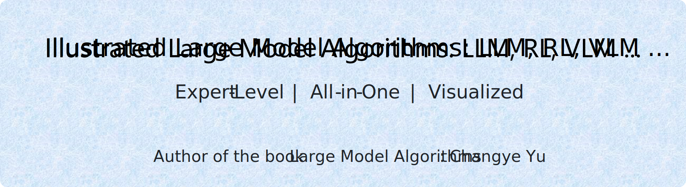

<p align="center">
  
</p>


<p align="center">
    <a href="./README_EN.md">
    
  </a> 
  &nbsp; &nbsp;&nbsp;

  <a href="../README.md">
    
  </a>    

</p>


---
## Description

🎉 **100+ original diagrams**visualizing core concepts of large model algorithms — from LLMs, VLMs, and training methods (RL, RLHF, GRPO, DPO, SFT, distillation) to RAG and performance optimization.

🎉 Originally based on the diagrams from the Chinese **book** [《大模型算法：强化学习、微调与对齐》](https://item.jd.com/15017130.html) (<em>Large Model Algorithms: Reinforcement Learning, Fine-Tuning, and Alignment</em>), this project has since been continuously expanded with new content and improvements.

🎉 **Continuously updated** and actively maintained — click **Star ⭐** to stay tuned!

🎉 Contributions welcome — see the <a href="#contributing" style="color:rgb(44, 46, 49); text-decoration: underline;">Contributing Guide</a> to get involved.

Click on the images to view high-resolution versions, or browse the `.svg` vector files in the repository for infinite zoom support.


## Table of Contents
- [Overall Architecture of Large Model Algorithms (Focusing on LLMs and VLMs)](#header-1)
- [【LLM basics】LLM overview](#header-2)
- [【LLM basics】LLM structure](#header-3)
- [【LLM basics】LLM generation and decoding](#header-4)
- [【LLM basics】LLM Input](#header-5)
- [【LLM basics】LLM output](#header-6)
- [【LLM basics】MLLM and VLM](#header-7)
- [【LLM basics】LLM training process](#header-8)
- [【SFT】Categories of fine-tuning techniques](#header-9)
- [【SFT】LoRA(1 of 2)](#header-10)
- [【SFT】LoRA(2 of 2)](#header-11)
- [【SFT】Prefix-Tuning](#header-12)
- [【SFT】Token ID and Token](#header-13)
- [【SFT】Loss of SFT(cross-entropy)](#header-14)
- [【SFT】Packing of multiple pieces of sample](#header-15)
- [【DPO】RLHF vs DPO](#header-16)
- [【DPO】DPO(Direct Preference Optimization)](#header-17)
- [【DPO】Overview of DPO training](#header-18)
- [【DPO】Impact of the β parameter on DPO](#header-19)
- [【DPO】Effect of implicit reward differences on the magnitude of parameter updates](#header-20)
- [【Optimization without training】Comparison of CoT and traditional Q&A](#header-21)
- [【Optimization without training】CoT、Self-consistency CoT、ToT、GoT <sup>[<a href="./references.md">87</a>]</sup>](#header-22)
- [【Optimization without training】Exhaustive Search](#header-23)
- [【Optimization without training】Greedy Search](#header-24)
- [【Optimization without training】Beam Search](#header-25)
- [【Optimization without training】Multinomial Sampling](#header-26)
- [【Optimization without training】Top-K Sampling](#header-27)
- [【Optimization without training】Top-P Sampling](#header-28)
- [【Optimization without training】RAG(Retrieval-Augmented Generation)](#header-29)
- [【Optimization without training】Function Calling](#header-30)
- [【RL basics】History of RL](#header-31)
- [【RL basics】Three major machine learning paradigms](#header-32)
- [【RL basics】Basic architecture of RL](#header-33)
- [【RL basics】Fundamental Concepts of RL](#header-34)
- [【RL basics】Markov Chain vs MDP](#header-35)
- [【RL basics】Using dynamic ε values under the ε-greedy strategy](#header-36)
- [【RL basics】Comparison of RL training paradigms](#header-37)
- [【RL basics】Classification of RL](#header-38)
- [【RL basics】Return(cumulative reward)](#header-39)
- [【RL basics】Backwards iteration and computation of return G](#header-40)
- [【RL basics】Reward, Return, and Value](#header-41)
- [【RL basics】Qπ and Vπ](#header-42)
- [【RL basics】Estimate the value through Monte Carlo(MC)](#header-43)
- [【RL basics】TD target and TD error](#header-44)
- [【RL basics】TD(0), n-step TD, and MC](#header-45)
- [【RL basics】Characteristics of MC and TD methods](#header-46)
- [【RL basics】MC, TD, DP, and exhaustive search <sup>[<a href="./references.md">32</a>]</sup>](#header-47)
- [【RL basics】DQN model with two input-output structures](#header-48)
- [【RL basics】How to use DQN](#header-49)
- [【RL basics】DQN's overestimation problem](#header-50)
- [【RL basics】Value-Based vs Policy-Based](#header-51)
- [【RL basics】Policy gradient](#header-52)
- [【RL basics】Multi-agent reinforcement learning(MARL)](#header-53)
- [【RL basics】Multi-agent DDPG <sup>[<a href="./references.md">41</a>]</sup>](#header-54)
- [【RL basics】Imitation learning(IL)](#header-55)
- [【RL basics】Behavior cloning(BC)](#header-56)
- [【RL basics】Inverse RL(IRL) and RL](#header-57)
- [【RL basics】Model-Based and Model-Free](#header-58)
- [【RL basics】Feudal RL](#header-59)
- [【RL basics】Distributional RL](#header-60)
- [【Policy Optimization & Variants】Actor-Critic](#header-61)
- [【Policy Optimization & Variants】Comparison of baseline and advantage](#header-62)
- [【Policy Optimization & Variants】GAE(Generalized Advantage Estimation)](#header-63)
- [【Policy Optimization & Variants】TRPO and its trust region](#header-64)
- [【Policy Optimization & Variants】Importance sampling](#header-65)
- [【Policy Optimization & Variants】PPO-Clip](#header-66)
- [【Policy Optimization & Variants】Policy model update process in PPO training](#header-67)
- [【Policy Optimization & Variants】PPO Pseudocode](#header-67-2)
- [【Policy Optimization & Variants】GRPO & PPO <sup>[<a href="./references.md">72</a>]</sup>](#header-68)
- [【Policy Optimization & Variants】Deterministic policy vs. Stochastic policy](#header-69)
- [【Policy Optimization & Variants】DPG](#header-70)
- [【Policy Optimization & Variants】DDPG（Deep Deterministic Policy Gradient）](#header-71)
- [【RLHF and RLAIF】RL modeling of language models](#header-72)
- [【RLHF and RLAIF】Two-stage training process of RLHF](#header-73)
- [【RLHF and RLAIF】Structure of the reward model](#header-74)
- [【RLHF and RLAIF】Input and output of the reward model](#header-75)
- [【RLHF and RLAIF】Reward deviation and loss](#header-76)
- [【RLHF and RLAIF】Training of the reward model](#header-77)
- [【RLHF and RLAIF】Relationship between the four models in PPO](#header-78)
- [【RLHF and RLAIF】The structure and init of the four models in PPO](#header-79)
- [【RLHF and RLAIF】A value model with a dual-head structure](#header-80)
- [【RLHF and RLAIF】Four models can share one base in RLHF](#header-81)
- [【RLHF and RLAIF】Inputs and Outputs of Each Model in PPO](#header-82)
- [【RLHF and RLAIF】The Process of Calculating KL in PPO](#header-83)
- [【RLHF and RLAIF】RLHF Training Based on PPO](#header-84)
- [【RLHF and RLAIF】Rejection Sampling Fine-tuning](#header-85)
- [【RLHF and RLAIF】RLAIF vs RLHF](#header-86)
- [【RLHF and RLAIF】CAI(Constitutional AI)](#header-87)
- [【RLHF and RLAIF】OpenAI RBR(Rule-Based Reward)](#header-88)
- [【Reasoning capacity optimization】Knowledge Distillation Based on CoT](#header-89)
- [【Reasoning capacity optimization】Distillation Based on DeepSeek](#header-90)
- [【Reasoning capacity optimization】ORM(Outcome Reward Model) & PRM (Process Reward Model)](#header-91)
- [【Reasoning capacity optimization】Four Key Steps of Each MCTS](#header-92)
- [【Reasoning capacity optimization】MCTS](#header-93)
- [【Reasoning capacity optimization】Search Tree Example in a Linguistic Context](#header-94)
- [【Reasoning capacity optimization】BoN(Best-of-N) Sampling](#header-95)
- [【Reasoning capacity optimization】Majority Vote](#header-96)
- [【Reasoning capacity optimization】Performance Growth of AlphaGo Zero <sup>[<a href="./references.md">179</a>]</sup>](#header-97)
- [【LLM basics extended】Performance Optimization Map for Large Models](#header-98)
- [【LLM basics extended】ALiBi positional encoding](#header-99)
- [【LLM basics extended】Traditional knowledge distillation](#header-100)
- [【LLM basics extended】Numerical representation, quantization](#header-101)
- [【LLM basics extended】Forward and backward](#header-102)
- [【LLM basics extended】Gradient Accumulation](#header-103)
- [【LLM basics extended】Gradient Checkpoint(gradient recomputation)](#header-104)
- [【LLM basics extended】Full recomputation ](#header-105)
- [【LLM basics extended】LLM Benchmark](#header-106)
- [【LLM basics extended】MHA、GQA、MQA、MLA](#header-107)
- [【LLM basics extended】RNN(Recurrent Neural Network)](#header-108)
- [【LLM basics extended】Pre-norm vs Post-norm](#header-109)
- [【LLM basics extended】BatchNorm & LayerNorm](#header-110)
- [【LLM basics extended】RMSNorm](#header-111)
- [【LLM basics extended】Prune](#header-112)
- [【LLM basics extended】Role of the temperature coefficient](#header-113)
- [【LLM basics extended】SwiGLU](#header-114)
- [【LLM basics extended】AUC、PR、F1、Precision、Recall](#header-115)
- [【LLM basics extended】RoPE positional encoding](#header-116)
- [【LLM basics extended】The effect of RoPE on each sequence position and each dim](#header-117)
- [📌 For Reference Section](#header-118)
- [📌 BibTeX Citation Format](#header-119)


### <a name="header-1"></a>Overall Architecture of Large Model Algorithms (Focusing on LLMs and VLMs)


### <a name="header-2"></a>【LLM basics】LLM overview
- This is the culmination of dozens of hours of dedicated effort; clicking the **Star ⭐** at the top right ↗ of this repository is my greatest encouragement!
- LLMs mainly come in two forms: Decoder-Only or MoE (Mixture of Experts). The overall architectures are similar; the main difference is that MoE introduces multiple expert networks into the FFN (Feed-Forward Network) component.

[](https://raw.githubusercontent.com/changyeyu/LLM-RL-Visualized/master/images_english/source_svg/%E3%80%90LLM%20basics%E3%80%91LLM%20overview.svg)

### <a name="header-3"></a>【LLM basics】LLM structure
- LLMs mainly come in two forms: Decoder-Only or MoE (Mixture of Experts). The overall architectures are similar; the key difference is that MoE introduces multiple expert networks into the FFN (Feed-Forward Network) component.
- A typical LLM architecture can be divided into three parts: the input layer, the multi-layer stacked Decoder structure, and the output layer (including the language model head and the decoding module).

[](https://raw.githubusercontent.com/changyeyu/LLM-RL-Visualized/master/images_english/png_big/%E3%80%90LLM%20basics%E3%80%91LLM%20structure.png)

### <a name="header-4"></a>【LLM basics】LLM generation and decoding
- **Decoding strategies** are the core factors that determine the fluency, diversity, and overall performance of the final output text. **Common** decoding algorithms include: Greedy Search, Beam Search and its variants, Multinomial Sampling, Top-K Sampling, Top-P Sampling, Contrastive Search, Speculative Decoding, Lookahead Decoding, DoLa Decoding, and others.
- The output layer of an LLM is responsible for applying a **decoding algorithm** to the probability distribution to determine the final predicted next token(s).
- Based on the probability distribution, the decoding strategy (e.g., random sampling or selecting the highest probability) is applied to choose the **next** token. For example, under Greedy Search, the token “我” (“I”) with the highest probability would be selected.
- Each token generation requires **passing through** all layers of the Transformer structure again.
- This diagram shows one-token-at-a-time prediction. There are also multi-token prediction schemes; see Chapter 4 of *Large Model Algorithms: Reinforcement Learning, Fine-Tuning, and Alignment* for details.

[](https://raw.githubusercontent.com/changyeyu/LLM-RL-Visualized/master/images_english/png_big/%E3%80%90LLM%20basics%E3%80%91LLM%20generation%20and%20decoding.png)

### <a name="header-5"></a>【LLM basics】LLM Input
- The input layer of an LLM converts input **text** into a multi-dimensional **numerical tensor** for processing by the model’s main structure.
[](https://raw.githubusercontent.com/changyeyu/LLM-RL-Visualized/master/images_english/png_big/%E3%80%90LLM%20basics%E3%80%91LLM%20Input.png)

### <a name="header-6"></a>【LLM basics】LLM output
The output layer of an LLM predicts the next token (text) based on the hidden states (a multi-dimensional tensor). The process is as follows:
- (1) **Input hidden states**: The hidden states from the final Decoder layer serve as input to the LLM’s output layer. For example, a 3×896 tensor containing all semantic information of the prefix sequence.
- (2) **Language Model Head** (LM Head): Typically a fully connected layer that converts hidden states to logits (calculating only the last position’s logits during inference). For example, producing a 3×151936 matrix of scores for each vocabulary token.
- (3) **Extract last position logits**: Next-token prediction depends only on the logits at the last position, so we extract the final row from the logits matrix, yielding a 151936-dimensional vector [2.0, 3.1, −1.7, …, −1.7].
- (4) **Convert to probability distribution** (Softmax): Apply Softmax to the logits to obtain probabilities for each vocabulary token. For example, a 151936-dimensional vector [0.01, 0.03, 0.001, …, 0.001], summing to 1. A higher probability indicates a higher chance of being chosen as the next token (e.g., “我” has p=0.34).
- (5) **Decoding**: Apply the decoding strategy (e.g., random sampling or choosing the maximum) to the probability distribution to determine the next token. Under Greedy Search, select the token with the highest probability, such as “我”.

[](https://raw.githubusercontent.com/changyeyu/LLM-RL-Visualized/master/images_english/png_big/%E3%80%90LLM%20basics%E3%80%91LLM%20output.png)

### <a name="header-7"></a>【LLM basics】MLLM and VLM
Depending on their focus, multimodal models are often referred to by various names:
- **VLM** (Vision-Language Model)
- **MLLM** (Multimodal Large Language Model)
- **VLA** (Vision-Language-Action Model)

[](https://raw.githubusercontent.com/changyeyu/LLM-RL-Visualized/master/images_english/png_big/%E3%80%90LLM%20basics%E3%80%91MLLM%20and%20VLM.png)

### <a name="header-8"></a>【LLM basics】LLM training process
- Training large models involves two main **stages**: Pre-Training and Post-Training. Each stage uses different data, paradigms (algorithms), objectives, and hyperparameters.
- **Pre-Training** includes early training (short-context on massive data), mid-training (long-text/long-context), and Annealing. This stage is self-supervised, uses the most data, and is the most compute-intensive.
- **Post-Training** encompasses various fine-tuning paradigms, including but not limited to SFT (Supervised Fine-Tuning), Distillation, RSFT (Rejection Sampling Fine-Tuning), RLHF (Reinforcement Learning from Human Feedback), DPO (Direct Preference Optimization), and other RL methods like GRPO and PPO. Some steps, like RSFT, can iterate multiple times.

[](https://raw.githubusercontent.com/changyeyu/LLM-RL-Visualized/master/images_english/png_big/%E3%80%90LLM%20basics%E3%80%91LLM%20training%20process.png)

### <a name="header-9"></a>【SFT】Categories of fine-tuning techniques
- There are many fine-tuning techniques for SFT, as shown in the diagram: the first two methods only require fine-tuning the pretrained model body (low development cost), while Parallel Low-Rank Fine-Tuning and Adapter Tuning introduce **additional** modules and are more complex. All these modify model parameters; prompt-based tuning instead fine-tunes the **input**.

[](https://raw.githubusercontent.com/changyeyu/LLM-RL-Visualized/master/images_english/png_big/%E3%80%90SFT%E3%80%91Categories%20of%20fine-tuning%20techniques.png)

### <a name="header-10"></a>【SFT】LoRA(1 of 2)
- **LoRA** (Low-Rank Adaptation) was introduced by Microsoft Research in 2021. Its efficient fine-tuning and strong performance have made it widely adopted. The core idea is that the parameter difference ∆W before and after fine-tuning is low-rank.
- A **low-rank** matrix contains redundancy; decomposing it into smaller matrices preserves most useful information. For example, a 1024×1024 matrix can be approximated by a 1024×2 and a 2×1024 matrix product, reducing parameters to ~0.4%.

[](https://raw.githubusercontent.com/changyeyu/LLM-RL-Visualized/master/images_english/png_big/%E3%80%90SFT%E3%80%91LoRA%281%20of%202%29.png)

### <a name="header-11"></a>【SFT】LoRA(2 of 2)
- Initialization of A and B:
  1. A is randomly initialized (e.g., Kaiming initialization);
  2. B is zero-initialized or uses very small random values.
- The goal is to ensure the inserted LoRA module does not overly perturb model outputs at the start of training.

[](https://raw.githubusercontent.com/changyeyu/LLM-RL-Visualized/master/images_english/png_big/%E3%80%90SFT%E3%80%91LoRA%282%20of%202%29.png)

### <a name="header-12"></a>【SFT】Prefix-Tuning
- **Prefix-Tuning**, proposed by Stanford researchers, offers lightweight fine-tuning by inserting a trainable sequence of vectors (the “prefix”) at the start of input. These vectors act as **virtual tokens** in subsequent Transformer attention.

[](https://raw.githubusercontent.com/changyeyu/LLM-RL-Visualized/master/images_english/png_big/%E3%80%90SFT%E3%80%91Prefix-Tuning.png)

### <a name="header-13"></a>【SFT】Token ID and Token
- For example data (preprocessed in ChatML), tokenization produces 33 tokens at 33 positions.
- Each Token ID **maps one-to-one** with a token.
[](https://raw.githubusercontent.com/changyeyu/LLM-RL-Visualized/master/images_english/png_big/%E3%80%90SFT%E3%80%91Token%20ID%20and%20Token.png)

### <a name="header-14"></a>【SFT】Loss of SFT(cross-entropy)
- Like pre-training, SFT uses cross-entropy (CE) loss.
[](https://raw.githubusercontent.com/changyeyu/LLM-RL-Visualized/master/images_english/png_big/%E3%80%90SFT%E3%80%91Loss%20of%20SFT%28cross-entropy%29.png)

### <a name="header-15"></a>【SFT】Packing of multiple pieces of sample
- Training uses **fixed-length** input. Short sequences are padded, wasting compute.
- **Packing** concatenates multiple samples into one fixed-length sequence, resetting position IDs and attention masks to keep samples independent.

[](https://raw.githubusercontent.com/changyeyu/LLM-RL-Visualized/master/images_english/png_big/%E3%80%90SFT%E3%80%91Packing%20of%20multiple%20pieces%20of%20sample.png)

### <a name="header-16"></a>【DPO】RLHF vs DPO
Unlike RLHF, DPO simplifies alignment via supervised learning:
- **Streamlined**: DPO directly optimizes the policy model, no reward model training needed, and uses only provided preference data—no sampling required.
- **Stability**: As a supervised method, DPO avoids RL’s instability.
- **Low overhead**: Only one model is loaded (policy model); reference model outputs can be precomputed.

[](https://raw.githubusercontent.com/changyeyu/LLM-RL-Visualized/master/images_english/png_big/%E3%80%90DPO%E3%80%91RLHF%20vs%20DPO.png)

### <a name="header-17"></a>【DPO】DPO(Direct Preference Optimization)
- **DPO**, introduced by Stanford et al. in 2023, is a preference-optimization algorithm for LLM/VLM alignment.
- It greatly **simplifies** PPO-based RLHF by skipping reward model training and directly optimizing the policy model—hence “Direct”.
- Two models are used:
  - **Policy model**: initialized from the SFT model copy.
  - **Reference model**: also copied from SFT (or a stronger model), with attention to KL-distance and data distribution.

[](https://raw.githubusercontent.com/changyeyu/LLM-RL-Visualized/master/images_english/png_big/%E3%80%90DPO%E3%80%91DPO%28DirectPreferenceOptimization%29.png)

### <a name="header-18"></a>【DPO】Overview of DPO training
- You may load two models (policy and reference) or just one (policy). This overview illustrates loading both. Blue blocks denote the “good response” and its intermediate results; pink blocks, the “bad response” and results.

[](https://raw.githubusercontent.com/changyeyu/LLM-RL-Visualized/master/images_english/png_big/%E3%80%90DPO%E3%80%91Overview%20of%20DPO%20training.png)

### <a name="header-19"></a>【DPO】Impact of the β parameter on DPO
- In DPO, β plays a role **similar** to its use in RLHF.

[](https://raw.githubusercontent.com/changyeyu/LLM-RL-Visualized/master/images_english/png_big/%E3%80%90DPO%E3%80%91Impact%20of%20the%20%CE%B2%20parameter%20on%20DPO.png)

### <a name="header-20"></a>【DPO】Effect of implicit reward differences on the magnitude of parameter updates
- DPO’s gradient update **increases** the probability of good responses and **reduces** that of bad ones. The gradient includes a **dynamic coefficient** reflecting the implicit reward difference—i.e., how much the implicit “reward model” deviates in judging preferences.

[](https://raw.githubusercontent.com/changyeyu/LLM-RL-Visualized/master/images_english/png_big/%E3%80%90DPO%E3%80%91Effect%20of%20implicit%20reward%20differences%20on%20the%20magnitude%20of%20parameter%20updates.png)

### <a name="header-21"></a>【Optimization without training】Comparison of CoT and traditional Q&A
- **CoT** (Chain of Thought), introduced by Jason Wei et al. at Google in 2022, is a major innovation that explicitly breaks down reasoning steps to improve performance on complex tasks.

[](https://raw.githubusercontent.com/changyeyu/LLM-RL-Visualized/master/images_english/png_big/%E3%80%90Optimization%20without%20training%E3%80%91Comparison%20of%20CoT%20and%20traditional%20Q%26A.png)

### <a name="header-22"></a>【Optimization without training】CoT、Self-consistency CoT、ToT、GoT <sup>[<a href="./references.md">87</a>]</sup>
- After CoT’s success, many variants emerged: ToT, GoT, Self-consistency CoT, Zero-shot-CoT, Auto-CoT, MoT, XoT, etc.

[](https://raw.githubusercontent.com/changyeyu/LLM-RL-Visualized/master/images_english/png_big/%E3%80%90Optimization%20without%20training%E3%80%91CoT%E3%80%81Self-consistencyCoT%E3%80%81ToT%E3%80%81GoT.png)

### <a name="header-23"></a>【Optimization without training】Exhaustive Search
- Token generation can be viewed as a V=10⁵-ary **tree**. Exhaustive Search finds the global optimum but is computationally prohibitive.
[](https://raw.githubusercontent.com/changyeyu/LLM-RL-Visualized/master/images_english/png_big/%E3%80%90Optimization%20without%20training%E3%80%91Exhaustive%20Search.png)

### <a name="header-24"></a>【Optimization without training】Greedy Search
- **Greedy Search** selects the current highest-probability token at each step, ignoring global optimality and diversity, leading to possible local optima and **lack of diversity**.

[](https://raw.githubusercontent.com/changyeyu/LLM-RL-Visualized/master/images_english/png_big/%E3%80%90Optimization%20without%20training%E3%80%91Greedy%20Search.png)

### <a name="header-25"></a>【Optimization without training】Beam Search
- **Beam Search** keeps multiple candidate sequences (“beams”) each step, pruning others. The final output is the highest-scoring beam. Larger beam count → closer to global optimum but higher cost.

[](https://raw.githubusercontent.com/changyeyu/LLM-RL-Visualized/master/images_english/png_big/%E3%80%90Optimization%20without%20training%E3%80%91Beam%20Search.png)

### <a name="header-26"></a>【Optimization without training】Multinomial Sampling
- **Multinomial Sampling** randomly draws tokens according to the model’s predicted distribution rather than uniform sampling. Includes Top-K, Top-P, etc.

[](https://raw.githubusercontent.com/changyeyu/LLM-RL-Visualized/master/images_english/png_big/%E3%80%90Optimization%20without%20training%E3%80%91Multinomial%20Sampling.png)

### <a name="header-27"></a>【Optimization without training】Top-K Sampling
- **Top-K Sampling** limits the candidate pool to the top K tokens by probability, then samples from them.
[](https://raw.githubusercontent.com/changyeyu/LLM-RL-Visualized/master/images_english/png_big/%E3%80%90Optimization%20without%20training%E3%80%91Top-K%20Sampling.png)

### <a name="header-28"></a>【Optimization without training】Top-P Sampling
- **Top-P Sampling** (Nucleus Sampling) dynamically selects the smallest set of tokens whose cumulative probability ≥ P, then samples from that set.
[](https://raw.githubusercontent.com/changyeyu/LLM-RL-Visualized/master/images_english/png_big/%E3%80%90Optimization%20without%20training%E3%80%91Top-P%20Sampling.png)

### <a name="header-29"></a>【Optimization without training】RAG(Retrieval-Augmented Generation)
- **RAG** integrates external knowledge via retrieval to enhance generative models. Proposed by Meta AI in 2020, it boosts performance on knowledge-intensive tasks. The workflow has offline index building and online serving components.

[](https://raw.githubusercontent.com/changyeyu/LLM-RL-Visualized/master/images_english/png_big/%E3%80%90Optimization%20without%20training%E3%80%91RAG%28Retrieval-Augmented%20Generation%29.png)

### <a name="header-30"></a>【Optimization without training】Function Calling
- **Function Calling** (Tool Use) lets an LLM agent invoke external APIs, database queries, local functions, or plugins. The agent parses user requests, handles parameters, calls tools, then feeds results back into the model.

[](https://raw.githubusercontent.com/changyeyu/LLM-RL-Visualized/master/images_english/png_big/%E3%80%90Optimization%20without%20training%E3%80%91Function%20Calling.png)

### <a name="header-31"></a>【RL basics】History of RL
- RL dates back to the 1950s, with key contributions by Richard S. Sutton and others.
- Since 2012, deep learning has spurred high-profile RL applications.
- In November 2022, ChatGPT (trained with RLHF) launched.
- In December 2024, OpenAI released the more deeply RL-optimized o1 model, driving industry interest in RL for large models.

[](https://raw.githubusercontent.com/changyeyu/LLM-RL-Visualized/master/images_english/png_big/%E3%80%90RL%20basics%E3%80%91History%20of%20RL.png)

### <a name="header-32"></a>【RL basics】Three major machine learning paradigms
- The three paradigms are Unsupervised Learning, Supervised Learning, and Reinforcement Learning.

[](https://raw.githubusercontent.com/changyeyu/LLM-RL-Visualized/master/images_english/png_big/%E3%80%90RL%20basics%E3%80%91Three%20major%20machine%20learning%20paradigms.png)

### <a name="header-33"></a>【RL basics】Basic architecture of RL
- RL involves two **core roles**: the Agent and the Environment.
- The **Agent** perceives state, selects actions via its policy.
- The **Environment** updates state and returns rewards.
[](https://raw.githubusercontent.com/changyeyu/LLM-RL-Visualized/master/images_english/png_big/%E3%80%90RL%20basics%E3%80%91Basic%20architecture%20of%20RL.png)

### <a name="header-34"></a>【RL basics】Fundamental Concepts of RL
- Example: an AGI travel company uses self-driving cars. The Agent learns optimal routes via iterative trips and accumulated passenger ratings (rewards), optimizing the travel experience.

[](https://raw.githubusercontent.com/changyeyu/LLM-RL-Visualized/master/images_english/png_big/%E3%80%90RL%20basics%E3%80%91Fundamental%20Concepts%20of%20RL.png)

### <a name="header-35"></a>【RL basics】Markov Chain vs MDP
- Markov Chains are extended to Markov Decision Processes by adding Actions (A) and Rewards (R).

[](https://raw.githubusercontent.com/changyeyu/LLM-RL-Visualized/master/images_english/png_big/%E3%80%90RL%20basics%E3%80%91Markov%20Chain%20vs%20MDP.png)

### <a name="header-36"></a>【RL basics】Using dynamic ε values under the ε-greedy strategy
- **Epsilon-Greedy** uses ε to balance exploration/exploitation. Start with high ε to explore, then decay ε to exploit learned knowledge, improving training efficiency and final policy.

[](https://raw.githubusercontent.com/changyeyu/LLM-RL-Visualized/master/images_english/png_big/%E3%80%90RL%20basics%E3%80%91Using%20dynamic%20%CE%B5%20values%20under%20the%20%CE%B5-greedy%20strategy.png)

### <a name="header-37"></a>【RL basics】Comparison of RL training paradigms
- On-policy vs. Off-policy vs. Online RL vs. Offline RL.  
- **On-policy**: behavior and target policies are the same (e.g., SARSA).  
- **Off-policy**: behavior and target differ (e.g., Q-learning, DQN).  
- **Online RL**: continuous environment interaction and data collection.  
- **Offline RL**: training solely on a fixed dataset without environment interaction.
[](https://raw.githubusercontent.com/changyeyu/LLM-RL-Visualized/master/images_english/png_big/%E3%80%90RL%20basics%E3%80%91Comparison%20of%20RL%20training%20paradigms.png)

### <a name="header-38"></a>【RL basics】Classification of RL
- RL algorithms are categorized by various dimensions and often combined with SL, CL, IL, GANs, etc., spawning many hybrid methods.
[](https://raw.githubusercontent.com/changyeyu/LLM-RL-Visualized/master/images_english/png_big/%E3%80%90RL%20basics%E3%80%91Classification%20of%20RL.png)

### <a name="header-39"></a>【RL basics】Return(cumulative reward)
- **Return** (G) is the sum of future rewards from a time step, measuring the total expected reward under a policy.

[](https://raw.githubusercontent.com/changyeyu/LLM-RL-Visualized/master/images_english/png_big/%E3%80%90RL%20basics%E3%80%91Return%28cumulative%20reward%29.png)

### <a name="header-40"></a>【RL basics】Backwards iteration and computation of return G
- Using discount factor γ, compute returns backwards from the end of an episode.

[](https://raw.githubusercontent.com/changyeyu/LLM-RL-Visualized/master/images_english/png_big/%E3%80%90RL%20basics%E3%80%91Backwards%20iteration%20and%20computation%20of%20return%20G.png)

### <a name="header-41"></a>【RL basics】Reward, Return, and Value
- **Reward**: immediate, local gain.  
- **Return**: total future gain.  
- **Value**: expected return over all trajectories, weighted by their probability (assuming γ=1 in this illustration).
[](https://raw.githubusercontent.com/changyeyu/LLM-RL-Visualized/master/images_english/png_big/%E3%80%90RL%20basics%E3%80%91Reward%2C%20Return%2C%20and%20Value.png)

### <a name="header-42"></a>【RL basics】Qπ and Vπ
- **Action-Value Function** Qπ(s,a): expected return after taking action a in state s under policy π.  
- **State-Value Function** Vπ(s): expected return from state s under π.
[](https://raw.githubusercontent.com/changyeyu/LLM-RL-Visualized/master/images_english/png_big/%E3%80%90RL%20basics%E3%80%91Q%CF%80%20and%20V%CF%80.png)

### <a name="header-43"></a>【RL basics】Estimate the value through Monte Carlo(MC)
- **Monte Carlo** methods estimate value functions by sampling complete episodes, suitable when the environment model is unknown.

[](https://raw.githubusercontent.com/changyeyu/LLM-RL-Visualized/master/images_english/png_big/%E3%80%90RL%20basics%E3%80%91Estimate%20the%20value%20through%20Monte%20Carlo%28MC%29.png)

### <a name="header-44"></a>【RL basics】TD target and TD error
- **TD Target** uses the next reward and next state value; **TD Error** measures the difference between current value estimate and TD target, guiding updates.

[](https://raw.githubusercontent.com/changyeyu/LLM-RL-Visualized/master/images_english/png_big/%E3%80%90RL%20basics%E3%80%91TD%20target%20and%20TD%20error.png)

### <a name="header-45"></a>【RL basics】TD(0), n-step TD, and MC
- When n=1, multi-step TD reduces to TD(0); as n→∞, it approaches Monte Carlo.

[](https://raw.githubusercontent.com/changyeyu/LLM-RL-Visualized/master/images_english/png_big/%E3%80%90RL%20basics%E3%80%91TD%280%29%2C%20n-step%20TD%2C%20and%20MC.png)

### <a name="header-46"></a>【RL basics】Characteristics of MC and TD methods
- MC: low bias, high variance; TD: high bias, low variance.

[](https://raw.githubusercontent.com/changyeyu/LLM-RL-Visualized/master/images_english/png_big/%E3%80%90RL%20basics%E3%80%91Characteristics%20of%20MC%20and%20TD%20methods.png)

### <a name="header-47"></a>【RL basics】MC, TD, DP, and exhaustive search <sup>[<a href="./references.md">32</a>]</sup>
- Four approaches to value estimation and policy optimization: Monte Carlo, Temporal Difference, Dynamic Programming, and Brute-Force Search.

[](https://raw.githubusercontent.com/changyeyu/LLM-RL-Visualized/master/images_english/png_big/%E3%80%90RL%20basics%E3%80%91MC%2C%20TD%2C%20DP%2C%20and%20exhaustive%20search.png)

### <a name="header-48"></a>【RL basics】DQN model with two input-output structures
DQN has two IO variants:
1. Input: state and a candidate action → output: its Q-value (batch compute for multiple actions possible).  
2. Input: state → output: Q-values for all actions; choose the max.

[](https://raw.githubusercontent.com/changyeyu/LLM-RL-Visualized/master/images_english/png_big/%E3%80%90RL%20basics%E3%80%91DQN%20model%20with%20two%20input-output%20structures.png)

### <a name="header-49"></a>【RL basics】How to use DQN
- After training, deploy DQN online to aid decisions. At inference, pick the action with the highest Q-value as determined by the model.

[](https://raw.githubusercontent.com/changyeyu/LLM-RL-Visualized/master/images_english/png_big/%E3%80%90RL%20basics%E3%80%91How%20to%20use%20DQN.png)

### <a name="header-50"></a>【RL basics】DQN's overestimation problem
- Two core issues: 
- (1) **Overestimation** of Q-values due to max operations accumulating error unevenly across actions. 
- (2) **Bootstrapping** (“dog chases its tail”) where the target depends on the same network weights, causing training instability and convergence difficulties.

[](https://raw.githubusercontent.com/changyeyu/LLM-RL-Visualized/master/images_english/png_big/%E3%80%90RL%20basics%E3%80%91DQN%27s%20overestimation%20problem.png)

### <a name="header-51"></a>【RL basics】Value-Based vs Policy-Based
- **Value-Based**: estimate value functions (V or Q) → derive policy.  
- **Policy-Based**: directly parameterize and optimize policy π.  
- **Actor-Critic**: combines both approaches, learning policy (Actor) and value (Critic) together.
[](https://raw.githubusercontent.com/changyeyu/LLM-RL-Visualized/master/images_english/png_big/%E3%80%90RL%20basics%E3%80%91Value-Based%20vs%20Policy-Based.png)

### <a name="header-52"></a>【RL basics】Policy gradient
- **Policy Gradients** underpin many RL algorithms (PPO, GRPO, DPG, Actor-Critic variants). Sutton et al. formalized the **Policy Gradient Theorem**. Unlike value-based methods, policy-based methods optimize π directly via gradient ascent.

[](https://raw.githubusercontent.com/changyeyu/LLM-RL-Visualized/master/images_english/png_big/%E3%80%90RL%20basics%E3%80%91Policy%20gradient.png)

### <a name="header-53"></a>【RL basics】Multi-agent reinforcement learning(MARL)
- **MARL** studies multiple agents learning to cooperate or compete in a shared environment (e.g., AlphaGo, AlphaStar, OpenAI Five).

[](https://raw.githubusercontent.com/changyeyu/LLM-RL-Visualized/master/images_english/png_big/%E3%80%90RL%20basics%E3%80%91Multi-agent%20reinforcement%20learning%28MARL%29.png)

### <a name="header-54"></a>【RL basics】Multi-agent DDPG <sup>[<a href="./references.md">41</a>]</sup>
- **MADDPG** (Multi-Agent DDPG), introduced by OpenAI in 2017, uses N actor networks (π₁…πₙ) and N critic networks (Q₁…Qₙ). Each critic takes all agents’ actions and observations to output Q-value for its agent.

[](https://raw.githubusercontent.com/changyeyu/LLM-RL-Visualized/master/images_english/png_big/%E3%80%90RL%20basics%E3%80%91Multi-agent%20DDPG.png)

### <a name="header-55"></a>【RL basics】Imitation learning(IL)
- **Imitation Learning** learns policies by observing and **mimicking** experts, without explicit reward functions. Main approaches:  
  1. **Behavioral Cloning** (BC): supervised learning on state-action pairs.  
  2. **Inverse Reinforcement Learning** (IRL): infer reward function from expert behavior, then learn policy.  
  3. **Generative Adversarial Imitation Learning** (GAIL): adversarially train policy against expert.

[](https://raw.githubusercontent.com/changyeyu/LLM-RL-Visualized/master/images_english/png_big/%E3%80%90RL%20basics%E3%80%91Imitation%20learning%28IL%29.png)

### <a name="header-56"></a>【RL basics】Behavior cloning(BC)
- **Behavioral Cloning** treats imitation as regression/classification: input state → predict expert action. Minimizes difference between predicted and expert actions.

[](https://raw.githubusercontent.com/changyeyu/LLM-RL-Visualized/master/images_english/png_big/%E3%80%90RL%20basics%E3%80%91Behavior%20cloning%28BC%29.png)

### <a name="header-57"></a>【RL basics】Inverse RL(IRL) and RL
- **IRL** infers the underlying reward function from expert behavior, then learns the optimal policy.  
- Andrew Y. Ng and Stuart Russell formalized IRL in their 2000 paper *Algorithms for Inverse Reinforcement Learning*.
[](https://raw.githubusercontent.com/changyeyu/LLM-RL-Visualized/master/images_english/png_big/%E3%80%90RL%20basics%E3%80%91Inverse%20RL%28IRL%29%20and%20RL.png)

### <a name="header-58"></a>【RL basics】Model-Based and Model-Free
- **Model-Based**: uses environment model for planning; **Model-Free**: learns value or policy directly from interaction.

[](https://raw.githubusercontent.com/changyeyu/LLM-RL-Visualized/master/images_english/png_big/%E3%80%90RL%20basics%E3%80%91Model-Based%20and%20Model-Free.png)

### <a name="header-59"></a>【RL basics】Feudal RL
- **Hierarchical RL** decomposes tasks into sub-tasks or sub-policies. Feudal RL and MAXQ are classic examples. Geoffrey E. Hinton proposed Feudal RL; Hinton won the 2024 Nobel Prize in Physics.

[](https://raw.githubusercontent.com/changyeyu/LLM-RL-Visualized/master/images_english/png_big/%E3%80%90RL%20basics%E3%80%91Feudal%20RL.png)

### <a name="header-60"></a>【RL basics】Distributional RL
- **Distributional RL** models the **distribution** of returns rather than just the expectation, capturing richer uncertainty information for policy optimization.

[](https://raw.githubusercontent.com/changyeyu/LLM-RL-Visualized/master/images_english/png_big/%E3%80%90RL%20basics%E3%80%91Distributional%20RL.png)

### <a name="header-61"></a>【Policy Optimization & Variants】Actor-Critic
- The **Actor-Critic** architecture combines a policy model (Actor) and a value model (Critic). Algorithms like PPO, DPG, DDPG, TD3 are based on this.

[](https://raw.githubusercontent.com/changyeyu/LLM-RL-Visualized/master/images_english/png_big/%E3%80%90Policy%20Optimization%20%26%20Variants%E3%80%91Actor-Critic.png)

### <a name="header-62"></a>【Policy Optimization & Variants】Comparison of baseline and advantage
- **A2C** introduces a **baseline** (state value V(s)) and constructs the **Advantage Function** A(s,a) = Q(s,a) – V(s), reducing variance.

[](https://raw.githubusercontent.com/changyeyu/LLM-RL-Visualized/master/images_english/png_big/%E3%80%90Policy%20Optimization%20%26%20Variants%E3%80%91Comparison%20of%20baseline%20and%20advantage.png)

### <a name="header-63"></a>【Policy Optimization & Variants】GAE(Generalized Advantage Estimation)
- GAE (Generalized Advantage Estimation) was proposed by John Schulman et al. and is a key component of algorithms like PPO.
- It leverages the TD(λ) idea to balance bias and variance by tuning the λ parameter.
- Computation is typically performed recursively over time steps.
- The core implementation pseudocode is shown below:

```python

import numpy as np
def compute_gae(rewards, values, gamma=0.99, lambda_=0.95):
    """
    Parameters:
        rewards (list or np.ndarray): The rewards collected at each time step, shape (T,)
        values  (list or np.ndarray): The value estimates for each state V, shape (T+1,)
        gamma   (float): Discount factor γ
        lambda_ (float): Decay parameter λ for GAE
    Returns:
        np.ndarray: Advantage estimates A, shape (T,). For example, for T=5, A = [A0, A1, A2, A3, A4]
    """
    T = len(rewards)            # Eg. End: t=T-1, T = 5
    advantages = np.zeros(T)    # Eg. A=[A0, A1, A2, A3, A4]
    gae = 0

    # From t=T-1, to t=0
    for t in reversed(range(T)):
        # δ_t = r_t + γ * V(s_{t+1}) - V(s_t)
        delta = rewards[t] + gamma * values[t+1] - values[t]

        # A_t = δ_t + γ * λ * A_{t+1}
        gae = delta + gamma * lambda_ * gae
        advantages[t] = gae
    return advantages
```

[](https://raw.githubusercontent.com/changyeyu/LLM-RL-Visualized/master/images_english/png_big/%E3%80%90Policy%20Optimization%20%26%20Variants%E3%80%91GAE.png)

### <a name="header-64"></a>【Policy Optimization & Variants】TRPO and its trust region
- TRPO (Trust Region Policy Optimization) is the predecessor to PPO.
- It improves policy gradient methods by introducing a trust region constraint and importance sampling.
- The core idea is to maximize the objective J(θ) while limiting the divergence between the new and old policies.
[](https://raw.githubusercontent.com/changyeyu/LLM-RL-Visualized/master/images_english/png_big/%E3%80%90Policy%20Optimization%20%26%20Variants%E3%80%91TRPO%20and%20its%20trust%20region.png)

### <a name="header-65"></a>【Policy Optimization & Variants】Importance sampling
- Importance Sampling corrects distribution mismatch between old and new policies, enabling reuse of old data to optimize the new policy.
- It samples from an auxiliary distribution and applies importance weights to improve estimation efficiency.
- It requires that if p(x)>0 then p′(x)>0, ensuring no probability mass is lost during reweighting.

[](https://raw.githubusercontent.com/changyeyu/LLM-RL-Visualized/master/images_english/png_big/%E3%80%90Policy%20Optimization%20%26%20Variants%E3%80%91Importance%20sampling.png)

### <a name="header-66"></a>【Policy Optimization & Variants】PPO-Clip
- PPO-Clip refers to PPO with a clipped surrogate objective.
- The goal is to maximize expected future return by optimizing J(θ) with a clipping mechanism.
- The clipping limits the probability ratio r(θ) to [1−ε,1+ε], preventing overly large policy updates.

[](https://raw.githubusercontent.com/changyeyu/LLM-RL-Visualized/master/images_english/png_big/%E3%80%90Policy%20Optimization%20%26%20Variants%E3%80%91PPO-Clip.png)

### <a name="header-67"></a>【Policy Optimization & Variants】Policy model update process in PPO training
- PPO training alternates between two phases:
    1. Sample Collection: generate trajectories with the old policy and store them in a replay buffer.
    2. Multiple PPO Training Rounds: shuffle and split the buffer into mini-batches, then run multiple PPO epochs per mini-batch (computing clipped policy loss, value loss, and entropy bonus) to update parameters.
- These phases repeat iteratively until training completes.

[](https://raw.githubusercontent.com/changyeyu/LLM-RL-Visualized/master/images_english/png_big/%E3%80%90Policy%20Optimization%20%26%20Variants%E3%80%91Policy%20model%20update%20process%20in%20PPO%20training.png)

### <a name="header-67-2"></a>【Policy Optimization & Variants】PPO Pseudocode
```python
# Abbreviations: R = rewards, V = values, Adv = advantages, J = objective, P = probability
for iteration in range(num_iterations):  # Perform num_iterations training iterations
    # [1/2] Collect samples (prompt, response_old, logP_old, Adv, V_target)
    prompt_batch, response_old_batch = [], []
    logP_old_batch, Adv_batch, V_target_batch = [], [], []
    for _ in range(num_examples):
        logP_old, response_old  = actor_model(prompt)
        V_old    = critic_model(prompt, response_old)
        R        = reward_model(prompt, response_old)[-1]
        logP_ref = ref_model(prompt, response_old)
        
        # KL penalty. Note: R here is only the reward for the final token
        KL = logP_old - logP_ref
        R_with_KL = R - scale_factor * KL

        # Compute advantage Adv via GAE
        Adv = GAE_Advantage(R_with_KL, V_old, gamma, λ)
        V_target = Adv + V_old

        prompt_batch        += prompt
        response_old_batch  += response_old
        logP_old_batch      += logP_old
        Adv_batch           += Adv
        V_target_batch      += V_target

    # [2/2] PPO training loop: multiple parameter updates
    for _ in range(ppo_epochs):
        mini_batches = shuffle_split(
            (prompt_batch, response_old_batch, logP_old_batch, Adv_batch, V_target_batch),
            mini_batch_size
        )
        
        for prompt, response_old, logP_old, Adv, V_target in mini_batches:
            logits, logP_new = actor_model(prompt, response_old)
            V_new            = critic_model(prompt, response_old)

            # Probability ratio: ratio(θ) = π_θ(a|s) / π_{θ_old}(a|s)
            ratios = exp(logP_new - logP_old)

            # Compute clipped policy loss
            L_clip = -mean(
                min(ratios * Adv,
                    clip(ratios, 1 - ε, 1 + ε) * Adv)
            )
            
            S_entropy = mean(compute_entropy(logits))  # Compute policy entropy

            Loss_V = mean((V_new - V_target) ** 2)     # Compute value function loss

            # Total loss
            Loss = L_clip + C1 * Loss_V - C2 * S_entropy

            backward_update(Loss, L_clip, Loss_V)      # Backpropagate and update parameters
```

### <a name="header-68"></a>【Policy Optimization & Variants】GRPO & PPO <sup>[<a href="./references.md">72</a>]</sup>
- GRPO (Group Relative Policy Optimization) is a policy-based RL algorithm by DeepSeek.
- It removes the separate value network and uses group-relative advantage estimation as a baseline, reducing resource usage while maintaining stability.
[](https://raw.githubusercontent.com/changyeyu/LLM-RL-Visualized/master/images_english/png_big/%E3%80%90Policy%20Optimization%20%26%20Variants%E3%80%91GRPO%20%26%20PPO.png)

### <a name="header-69"></a>【Policy Optimization & Variants】Deterministic policy vs. Stochastic policy
- Reinforcement learning policies can be deterministic or stochastic.
- Deterministic policies output a single action per state.
- Stochastic policies output a probability distribution over actions.

[](https://raw.githubusercontent.com/changyeyu/LLM-RL-Visualized/master/images_english/png_big/%E3%80%90Policy%20Optimization%20%26%20Variants%E3%80%91Deterministic%20policy%20vs.%20Stochastic%20policy.png)

### <a name="header-70"></a>【Policy Optimization & Variants】DPG
- DPG (Deterministic Policy Gradient) was formalized by David Silver et al. in 2014 at DeepMind.
- It uses an actor-critic architecture for continuous action spaces.

[](https://raw.githubusercontent.com/changyeyu/LLM-RL-Visualized/master/images_english/png_big/%E3%80%90Policy%20Optimization%20%26%20Variants%E3%80%91DPG.png)

### <a name="header-71"></a>【Policy Optimization & Variants】DDPG（Deep Deterministic Policy Gradient）
- DDPG extends DPG by incorporating deep Q-network concepts, requiring four networks (2 actors, 2 critics).
- TD3 (Twin Delayed DDPG) further improves DDPG with six networks (2 actors, 4 critics) and delayed updates for stability.
[](https://raw.githubusercontent.com/changyeyu/LLM-RL-Visualized/master/images_english/png_big/%E3%80%90Policy%20Optimization%20%26%20Variants%E3%80%91DDPG.png)

### <a name="header-72"></a>【RLHF and RLAIF】RL modeling of language models
- To apply RL to LMs, define:
    1. Action: selecting a token.
    2. Action Space: the vocabulary (~100k tokens).
    3. Agent: the LLM.
    4. Policy: the model parameters π.
    5. State: the generated token sequence.
    6. Episode: one full generation until EOS.
    7. Value: expected future return, estimated by a value network.
[](https://raw.githubusercontent.com/changyeyu/LLM-RL-Visualized/master/images_english/png_big/%E3%80%90RLHF%20and%20RLAIF%E3%80%91RL%20modeling%20of%20language%20models.png)

### <a name="header-73"></a>【RLHF and RLAIF】Two-stage training process of RLHF
- RLHF involves two stages:
    1. Phase 1 (SFT & Reward Model): generate candidate responses and collect human preference labels to train the reward model.
    2. Phase 2 (RL with PPO): optimize the policy model using PPO, guided by the reward model and constrained by the reference model’s KL penalty.
- Phase 1 uses preference pairs (Prompt + Responses); Phase 2 uses only prompts, relying on RL interactions.

[](https://raw.githubusercontent.com/changyeyu/LLM-RL-Visualized/master/images_english/png_big/%E3%80%90RLHF%20and%20RLAIF%E3%80%91Two-stage%20training%20process%20of%20RLHF.png)

### <a name="header-74"></a>【RLHF and RLAIF】Structure of the reward model
- The Reward Model shares the decoder layers of the SFT model and replaces its LM head with a reward head that outputs a single scalar score.

[](https://raw.githubusercontent.com/changyeyu/LLM-RL-Visualized/master/images_english/png_big/%E3%80%90RLHF%20and%20RLAIF%E3%80%91Structure%20of%20the%20reward%20model.png)

### <a name="header-75"></a>【RLHF and RLAIF】Input and output of the reward model
- Input: Prompt + Response sequence.
- Output: reward scores r0, r1, … for each token of the response.

[](https://raw.githubusercontent.com/changyeyu/LLM-RL-Visualized/master/images_english/png_big/%E3%80%90RLHF%20and%20RLAIF%E3%80%91Input%20and%20output%20of%20the%20reward%20model.png)

### <a name="header-76"></a>【RLHF and RLAIF】Reward deviation and loss
- The Reward Model’s objective is a contrastive negative log-likelihood loss, fitting human preference scores similarly to DPO’s reward modeling.

[](https://raw.githubusercontent.com/changyeyu/LLM-RL-Visualized/master/images_english/png_big/%E3%80%90RLHF%20and%20RLAIF%E3%80%91Reward%20deviation%20and%20loss.png)

### <a name="header-77"></a>【RLHF and RLAIF】Training of the reward model
- (1) Compute reward scores for preferred (yw) and less preferred (yl) responses.
- (2) Calculate loss based on score difference.
- (3) Backpropagate to update parameters.
- (4) Iterate over preference samples until alignment with human judgments.

[](https://raw.githubusercontent.com/changyeyu/LLM-RL-Visualized/master/images_english/png_big/%E3%80%90RLHF%20and%20RLAIF%E3%80%91Training%20of%20the%20reward%20model.png)

### <a name="header-78"></a>【RLHF and RLAIF】Relationship between the four models in PPO
- Four models collaborate:
    1. Policy Model (Actor): generates responses, balances reward guidance and KL constraint.
    2. Reference Model: provides KL baseline to prevent divergence.
    3. Reward Model: scores responses to simulate human feedback.
    4. Value Model (Critic): estimates long-term returns Vt.

[](https://raw.githubusercontent.com/changyeyu/LLM-RL-Visualized/master/images_english/png_big/%E3%80%90RLHF%20and%20RLAIF%E3%80%91Relationship%20between%20the%20four%20models%20in%20PPO.png)

### <a name="header-79"></a>【RLHF and RLAIF】The structure and init of the four models in PPO
- All four share the same N-layer decoder but differ in heads and LoRA modules:
    1. Policy Model: SFT model + LM head, parameters updated during PPO.
    2. Reference Model: SFT model + LM head, frozen.
    3. Reward Model: SFT decoder + Reward head (random init), frozen.
    4. Value Model: SFT decoder + Value head, updated during PPO.

[](https://raw.githubusercontent.com/changyeyu/LLM-RL-Visualized/master/images_english/png_big/%E3%80%90RLHF%20and%20RLAIF%E3%80%91The%20structure%20and%20init%20of%20the%20four%20models%20in%20PPO.png)

### <a name="header-80"></a>【RLHF and RLAIF】A value model with a dual-head structure
- TRL’s AutoModelForCausalLMWithValueHead uses two heads:
    - LM Head outputs logits ([seq_len, vocab_size]).
    - Value Head outputs values ([seq_len, 1]).
- Shared decoder pass reduces compute and memory.
[](https://raw.githubusercontent.com/changyeyu/LLM-RL-Visualized/master/images_english/png_big/%E3%80%90RLHF%20and%20RLAIF%E3%80%91A%20value%20model%20with%20a%20dual-head%20structure.png)

### <a name="header-81"></a>【RLHF and RLAIF】Four models can share one base in RLHF
- By sharing a frozen decoder and using separate LoRA modules for each head, RLHF minimizes GPU memory. LoRA modules and heads can be dynamically loaded or swapped.

[](https://raw.githubusercontent.com/changyeyu/LLM-RL-Visualized/master/images_english/png_big/%E3%80%90RLHF%20and%20RLAIF%E3%80%91Four%20models%20can%20share%20one%20base%20in%20RLHF.png)

### <a name="header-82"></a>【RLHF and RLAIF】Inputs and Outputs of Each Model in PPO
 PPO training models’ inputs and outputs
| Model           | Input                          | Output                                      |
|-----------------|--------------------------------|---------------------------------------------|
| Policy Model    | Prompt (or context)            | Response and its log-probs (LogProbs)       |
| Reference Model | Prompt (or context) + Response | Response log-probs (LogProbs)               |
| Reward Model    | Prompt (or context) + Response | Per-token reward scores                     |
| Value Model     | Prompt (or context) + Response | Per-token value estimates                   |

[](https://raw.githubusercontent.com/changyeyu/LLM-RL-Visualized/master/images_english/png_big/%E3%80%90RLHF%20and%20RLAIF%E3%80%91Inputs%20and%20Outputs%20of%20Each%20Model%20in%20PPO.png)

### <a name="header-83"></a>【RLHF and RLAIF】The Process of Calculating KL in PPO
- In frameworks like TRL, KL is penalized during advantage computation: policy and reference logits → log-probs → gather token log-probs → compute per-token KL differences.

[](https://raw.githubusercontent.com/changyeyu/LLM-RL-Visualized/master/images_english/png_big/%E3%80%90RLHF%20and%20RLAIF%E3%80%91The%20Process%20of%20Calculating%20KL%20in%20PPO.png)

### <a name="header-84"></a>【RLHF and RLAIF】RLHF Training Based on PPO
- The PPO RLHF workflow is split into two halves: experience collection and multi-epoch PPO training, iterating via a replay buffer with old/new model versions.

[](https://raw.githubusercontent.com/changyeyu/LLM-RL-Visualized/master/images_english/png_big/%E3%80%90RLHF%20and%20RLAIF%E3%80%91RLHF%20Training%20Based%20on%20PPO.png)

### <a name="header-85"></a>【RLHF and RLAIF】Rejection Sampling Fine-tuning
- Rejection Sampling Fine-Tuning filters out low-quality generated samples, retaining only high-quality ones for further fine-tuning. Used by Anthropic, Meta, etc., and can iterate multiple rounds.

[](https://raw.githubusercontent.com/changyeyu/LLM-RL-Visualized/master/images_english/png_big/%E3%80%90RLHF%20and%20RLAIF%E3%80%91Rejection%20Sampling%20Fine-tuning.png)

### <a name="header-86"></a>【RLHF and RLAIF】RLAIF vs RLHF
- RLAIF (Reinforcement Learning from AI Feedback) mirrors RLHF but uses AI for preference labeling instead of humans.

[](https://raw.githubusercontent.com/changyeyu/LLM-RL-Visualized/master/images_english/png_big/%E3%80%90RLHF%20and%20RLAIF%E3%80%91RLAIF%20vs%20RLHF.png)

### <a name="header-87"></a>【RLHF and RLAIF】CAI(Constitutional AI)
- Constitutional AI (CAI) by Anthropic (2022) uses a set of constitutional principles:
    1. Self-critique & revision by a random principle.
    2. Train SL-CAI on revised + human-labeled data.
    3. Generate candidates and AI-label via random principle.
    4. Train reward model on combined labels.
    5. RL-CAI: optimize target model with PPO and the reward model.

[](https://raw.githubusercontent.com/changyeyu/LLM-RL-Visualized/master/images_english/png_big/%E3%80%90RLHF%20and%20RLAIF%E3%80%91CAI%28Constitutional%20AI%29.png)

### <a name="header-88"></a>【RLHF and RLAIF】OpenAI RBR(Rule-Based Reward)
- RBR (Rule Based Rewards) by OpenAI (2024) trains a rule-based reward model on human data, integrating AI feedback into RLHF. It is central to GPT-4’s safety system.

[](https://raw.githubusercontent.com/changyeyu/LLM-RL-Visualized/master/images_english/png_big/%E3%80%90RLHF%20and%20RLAIF%E3%80%91OpenAI%20RBR%28Rule-Based%20Reward%29.png)

### <a name="header-89"></a>【Reasoning capacity optimization】Knowledge Distillation Based on CoT
- Knowledge Distillation (KD) by Hinton et al. (2015) compresses models by transferring teacher outputs (soft labels) to a student. In reasoning tasks, distill CoT chains and answers from a strong model to a smaller one.

[](https://raw.githubusercontent.com/changyeyu/LLM-RL-Visualized/master/images_english/png_big/%E3%80%90Reasoning%20capacity%20optimization%E3%80%91Knowledge%20Distillation%20Based%20on%20CoT.png)

### <a name="header-90"></a>【Reasoning capacity optimization】Distillation Based on DeepSeek
- To reduce model size and deployment overhead, distill capabilities from a strong model (e.g., DeepSeek) into a smaller model.

[](https://raw.githubusercontent.com/changyeyu/LLM-RL-Visualized/master/images_english/png_big/%E3%80%90Reasoning%20capacity%20optimization%E3%80%91Distillation%20Based%20on%20DeepSeek.png)

### <a name="header-91"></a>【Reasoning capacity optimization】ORM(Outcome Reward Model) & PRM (Process Reward Model)
- Outcome Reward Model (ORM) scores only the final result.
- Process Reward Model (PRM) scores each intermediate reasoning step for finer feedback.

[](https://raw.githubusercontent.com/changyeyu/LLM-RL-Visualized/master/images_english/png_big/%E3%80%90Reasoning%20capacity%20optimization%E3%80%91ORM%C2%A0%26%C2%A0PRM.png)

### <a name="header-92"></a>【Reasoning capacity optimization】Four Key Steps of Each MCTS
- MCTS iterates four key steps: Selection, Expansion, Simulation, Backpropagation.

[](https://raw.githubusercontent.com/changyeyu/LLM-RL-Visualized/master/images_english/png_big/%E3%80%90Reasoning%20capacity%20optimization%E3%80%91Four%20Key%20Steps%20of%20Each%20MCTS.png)

### <a name="header-93"></a>【Reasoning capacity optimization】MCTS
- MCTS repeats these steps to expand and refine the search tree, gradually favoring better paths as simulation count increases.

[](https://raw.githubusercontent.com/changyeyu/LLM-RL-Visualized/master/images_english/png_big/%E3%80%90Reasoning%20capacity%20optimization%E3%80%91MCTS.png)

### <a name="header-94"></a>【Reasoning capacity optimization】Search Tree Example in a Linguistic Context
- In language tasks, each tree node represents a sentence or paragraph-level reasoning step.

[](https://raw.githubusercontent.com/changyeyu/LLM-RL-Visualized/master/images_english/png_big/%E3%80%90Reasoning%20capacity%20optimization%E3%80%91Search%20Tree%20Example%20in%20a%20Linguistic%20Context.png)

### <a name="header-95"></a>【Reasoning capacity optimization】BoN(Best-of-N) Sampling
- Best-of-N sampling: generate N candidates and select the highest-scoring one.
- Run multiple reasoning paths, then choose the most frequent final answer.

[](https://raw.githubusercontent.com/changyeyu/LLM-RL-Visualized/master/images_english/png_big/%E3%80%90Reasoning%20capacity%20optimization%E3%80%91BoN%28Best-of-N%29%20Sampling.png)

### <a name="header-96"></a>【Reasoning capacity optimization】Majority Vote
- Run multiple reasoning paths, then choose the most frequent final answer.

[](https://raw.githubusercontent.com/changyeyu/LLM-RL-Visualized/master/images_english/png_big/%E3%80%90Reasoning%20capacity%20optimization%E3%80%91Majority%20Vote.png)

### <a name="header-97"></a>【Reasoning capacity optimization】Performance Growth of AlphaGo Zero <sup>[<a href="./references.md">179</a>]</sup>
- AlphaGo Zero achieved an Elo of 5185 with MCTS; without MCTS pre-search, its Elo was only 3055, highlighting search’s impact.

[](https://raw.githubusercontent.com/changyeyu/LLM-RL-Visualized/master/images_english/png_big/%E3%80%90Reasoning%20capacity%20optimization%E3%80%91Performance%20Growth%20of%20AlphaGo%20Zero.png)

### <a name="header-98"></a>【LLM basics extended】Performance Optimization Map for Large Models
- The optimization map shows five levels—service, model, framework, compiler, hardware/communication—for training and inference.

[](https://raw.githubusercontent.com/changyeyu/LLM-RL-Visualized/master/images_english/png_big/%E3%80%90LLM%20basics%20extended%E3%80%91Performance%20Optimization%20Map%20for%20Large%20Models.png)

### <a name="header-99"></a>【LLM basics extended】ALiBi positional encoding
- RoPE is mainstream; ALiBi is being phased out.

[](https://raw.githubusercontent.com/changyeyu/LLM-RL-Visualized/master/images_english/png_big/%E3%80%90LLM%20basics%20extended%E3%80%91ALiBi%20positional%20encoding.png)

### <a name="header-100"></a>【LLM basics extended】Traditional knowledge distillation
- Knowledge Distillation: transfer teacher soft labels to a student for compression and faster inference. Introduced by Hinton in “Distilling the Knowledge in a Neural Network.”

[](https://raw.githubusercontent.com/changyeyu/LLM-RL-Visualized/master/images_english/png_big/%E3%80%90LLM%20basics%20extended%E3%80%91Traditional%20knowledge%20distillation.png)

### <a name="header-101"></a>【LLM basics extended】Numerical representation, quantization
| Type | Total Bits | Sign Bits | Exponent Bits | Mantissa/Integer Bits |
|------|------------|-----------|---------------|-----------------------|
| FP64 | 64         | 1         | 11            | 52 (mantissa)         |
| FP32 | 32         | 1         | 8             | 23 (mantissa)         |
| TF32 | 19         | 1         | 8             | 10 (mantissa)         |
| BF16 | 16         | 1         | 8             | 7 (mantissa)          |
| FP16 | 16         | 1         | 5             | 10 (mantissa)         |
| INT64| 64         | 1         | –             | 63 (integer)          |
| INT32| 32         | 1         | –             | 31 (integer)          |
| INT8 | 8          | 1         | –             | 7 (integer)           |
| UINT8| 8          | 0         | –             | 8 (integer)           |
| INT4 | 4          | 1         | –             | 3 (integer)           |

[](https://raw.githubusercontent.com/changyeyu/LLM-RL-Visualized/master/images_english/png_big/%E3%80%90LLM%20basics%20extended%E3%80%91Numerical%20representation%2C%20quantization.png)

### <a name="header-102"></a>【LLM basics extended】Forward and backward
- Forward Propagation: inputs pass through layers (1–4), caching activations.
- Backward Propagation: compute gradients from loss back through layers using cached activations.

[](https://raw.githubusercontent.com/changyeyu/LLM-RL-Visualized/master/images_english/png_big/%E3%80%90LLM%20basics%20extended%E3%80%91Forward%20and%20backward.png)

### <a name="header-103"></a>【LLM basics extended】Gradient Accumulation
- Standard: each batch runs forward & backward immediately, updating parameters frequently with low memory usage.
- Accumulation: accumulate gradients over several batches before updating, simulating a larger batch size.
[](https://raw.githubusercontent.com/changyeyu/LLM-RL-Visualized/master/images_english/png_big/%E3%80%90LLM%20basics%20extended%E3%80%91Gradient%20Accumulation.png)

### <a name="header-104"></a>【LLM basics extended】Gradient Checkpoint(gradient recomputation)
- Standard: store all activations for backward, high memory cost.
- Checkpointing: save only key activations, recompute others during backward to save memory at the expense of compute.

[](https://raw.githubusercontent.com/changyeyu/LLM-RL-Visualized/master/images_english/png_big/%E3%80%90LLM%20basics%20extended%E3%80%91Gradient%20Checkpoint%28gradient%20recomputation%29.png)

### <a name="header-105"></a>【LLM basics extended】Full recomputation 
- Full Recomputation: store no activations, recompute the forward pass during backward propagation. Minimizes memory usage, increases compute time.

[](https://raw.githubusercontent.com/changyeyu/LLM-RL-Visualized/master/images_english/png_big/%E3%80%90LLM%20basics%20extended%E3%80%91Full%20recomputation%20.png)

### <a name="header-106"></a>【LLM basics extended】LLM Benchmark
- LLM benchmarks (e.g., MMLU, C-eval) follow similar evaluation protocols as illustrated.

[](https://raw.githubusercontent.com/changyeyu/LLM-RL-Visualized/master/images_english/png_big/%E3%80%90LLM%20basics%20extended%E3%80%91LLM%20Benchmark.png)

### <a name="header-107"></a>【LLM basics extended】MHA、GQA、MQA、MLA
- MHA: Multi-Head Attention
- GQA: General Question Answering
- MQA: Multimodal QA
- MLA: Multimodal Language and Action (various naming conventions)
[](https://raw.githubusercontent.com/changyeyu/LLM-RL-Visualized/master/images_english/png_big/%E3%80%90LLM%20basics%20extended%E3%80%91MHA%E3%80%81GQA%E3%80%81MQA%E3%80%81MLA.png)

### <a name="header-108"></a>【LLM basics extended】RNN(Recurrent Neural Network)
- RNN processes sequential data via recurrent connections to maintain hidden state.
- Pros: simple, handles short-term dependencies.
- Cons: suffers from vanishing/exploding gradients, poor long-term dependencies.
[](https://raw.githubusercontent.com/changyeyu/LLM-RL-Visualized/master/images_english/png_big/%E3%80%90LLM%20basics%20extended%E3%80%91RNN.png)

### <a name="header-109"></a>【LLM basics extended】Pre-norm vs Post-norm
- Pre-norm: apply LayerNorm before sublayer then add residual, improving gradient flow in deep networks.
- Post-norm: traditional Transformer norm after residual, may cause gradient decay in deep models.

[](https://raw.githubusercontent.com/changyeyu/LLM-RL-Visualized/master/images_english/png_big/%E3%80%90LLM%20basics%20extended%E3%80%91Pre-norm%20vs%20Post-norm.png)

### <a name="header-110"></a>【LLM basics extended】BatchNorm & LayerNorm
- BatchNorm: normalize each channel across the batch, then scale and shift.
- LayerNorm: normalize all features of each sample, then scale and shift.
[](https://raw.githubusercontent.com/changyeyu/LLM-RL-Visualized/master/images_english/png_big/%E3%80%90LLM%20basics%20extended%E3%80%91BatchNorm%C2%A0%26%C2%A0LayerNorm.png)

### <a name="header-111"></a>【LLM basics extended】RMSNorm
- RMSNorm normalizes by the root-mean-square of input features (no mean subtraction), then scales and shifts. More efficient and comparable or superior to LayerNorm.

[](https://raw.githubusercontent.com/changyeyu/LLM-RL-Visualized/master/images_english/png_big/%E3%80%90LLM%20basics%20extended%E3%80%91RMSNorm.png)

### <a name="header-112"></a>【LLM basics extended】Prune
- Model pruning removes redundant weights/neuron channels to compress networks, then fine-tunes to retain accuracy. Steps: importance scoring → prune → fine-tune → validate.

[](https://raw.githubusercontent.com/changyeyu/LLM-RL-Visualized/master/images_english/png_big/%E3%80%90LLM%20basics%20extended%E3%80%91Prune.png)

### <a name="header-113"></a>【LLM basics extended】Role of the temperature coefficient
- Temperature T scales logits for sampling diversity:
  - T<1 sharpens distribution, more deterministic.
  - T>1 flattens distribution, more random.
- Adjusting T balances accuracy vs creativity.
[](https://raw.githubusercontent.com/changyeyu/LLM-RL-Visualized/master/images_english/png_big/%E3%80%90LLM%20basics%20extended%E3%80%91Role%20of%20the%20temperature%20coefficient.png)

### <a name="header-114"></a>【LLM basics extended】SwiGLU
- SwiGLU is a GLU variant with two linear projections: one direct, one through a SiLU gate, multiply elementwise. Smooth gating improves gradient stability and convergence.

[](https://raw.githubusercontent.com/changyeyu/LLM-RL-Visualized/master/images_english/png_big/%E3%80%90LLM%20basics%20extended%E3%80%91SwiGLU.png)

### <a name="header-115"></a>【LLM basics extended】AUC、PR、F1、Precision、Recall
- AUC: Area Under the ROC Curve.
- PR Curve: precision–recall across thresholds.
- Precision = TP/(TP+FP).
- Recall = TP/(TP+FN).
- F1 Score = 2 * (Precision * Recall) / (Precision + Recall).
- Accuracy = (TP+TN)/(TP+TN+FP+FN).
- BLEU: n-gram overlap for MT.
- ROUGE: n-gram/LCS overlap for summarization.
[](https://raw.githubusercontent.com/changyeyu/LLM-RL-Visualized/master/images_english/png_big/%E3%80%90LLM%20basics%20extended%E3%80%91AUC%E3%80%81PR%E3%80%81F1%E3%80%81Precision%E3%80%81Recall.png)

### <a name="header-116"></a>【LLM basics extended】RoPE positional encoding
- Rotary Position Embedding applies sinusoidal rotations to query/key vectors, encoding positions as phase differences. No extra parameters, efficient for long sequences.

[](https://raw.githubusercontent.com/changyeyu/LLM-RL-Visualized/master/images_english/png_big/%E3%80%90LLM%20basics%20extended%E3%80%91RoPE%20positional%20encoding.png)

### <a name="header-117"></a>【LLM basics extended】The effect of RoPE on each sequence position and each dim
- For details on the principles of RoPE, the base and θ values, and how they work, see: [RoPE-theta-base.xlsx](./RoPE-theta-base.xlsx) 
- RoPE groups embedding dimensions in pairs and applies a 2D rotation per pair with an angle based on position and frequency.
- High-frequency dimensions capture short-range relative positions.
- Low-frequency dimensions capture long-range relative positions.

[](https://raw.githubusercontent.com/changyeyu/LLM-RL-Visualized/master/images_english/png_big/%E3%80%90LLM%20basics%20extended%E3%80%91The%20effect%20of%20RoPE%20on%20each%20sequence%20position%20and%20each%20dim.png)


<br>

---


## Contributing
- **Contributions are welcome!** Whether it's new diagrams, documentation, error corrections, or other improvements. You're welcome to include your name or nickname in the diagrams. Your GitHub account will also be listed in the **Contributors** to help more people discover you and your work. Example diagram template: [images-template.pptx](./assets/images-template.pptx)


-  **How to contribute:**  
  (1) Fork: Click the "Fork" button to create a copy of the repo under your GitHub account →  
  (2) Clone: Clone the forked repo to your local environment →  
  (3) Create a new local branch →  
  (4) Make changes and commit →  
  (5) Push changes to your remote repo →  
  (6) Submit a PR: On GitHub, go to your forked repo and click "Compare & pull request" to submit a PR. The maintainer will review and merge it into the main repository.

-  **Suggested color** scheme for diagram design:  
  <span style="display:inline-block;width:12px;height:12px;background-color:#71CCF5;border-radius:2px;margin-right:8px;"></span>Light Blue (`#71CCF5`) ;  
  <span style="display:inline-block;width:12px;height:12px;background-color:#FFE699;border-radius:2px;margin-right:8px;"></span>Light Yellow (`#FFE699`) ;  
  <span style="display:inline-block;width:12px;height:12px;background-color:#C0BFDE;border-radius:2px;margin-right:8px;"></span>Blue-Purple (`#C0BFDE`) ;  
  <span style="display:inline-block;width:12px;height:12px;background-color:#F0ADB7;border-radius:2px;margin-right:8px;"></span>Pink (`#F0ADB7`)


## Terms of Use
All images in this repository are licensed under [LICENSE](../LICENSE). You are free to use, modify, and remix the materials under the following terms:  
- **Sharing** — You may copy and redistribute the material in any format.  
- **Adapting** — You may remix, transform, and build upon the material.

You must also comply with the following terms:  
- **For Web Use** — If using the materials in blog posts or online content, please retain the original author information embedded in the images.  
- **For Papers, Books, and Publications** — If using the materials in formal publications, please cite the source using the format below. In such cases, the embedded author info may be removed from the image.  
- **Non-commercial Use Only** — These materials may not be used for any direct commercial purposes.


## Citation

If you use any content from this project (including diagrams or concepts from the book), please cite it as follows:

#### <a name="header-118"></a>📌 For Reference Section
```
Yu, Changye. Large Model Algorithms: Reinforcement Learning, Fine-Tuning, and Alignment. 
Beijing: Publishing House of Electronics Industry, 2025. https://github.com/changyeyu/LLM-RL-Visualized
```

#### <a name="header-119"></a>📌 BibTeX Citation Format
```bibtex
@book{yu2025largemodel_en,
  title     = {Large Model Algorithms: Reinforcement Learning, Fine-Tuning, and Alignment},
  author    = {Yu, Changye},
  publisher = {Publishing House of Electronics Industry},
  year      = {2025},
  address   = {Beijing},
  isbn      = {9787121500725},
  url       = {https://github.com/changyeyu/LLM-RL-Visualized},
  language  = {en}
}
```

---

<div align="center"> Continuously <strong> updating</strong>...   Click ⭐<strong>Star</strong> at the top-right to follow! </div> 